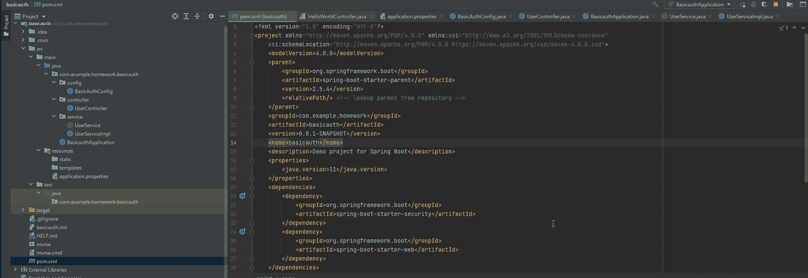
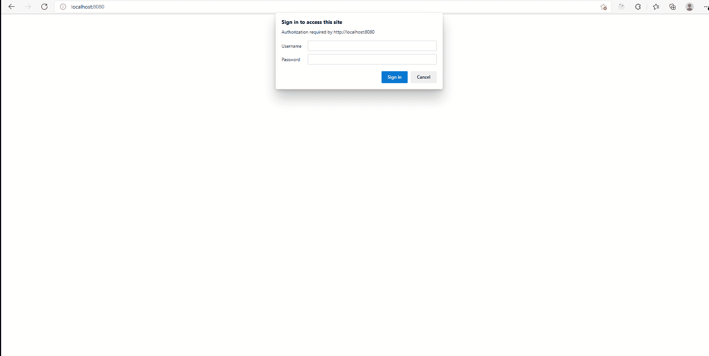
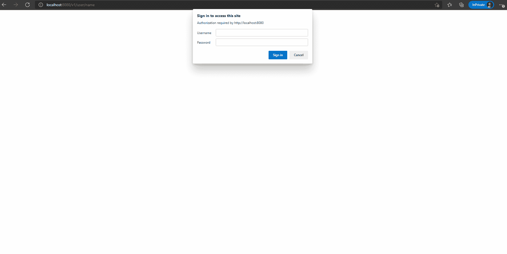

# 如何在 spring boot 中为 API 端点设置基本认证

> 原文：<https://medium.com/codex/how-to-set-basic-authentication-for-api-endpoints-in-spring-boot-9cd8c79d26a2?source=collection_archive---------2----------------------->

[Firmbee.com](https://unsplash.com/@firmbee?utm_source=medium&utm_medium=referral)在 [Unsplash](https://unsplash.com?utm_source=medium&utm_medium=referral) 上拍照

当我们谈论登录或一般身份验证时，我们首先想到的是登录应用程序。

然而，还有更多。

如果你是一名后端开发人员，很多时候你必须编写可供使用的 API 端点。

今天，我们将讨论如何创建一个 spring boot 应用程序，用户必须通过验证才能访问这些 API 端点。

为什么我们需要认证才能访问端点？我的意思是，如果我们创建这些端点而不进行身份验证，维护的代码不是更少吗？当这些端点不安全时，实际上会发生什么？

让我们用下面的例子:想象一下创建一个处理银行账户交易的 API。这个 API 允许我们转账到另一个账户，接受转账，以及创建一个有初始金额的银行账户。

现在，让我们假设我们创建了一个银行 UI 应用程序，它允许我们向其他外部帐户转账。当然，我可以向另一个受信任的账户进行交易。但是如果黑客获得了这些信息呢？

在这种情况下，黑客将利用这些信息，并使用它来进行 API 调用，以转移资金给自己。如果我们设置了基本身份验证，我们可以检查请求转账的人是否是我们信任的人。如果是的话，我们允许转移发生。如果不是，则交易不会发生。

现在让我们来讨论如何用一个基本的认证设置来设置 spring boot APIs。

在开始本教程之前，请完成在[通过 JDBC 设置您自己的 spring boot 服务器第 1 部分|作者 Michael Tong | Dev Genius](https://blog.devgenius.io/how-to-get-a-spring-boot-server-running-via-jdbc-part-1-659d33a5e373) 中指定的教程，以便有一个 spring boot 基础应用程序设置。

步骤 1:在 pom.xml 中，确保文件中包含以下依赖项:

之后，通过在 pom.xml 文件中重新加载项目来加载依赖项:

步骤 1:在 src/main/java/com.example.demo 下创建三个包:config、controller 和 service。配置包将存储设置基本身份验证所需的所有配置。控制器包将包括一个使用我们的 hello world 服务返回 hello world 的控制器。

步骤 2:在控制器包下，创建一个名为 HelloWorldController 的类，内容如下:

这里，我们有两个端点，返回年龄和姓名。现在，我们不要太担心 getAge 和 getName 的实现。我们只知道这两个函数返回一些虚拟值，我们将在实现服务时看到这些虚拟值。

步骤 3:在服务包内部，创建一个名为 HelloWorldService.java 的类:

在这里，我们有两个方法，getUserName 和 getAge。这两个方法只是返回一些虚拟数据。当应用程序接收到触发控制器级别的 getAge 和 getUserName 端点的客户端请求时，将调用这些方法。

步骤 4:找到您的配置包并创建一个名为 BasicAuthConfig.java 的文件:

在这里，我们包括@EnableWebSecurity 注释和@Configuration 注释，表明这将是一个配置文件，它将覆盖应用程序中现有的安全功能。

有三件事我们需要时刻牢记在心:

*   configureGlobal:这是我们决定使用什么用户名和密码来允许客户端请求被授权访问端点的部分。在这里，如果客户端请求的用户名为“michaeluser”，密码为“password ”,我们就会对其进行授权。
*   configure:通过覆盖这个方法，我们实际上是说任何客户端请求都会被提示用户名和密码。如果凭证与 configureGlobal 方法中要求的任何内容匹配，则允许用户访问资源。否则，用户将得到相同的提示，要求输入用户名和密码。
*   passwordEncoder:在后台，这个密码编码器将加密客户端在提供用户名和密码时提供的密码。

之后，您可以运行应用程序，它将在端口 8080 加载应用程序。

以下是我们尝试访问授权终端时的情况:

如果我使用错误的凭据访问授权的端点会发生什么？

在这种情况下，当您输入错误的用户名和密码后，它会再次提示您输入新的凭据。在此之前，不允许您访问服务器中的给定资源。

就是这样！您刚刚学习了如何构建支持基本身份验证的 spring 应用程序。

如果您无论如何都要限制外部访问某些 API，该怎么办呢？我们可以下次再谈。