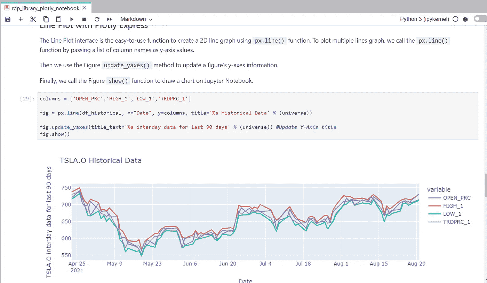

# 如何在 Docker 上用 Jupyter 设置和运行 Python 数据科学开发环境

> 原文：<https://medium.com/codex/how-to-set-up-and-run-python-data-science-development-environment-with-jupyter-on-docker-17e04e11d6c?source=collection_archive---------5----------------------->

# 介绍

**最后更新时间:2021 年 9 月**

关于[路孚特开发者社区](https://developers.refinitiv.com/)的原文可从[这里](https://developers.refinitiv.com/en/article-catalog/article/how-to-set-up-and-run-r-data-science-development-environment-wit)获得。

数据科学家和金融编码人员需要与各种数据科学/金融开发工具进行交互，例如 [Anaconda](https://www.anaconda.com/) (或 [Miniconda](https://docs.conda.io/en/latest/miniconda.html) ) Python 分发平台、 [Python 编程语言](https://www.python.org/)、 [R 编程语言](https://www.r-project.org/)、 [Matplotlib 库](https://matplotlib.org/)、 [Pandas 库](https://pandas.pydata.org/)、 [Jupyter](https://jupyter.org/) 应用程序等等。

作为数据开发人员，最难的部分之一是设置这些工具。您需要按照正确的顺序安装大量软件和库，以设置您的数据科学开发环境。示例步骤如下:

1.  安装 Python 或 Anaconda/Miniconda
2.  创建新的虚拟环境(不建议将程序安装到您的基础环境中)
3.  安装 Jupyter
4.  安装 Matplotlib、Pandas、Plotly、Bokeh 等数据科学库。
5.  如果您正在使用 R，安装 R 和它的库
6.  如果你正在使用 Julia，安装 Julia 和它的库
7.  …诸如此类。

如果您需要与您的同行共享您的代码/项目，在您的 collogues 环境中复制上述步骤的任务也是非常复杂的。

好消息是，有了码头工人集装箱化平台，你可以减少搭建工作台的工作量。你可能认为 Docker 只是为开发人员或核心开发人员准备的，但是 [Jupyter Docker Stacks](https://jupyter-docker-stacks.readthedocs.io/en/latest/index.html) 简化了如何用几个命令创建一个带有数据科学/财务库的现成 Jupyter 应用程序。


本文是该系列的第一部分，演示了如何使用 Docker 设置 Jupyter 笔记本环境，以便在不安装上述步骤的情况下使用和显示来自路孚特数据平台的财务数据。这篇文章介绍了使用 Python 编程语言的 Jupyter。如果你用的是 R，请看[第二篇](https://wasin-waeosri.medium.com/how-to-set-up-and-run-r-data-science-development-environment-with-jupyter-on-docker-93ba6884ef82)。

# Jupyter Docker 堆栈简介

[Jupyter Docker Stacks](https://jupyter-docker-stacks.readthedocs.io/en/latest/index.html) 是一组准备运行的 Docker 映像，包含 Jupyter 应用程序和交互式计算工具，并预装了内置的科学、数学和数据分析库。使用 Jupyter Docker 堆栈，设置环境部分被简化为以下步骤:

1.  [安装 Docker](https://docs.docker.com/get-docker/) ，注册 [DockerHub](https://hub.docker.com/) 网站(免费)。
2.  运行命令，根据映像类型提取包含 Jupyter 和预安装软件包的映像。
3.  处理您的笔记本文件
4.  如果您需要未随映像预安装的其他库，您可以使用 docker 文件创建您的映像来安装这些库。

Docker 还通过让您的同事轻松复制相同的环境来帮助团队共享开发环境。您可以与您的同事共享笔记本、docker 文件、依赖列表文件，然后他们只需运行一两个命令就可以运行相同的环境。

Jupyter Docker 堆栈根据开发人员的需求为他们提供各种图像，例如:

*   [Jupyter/scipy-Notebook](https://jupyter-docker-stacks.readthedocs.io/en/latest/using/selecting.html#jupyter-scipy-notebook):Jupyter Notebook/JupyterLab 与 [conda](https://github.com/conda/conda) / [mamba](https://github.com/mamba-org/mamba) 、 [ipywidgets](https://ipywidgets.readthedocs.io/en/stable/) 以及来自科学 Python 生态系统的热门包( [Pandas](https://pandas.pydata.org/) 、 [Matplotlib](https://matplotlib.org/) 、 [Seaborn](https://seaborn.pydata.org/) 、 [Requests](https://docs.python-requests.org/en/master/) 等。)
*   [Jupyter/R-Notebook](https://jupyter-docker-stacks.readthedocs.io/en/latest/using/selecting.html#jupyter-r-notebook):Jupyter Notebook/JupyterLab wit R 解释器，IRKernel 和 [devtools](https://cran.r-project.org/web/packages/devtools/index.html) 。
*   [jupyter/data science-notebook](https://jupyter-docker-stacks.readthedocs.io/en/latest/using/selecting.html#jupyter-datascience-notebook):jupyter/scipy-notebook*中的所有内容*和 *jupyter/r-notebook* 图片均有 Julia 支持。
*   [jupyter/tensor flow-notebook](https://jupyter-docker-stacks.readthedocs.io/en/latest/using/selecting.html#jupyter-tensorflow-notebook):*jupyter/scipy-notebook*中的一切都带有 [TensorFlow](https://www.tensorflow.org/) 的图像。

请在[选择图像](https://jupyter-docker-stacks.readthedocs.io/en/latest/using/selecting.html#selecting-an-image)页面上查看所有图像类型的更多详细信息。

# 运行 Jupyter Docker Scipy-笔记本映像

您可以运行以下命令来提取 jupyter/scipy-notebook 映像(标签 [*70178b8e48d7*](https://hub.docker.com/r/jupyter/scipy-notebook/tags?page=1&ordering=last_updated&name=70178b8e48d7) )并在您的机器上启动一个运行 Jupyter Notebook 服务器的容器。

```
docker run -p 8888:8888 --name notebook -v <your working directory>:/home/jovyan/work -e JUPYTER_ENABLE_LAB=yes --env-file .env -it jupyter/scipy-notebook:70178b8e48d7
```

上述命令设置以下容器的选项:

*   `-p 8888:8888`:暴露主机端口 8888 上的服务器
*   `-v <your working directory>:/home/jovyan/work`:将主机上的工作目录挂载为容器中的/home/jovyan/work 文件夹，保存主机和容器之间的文件。
*   `-e JUPYTER_ENABLE_LAB=yes`:运行 JupyterLab，而不是默认的经典 Jupyter 笔记本。
*   `--name notebook`:定义一个容器名为*笔记本*
*   `-it`:运行容器时，启用伪 TTY 交互模式
*   `--env-file .env`:将`.env`文件传递给容器。

*注*:

*   当您移除容器时，Docker 会销毁容器及其数据，因此您总是需要`-v`选项。
*   容器的默认笔记本用户名总是 **jovyan** (但是你可以把它改成别的)。

笔记本服务器 URL 信息的运行结果如下。


您可以通过在浏览器中打开笔记本服务器 URL 来访问 JupyterLab 应用程序。从 */home/jovyan/* 地点开始。请注意，只有*工作*文件夹中的笔记本和文件才能保存到主机(`<your working directory>`文件夹)。


jupyter/scipy-notebook 映像为您内置了有用的 Python 库，如 [requests](https://docs.python-requests.org/en/master/) ，Matplotlib，Pandas， [NumPy](https://numpy.org/) 等。


下次启动容器时，`<your working directory>`文件夹中的文件将在 JupyterLab 应用程序中可用，因此您可以像在普通的 JupyterLab/Anaconda 环境中一样使用您的文件。

要停止集装箱，只需按下 *Ctrl+c* 键退出集装箱。

或者，你可以运行`docker stop <container name>`停止集装箱，然后`docker rm <container name>`命令移走集装箱。

```
docker stop notebook
...
docker rm notebook
```

# 从 RDP API 请求 ESG 数据

jupyter/scipy-notebook 映像适用于使用路孚特数据平台 API(RDP API)内容构建笔记本或仪表板。您可以使用 HTTP 库从 RDP API 请求数据，执行数据分析，然后使用内置的 Python 库绘制图表。

## 什么是路孚特数据平台(RDP)API？

[路孚特数据平台(RDP)API](https://developers.refinitiv.com/en/api-catalog/refinitiv-data-platform/refinitiv-data-platform-apis)通过易于使用的基于网络的 API 为开发者提供各种路孚特数据和内容。

RDP API 使开发人员能够无缝、全面地访问所有路孚特内容，如历史定价、环境、社会和治理(ESG)、新闻、研究等，并与他们的内容混合，通过单一界面丰富、集成和分发数据，随时随地提供给他们需要的地方。RDP API 交付机制如下:

*   请求—响应:RESTful web 服务(HTTP GET、POST、PUT 或 DELETE)
*   警报:传递是一种接收订阅的异步更新(警报)的机制。
*   批量:交付大量有效负载，如整个场馆的日终定价数据。
*   流式传输:实时传递消息。

这个示例项目只关注请求-响应:RESTful web 服务交付方法。

有关路孚特数据平台的更多详细信息，请参见以下 API 资源:

*   [快速启动](https://developers.refinitiv.com/en/api-catalog/refinitiv-data-platform/refinitiv-data-platform-apis/quick-start)页面。
*   [教程](https://developers.refinitiv.com/en/api-catalog/refinitiv-data-platform/refinitiv-data-platform-apis/tutorials)页面。
*   [RDP API:请求-响应 API 简介](https://developers.refinitiv.com/en/api-catalog/refinitiv-data-platform/refinitiv-data-platform-apis/tutorials#introduction-to-the-request-response-api)页面。
*   [RDP API:授权——关于令牌的一切](https://developers.refinitiv.com/en/api-catalog/refinitiv-data-platform/refinitiv-data-platform-apis/tutorials#authorization-all-about-tokens)页面。

这个场景的示例笔记本是位于[GitHub repository/python/notebook](https://github.com/Refinitiv-API-Samples/Article.RDP.RDPLibrary.Python.R.JupyterDocker/tree/main/python/notebook)文件夹中的 *rdp_apis_notebook.ipynb* 示例笔记本文件。要运行这个*RDP _ APIs _ notebook . ipynb*示例笔记本，您只需创建一个*。env* 文件，然后运行 jupyter/scipy-notebook 映像，在 */python/* 文件夹中使用以下命令启动 jupyter 服务器。

```
docker run -p 8888:8888 --name notebook -v <project /python/notebook/ directory>:/home/jovyan/work -e JUPYTER_ENABLE_LAB=yes --env-file .env -it jupyter/scipy-notebook:70178b8e48d7
```

上面的命令启动了一个名为 *notebook* 的容器，并将 */python/notebook/* 文件夹挂载到容器的 */home/jovyan/work* 目录下。在网络浏览器中打开笔记本服务器 URL 后，*RDP _ APIs _ notebook . ipynb*示例笔记本将出现在 Jupyter 的 *work* 目录中。rdp_apis_notebook.ipynb 示例笔记本使用映像中的内置库向 rdp 身份验证服务进行身份验证，并向 RDP 环境、社会和治理(ESG)服务请求 ESG 数据以绘制图表。您可以浏览笔记本的每个步骤。您对该文件所做的所有操作都将被保存，以便以后运行。

请在[如何运行 Jupyter Docker Scipy-Notebook](#scipy_notebook_run)部分查看关于如何运行此示例笔记本的完整详细信息。

*rdp_apis_notebook.ipynb* 笔记本工作流程与我的[如何使用环境变量从源代码中分离您的凭证、秘密和配置](https://wasin-waeosri.medium.com/how-to-separate-your-credentials-secrets-and-configurations-from-your-source-code-with-70a9c8850edb)文章中的示例笔记本相同。它向 RDP API Auth 服务发送 HTTP 请求消息，以获取 RDP API 访问令牌。一旦收到访问令牌，它就会向 RDP API ESG 服务请求 ESG(环境、社会和治理)数据。


笔记本用预装的 [matplotlib.pyplot](https://matplotlib.org/stable/api/_as_gen/matplotlib.pyplot.html) 库绘制 ESG 数据图表。


# 如何更改容器用户

Jupyter Docker 堆栈映像是一个为您运行 Jupyter 服务器的 Linux 容器。Jupyter 服务器的默认笔记本用户( *nb_user* )始终是 **jovyan** ，主目录始终是 **home/jovyan** 。但是，您可以通过以下容器的选项，根据您的偏好将笔记本用户更改为其他人。

```
docker run -e CHOWN_HOME=yes --user root -e NB_USER=<User> <project /python/notebook/ directory>:/<User>/jovyan/work
```

带有*的示例是新的*用户。

```
docker run -p 8888:8888 --name notebook -e CHOWN_HOME=yes --user root -e NB_USER=wasinw -v C:\drive_d\Project\Code\notebook_docker\python\notebook:/home/wasinw/work -e JUPYTER_ENABLE_LAB=yes --env-file .env -it jupyter/scipy-notebook:70178b8e48d7
```

现在笔记本用户是 *wasinw* 工作目录是 */home/wasinw/work* 文件夹。


请注意，这个示例项目使用 *jovyan* 作为默认的笔记本用户。

# 如何使用其他 Python 库

如果你使用的是没有 jupyter/scipy-notebook Docker 镜像的库，比如 [Plotly Python 库](https://plotly.com/python/)，你可以用 pip 和 conda/mamba 工具通过笔记本外壳直接安装它们。

pip 示例:

```
import sys!$sys.executable -m pip install plotly
```

conda 示例:

```
import sys!conda install --yes --prefix {sys.prefix} plotly
```

然而，这个解决方案将软件包安装到当前运行的 Jupyter 内核中，每次停止 Docker 容器时，这个内核总是被销毁。更好的解决方案是从包含所需库的 Jupyter Docker 栈创建一个新的 Docker 映像，然后从该映像生成的所有容器都可以使用这些库，而无需任何手动安装。

Jupyter Docker 栈允许开发者创建他们的 Docker 文件，其中包含通过 mamba、pip 和 conda 包管理工具安装 Python 依赖项的指令。请在子 Docker 映像页面中查看关于[使用 mamba 安装或 pip 安装的更多详细信息。](https://jupyter-docker-stacks.readthedocs.io/en/latest/using/recipes.html#using-mamba-install-or-pip-install-in-a-child-docker-image)

# 通过路孚特数据平台库和 Plotly 获取路孚特数据的示例

让我们用 Python 的[路孚特数据平台库](https://developers.refinitiv.com/en/api-catalog/refinitiv-data-platform/refinitiv-data-platform-libraries)(Python 的 RDP 库)和 Plotly 库来演示一下。

# 路孚特数据平台(RDP)图书馆介绍

路孚特提供了范围广泛的内容和数据，需要多种技术、交付机制、数据格式和多种 API 来访问每个内容。 [RDP 图书馆](https://developers.refinitiv.com/en/api-catalog/refinitiv-data-platform/refinitiv-data-platform-libraries)是一套易于使用的界面，提供对[路孚特数据平台(RDP)](https://developers.refinitiv.com/en/api-catalog/refinitiv-data-platform/refinitiv-data-platform-apis) 内提供的流和非流数据服务的统一访问。这些库简化了如何通过单个库以各种交付模式访问数据，如请求-响应、流、批量文件和队列。

有关 RDP 图书馆的更多详细信息，请参考以下文章和教程:

*   [开发者文章:探索我们的路孚特数据平台库第 1 部分](https://developers.refinitiv.com/article/discover-our-upcoming-refinitiv-data-platform-library-part-1)。
*   [开发者文章:探索我们的路孚特数据平台库第 2 部分](https://developers.refinitiv.com/en/article-catalog/article/discover-our-refinitiv-data-platform-library-part-2)。
*   [路孚特数据平台库文档:介绍页](https://developers.refinitiv.com/en/api-catalog/refinitiv-data-platform/refinitiv-data-platform-libraries/documentation)。

## 放弃

由于该示例项目已经在 Python 库的 alpha 版本 **1.0.0.a10** 上进行了测试，因此方法签名、数据格式等可能会发生变化。

首先在 */python/* 文件夹下创建一个`requirements.txt`文件，内容如下:

```
plotly==5.2.2
refinitiv-dataplatform==1.0.0a10
```

接下来，在 */python/* 文件夹中创建一个`Dockerfile`文件，内容如下:

```
# Start from a core stack versionFROM jupyter/scipy-notebook:70178b8e48d7
LABEL maintainer="Your name and email address"# Install from requirements.txt file
COPY --chown=${NB_UID}:${NB_GID} requirements.txt /tmp/
RUN pip install --quiet --no-cache-dir --requirement /tmp/requirements.txt && \
    fix-permissions "${CONDA_DIR}" && \
    fix-permissions "/home/${NB_USER}"ENV JUPYTER_ENABLE_LAB=yes
```

请注意，Dockerfile 设置了`ENV JUPYTER_ENABLE_LAB=yes`环境变量，因此所有从该图像生成的容器都将默认运行 JupyterLab 应用程序。

然后用下面的命令构建一个 Docker 镜像名 *jupyter_rdp_plotly* :

```
docker build . -t jupyter_rdp_plotly
```

一旦 Docker 映像构建成功，您可以使用下面的命令启动一个运行 Jupyter Notebook 服务器的容器，该服务器包含您机器上的 *requirements.txt* 文件和 *jupyter/scipy-notebook* 中定义的所有 Python 库。

```
docker run -p 8888:8888 --name notebook -v <project /python/notebook/ directory>:/home/jovyan/work --env-file .env -it jupyter_rdp_plotly
```


请注意，所有凭证都已通过 Docker run `-env-file .env`选项传递给 Jupyter 服务器的环境变量，因此笔记本可以通过`os.getenv()`方法访问这些配置。开发人员不需要在笔记本源代码中保留凭证信息。

然后，您可以开始创建笔记本应用程序，使用 RDP 库 API 从路孚特获取内容，然后使用 Plotly 库绘制数据。请在[GitHub repository/python/notebook](https://github.com/Refinitiv-API-Samples/Article.RDP.RDPLibrary.Python.R.JupyterDocker/tree/main/python/notebook)文件夹中的*RDP _ library _ plotly _ notebook . ipynb*示例笔记本文件中查看更多详细信息。请参见[如何使用 Python 和 Plotly 的 RDP 库构建和运行 Jupyter Docker Scipy-Notebook customize 的映像](#scipy_notebook_build)部分中关于如何运行此示例笔记本的完整详细信息。

rdp _ library _ plot ly _ notebook . ipynb 工作流从初始化 RDP 会话开始。


然后笔记本使用 RDP 库功能层从 RDP 平台请求历史数据，并用[plot express](https://plotly.com/python/plotly-express/)对象将该历史数据绘制成多线图。



**注意**:你*要添加* `.env`(和`.env.example`)，Jupyter 检查点，缓存，配置等。文件添加到`.dockerignore`文件中，以避免将它们添加到公共 Docker Hub 存储库中。

# 如果我使用 Eikon 数据 API 会怎样

如果你正在使用 Eikon 数据 API (又名 DAPI)，Jupyter Docker 堆栈不适合你。路孚特工作空间/Eikon 应用程序集成了一个数据 API 代理，作为 Eikon 数据 API Python 库和 Eikon 数据平台之间的接口。因此，路孚特工作空间/Eikon 应用程序必须在运行 Eikon 数据 API 的同一台计算机上运行，而路孚特工作空间/Eikon 应用程序不支持 Docker。

但是，您可以从应用程序访问 [*代码本*](https://www.refinitiv.com/en/products/codebook) ，这是一个云托管的 Jupyter 笔记本开发环境，用于 Python 脚本编写。该代码本在路孚特工作空间和 Eikon 中作为应用程序提供(**无需安装！！**)，提供对已经预装在云上的路孚特 API 和其他流行 Python 库的访问。预安装库的列表可在码本的*库&*[*extensions . MD*](http://Extensions.md)文件中找到。

请参阅本文[中关于 CodeBook 应用程序的更多详细信息，在 Web 浏览器上的 CodeBook 中使用 Eikon 数据 API 或 Python 中的 RDP 库](https://developers.refinitiv.com/en/article-catalog/article/use-eikon-data-api-or-rdp-library-python-codebook-web-browser)。


# 演示先决条件

此示例需要下列依赖项软件和库。

1.  RDP 访问凭据。
2.  [Docker 桌面/引擎](https://docs.docker.com/get-docker/)版本 20.10.x
3.  [DockerHub](https://hub.docker.com/) 账号(免费订阅)。
4.  互联网连接。

请联系您的路孚特代表，以帮助您访问 RDP 帐户和服务。您可以在[路孚特数据平台入门文章](https://developers.refinitiv.com/en/article-catalog/article/getting-start-with-refinitiv-data-platform)的*用户 ID* 部分找到有关设置 RDP 访问凭据的更多详细信息:

# 如何运行示例

第一步是将示例项目文件夹解压缩或下载到您选择的目录中，然后根据您的偏好设置 Python 或 R Docker 环境。

**警告**:你*不应该*将`.env`文件共享给你的同事或者将它提交/推送到版本控制。您应该将该文件添加到`.gitignore`文件中，以避免意外地将其添加到版本控制或公共存储库中。

# 如何运行 Jupyter Docker Scipy-Notebook

首先，在命令提示符下打开项目文件夹，转到 *python* 子文件夹。然后在该文件夹中创建一个名为`.env`的文件，内容如下:

```
# RDP Core Credentials
RDP_USER=<Your RDP User>
RDP_PASSWORD=<Your RDP Password>
RDP_APP_KEY=<Your RDP App Key># RDP Core Endpoints
RDP_BASE_URL=https://api.refinitiv.com
RDP_AUTH_URL=/auth/oauth2/v1/token
RDP_ESG_URL=/data/environmental-social-governance/v2/views/scores-full
```

在命令提示符下运行下面的 [Docker run](https://docs.docker.com/engine/reference/run/) 命令来提取 Jupyter Docker Scipy-Notebook 映像并运行其容器。

```
docker run -p 8888:8888 --name notebook -v <project /python/notebook/ directory>:/home/jovyan/work -e JUPYTER_ENABLE_LAB=yes --env-file .env -it jupyter/scipy-notebook:70178b8e48d7
```

Jupyter Docker Scipy-Notebook 将运行 Jupyter 服务器并在控制台中打印服务器 URL，单击该 URL 在 web 浏览器中打开 JupyterLab 应用程序。

最后，打开工作文件夹，打开 *rdp_apis_notebook.ipynb* 示例笔记本文件，然后遍历每个笔记本单元格。


# 如何使用 Python 和 Plotly 的 RDP 库构建和运行 Jupyter Docker Scipy-Notebook 定制映像

首先，在命令提示符下打开项目文件夹，转到 *python* 子文件夹。然后在该文件夹中创建一个文件名为`.env`的文件，内容如下。如果您已经在上面的 Scipy-Notebook 运行一节中跳过了这一步，那么您可以跳过这一步。

```
# RDP Core CredentialsRDP_USER=<Your RDP User>
RDP_PASSWORD=<Your RDP Password>
RDP_APP_KEY=<Your RDP App Key>
```

运行下面的 [Docker build](https://docs.docker.com/engine/reference/commandline/build/) 命令来构建 Docker 镜像名称 *jupyter_rdp_plotly* :

```
docker build . -t jupyter_rdp_plotly
```

一旦 Docker 构建映像成功，运行以下命令来启动容器

```
docker run -p 8888:8888 --name notebook -v <project /python/notebook/ directory>:/home/jovyan/work --env-file .env -it jupyter_rdp_plotly
```

jupyter_rdp_plotly 容器将运行 jupyter 服务器并在控制台中打印服务器 URL，单击该 URL 在 web 浏览器中打开 JupyterLab 应用程序。

打开工作文件夹，打开*RDP _ library _ plot ly _ notebook . ipynb*示例笔记本文件，然后遍历每个笔记本单元格。


# 结论

Docker 是一个开放的容器化平台，用于开发、测试、部署和运行任何软件应用程序。Jupyter Docker 堆栈为数据科学家、财务编码人员及其团队提供了一个随时可用的一致开发环境。开发人员不需要设置他们的环境/工作台(Anaconda、虚拟环境、Jupyter 安装等。)手动操作，这对于他们来说是最复杂的任务。开发人员只需运行一个命令就可以从 Jupyter Docker 栈启动 Jupyter 笔记本服务器，并继续他们的工作。

Jupyter Docker 栈已经包含了一些针对各种需求(Python、R、机器学习等等)的数据科学/金融开发的库。如果开发人员需要额外的库，Jupyter Docker Stacks 允许开发人员创建他们的 Docker 文件，并提供安装这些依赖项的指令。从定制映像生成的所有容器都可以使用这些库，而无需任何手动安装。

# 参考

您可以从以下资源中找到有关路孚特数据平台库、Plotly、Jupyter Docker 堆栈以及该笔记本相关技术的更多详细信息:

*   [路孚特数据平台(RDP)图书馆](https://developers.refinitiv.com/en/api-catalog/refinitiv-data-platform/refinitiv-data-platform-libraries)在[路孚特开发者社区](https://developers.refinitiv.com/)网站上。
*   [RDP 图书馆快速入门指南页面](https://developers.refinitiv.com/en/api-catalog/refinitiv-data-platform/refinitiv-data-platform-libraries/quick-start)。
*   [RDP 图书馆教程页面](https://developers.refinitiv.com/en/api-catalog/refinitiv-data-platform/refinitiv-data-platform-libraries/tutorials)。
*   [探索我们的路孚特数据平台库(第一部分)](https://developers.refinitiv.com/en/article-catalog/article/discover-our-refinitiv-data-platform-library-part-1)。
*   [探索我们的路孚特数据平台库(第二部分)](https://developers.refinitiv.com/en/article-catalog/article/discover-our-refinitiv-data-platform-library-part-2)。
*   [剧情官方页面](https://plotly.com/)。
*   [Plotly Python 页面](https://plotly.com/python/)。
*   [剧情直通车页面](https://plotly.com/python/plotly-express/)
*   [Plotly 图形对象页面](https://plotly.com/python/graph-objects/)
*   [Jupyter Docker Stacks 页面](https://jupyter-docker-stacks.readthedocs.io/en/latest/index.html)
*   DockerHub 网站上的 Jupyter Docker 栈。
*   [如何在 Docker 上用 Jupyter 建立并运行 R 数据科学开发环境](https://wasin-waeosri.medium.com/how-to-set-up-and-run-r-data-science-development-environment-with-jupyter-on-docker-93ba6884ef82)

有关路孚特数据平台或路孚特数据平台库的任何问题，请使用[开发者社区 Q & A 页面](https://community.developers.refinitiv.com/)上的以下论坛。

*   RDP 原料药论坛。
*   [路孚特数据平台图书馆论坛](https://community.developers.refinitiv.com/spaces/321/refinitiv-data-platform-libraries.html)。

# 开源代码库

[https://github.com/Refinitiv-API-Samples/Article。RDP.RDPLibrary.Python.R.JupyterDocker(T1)](https://github.com/Refinitiv-API-Samples/Article.RDP.RDPLibrary.Python.R.JupyterDocker)