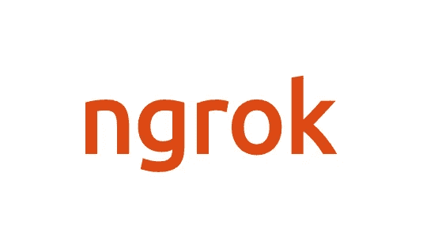

# 如何设置和排除 Ngrok (Mac)故障

> 原文：<https://medium.com/codex/how-to-set-up-and-troubleshoot-ngrok-mac-89a979108010?source=collection_archive---------0----------------------->

Ngrok 是一个易于使用的工具，它允许您在本地机器上创建一个安全的隧道以及一个公共 URL。您可以使用它来测试您的本地项目，或者与客户或队友共享您的工作以供审阅。您可以设置 HTTP 或 HTTPS。本文介绍了几种安装 ngrok 的简单方法，以及如果您无法让您的 web 应用程序与 ngrok 对话时应该做些什么。