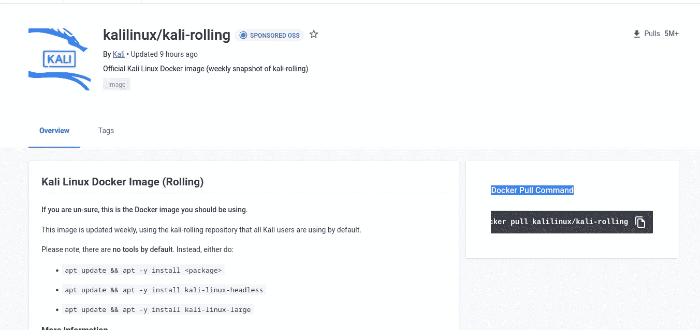

# 如何在 Docker 中设置 Kali 进行黑客攻击

> 原文：<https://medium.com/codex/how-to-set-up-kali-in-docker-for-hacking-c60360d622fc?source=collection_archive---------3----------------------->


# 为什么是码头工人

Docker 是一项帮助您运行容器化应用程序的神奇技术。令 docker 难以置信的是，与运行 Kali 的虚拟机相比，它只需要很少的 ram 和 CPU。Docker 不包含虚拟机管理程序，这就是它占用资源少且速度快的原因。


# 安装 Docker

## 设置存储库

1.  更新`apt`包索引并安装包，以允许`apt`通过 HTTPS 使用存储库:

```
$ sudo apt-get update

$ sudo apt-get install \
    ca-certificates \
    curl \
    gnupg \
    lsb-release
```

2.添加 Docker 官方 GPG 键:

```
$ sudo mkdir -p /etc/apt/keyrings
$ curl -fsSL https://download.docker.com/linux/ubuntu/gpg | sudo gpg --dearmor -o /etc/apt/keyrings/docker.gpg
```

3.使用以下命令设置存储库:

```
$ echo \
  "deb [arch=$(dpkg --print-architecture) signed-by=/etc/apt/keyrings/docker.gpg] https://download.docker.com/linux/ubuntu \
  $(lsb_release -cs) stable" | sudo tee /etc/apt/sources.list.d/docker.list > /dev/null
```

## 安装 Docker 引擎

1.  更新`apt`包索引:

运行`apt-get update`时收到 GPG 错误？
您的默认 [umask](https://en.wikipedia.org/wiki/Umask) 可能配置不正确，导致无法检测存储库公钥文件。在更新包索引之前，尝试授予 Docker 公钥文件的读取权限:

```
$ sudo chmod a+r /etc/apt/keyrings/docker.gpg
$ sudo apt-get update
```

1.  安装 Docker 引擎、containerd 和 Docker Compose。

*   最近的
*   特定版本

要安装最新版本，请运行:

```
$ sudo apt-get install docker-ce docker-ce-cli containerd.io docker-compose-plugin
```

要安装特定版本的 Docker 引擎，首先列出存储库中的可用版本:

```
# List the available versions:
    $ apt-cache madison docker-ce | awk '{ print $3 }'

    5:20.10.16~3-0~ubuntu-jammy
    5:20.10.15~3-0~ubuntu-jammy
    5:20.10.14~3-0~ubuntu-jammy
    5:20.10.13~3-0~ubuntu-jammy
```

选择所需版本并安装:

```
$ VERSION_STRING=5:20.10.13~3-0~ubuntu-jammy
    $ sudo apt-get install docker-ce=$VERSION_STRING docker-ce-cli=$VERSION_STRING containerd.io docker-compose-plugin
```

1.  通过运行`hello-world`映像，验证 Docker 引擎安装是否成功:

```
$ sudo docker run hello-world
```

该命令下载一个测试映像，并在容器中运行它。当容器运行时，它打印一条确认消息并退出。
[如果你使用的是其他操作系统，点击这里](https://docs.docker.com/)。

# 安装 Kali

现在安装了 docker 之后，就该在 docker 上安装 Kali 了。你可以访问官方的 [Kali 页面](https://www.kali.org/get-kali/)，导航到容器部分，点击 docker。或者你可以直接访问他们的 [docker 页面](https://hub.docker.com/u/kalilinux/)。在这里，您可以选择他们最新的滚动版本，并复制和运行他们的 Docker Pull 命令。



运行后，您将看到:


第一个存储库是我们现在已经下载的，其余的是我使用的其他图像。

# 设置 Kali


要将图像作为容器运行，请运行。图像 ID 可能因您而异，因此请根据需要进行更改:-

```
sudo docker run -it 3629dd971a7e  /bin/bash
```

之后，您需要更新存储库:

```
apt update
```

现在您的机器上有一个 Kali Linux，运行在 docker 中。

# 为行业安装工具


起初，只有运行系统所必需的软件包，没有黑客工具(也没有 neofetch，我是在更新了存储库之后安装的)。安装所有工具运行:-

```
apt update && apt -y install kali-linux-headless
apt update && apt -y install kali-linux-large
```

或者，如果您只想要几个工具，那么您必须手动一个接一个地安装它们

```
apt update && apt -y install <package>
```

我将来会写一篇关于 docker 的文章，所以请关注我以获得通知。

> 如果你喜欢这个博客，请不要忘记鼓掌。如果你想了解更多关于隐私、安全、技术和 Linux 的知识，可以考虑关注我。另外，任何我觉得有趣和有价值的东西。[跟着我骑乳齿象](https://fosstodon.org/@prinux)