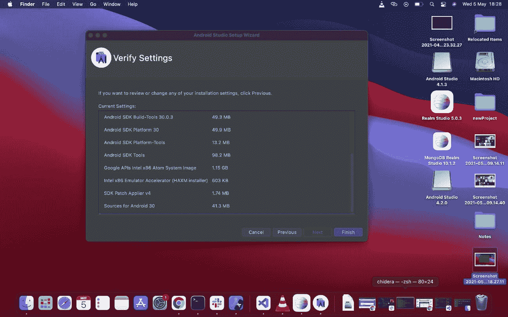

# 如何在 Mac OS 上设置 React Native

> 原文：<https://medium.com/codex/how-to-set-up-react-native-on-mac-os-3fef8a467df1?source=collection_archive---------10----------------------->


如果你需要为 iOS 和 Android 开发一个应用程序， [React Native](https://reactnative.dev/) 是最好的工具。

所以你有了一台新的 MacOS，现在你想在你的新机器上设置 [React Native](https://reactnative.dev/) 。本指南将带你一路直奔主题。没有噱头。

> *如果你使用 Linux 操作系统，我在这里为你写了这个*[](/learnfactory-nigeria/install-react-native-cli-and-run-your-projects-on-your-android-phone-27749ac871ec)
> 
> *****附言:*** *确保你有强大的网络连接和大量的数据哈哈***

# **一般**

**第一件事是确保你已经安装了[自制软件](https://brew.sh/)。打开您的终端，键入以下内容:**

```
**$ brew --version**
```

**如果你得到**

```
**zsh: command not found: brew**
```

**那就说明你没有安装。**

**安装自制软件:**

```
**/bin/bash -c "$(curl -fsSL [https://raw.githubusercontent.com/Homebrew/install/HEAD/install.sh](https://raw.githubusercontent.com/Homebrew/install/HEAD/install.sh))"**
```

**它将提示输入 sudo 密码(您的 MAC/笔记本电脑密码)，输入密码继续。**

**那你也应该看看这个**

```
**...
==> The Xcode Command Line Tools will be installed.Press RETURN to continue or any other key to abort**
```

**只需按回车键并继续**

**安装后，键入以下命令检查您的 brew 版本**

```
**$ brew --version**
```

**成功的安装应该输出**

```
**$ Homebrew 3.1.3
Homebrew/homebrew-core (git revision 036b0409ce; last commit 2021-04-27)**
```

**接下来我们必须安装[节点](https://nodejs.org/en/)。我更喜欢通过 [nvm(节点版本管理器)](https://github.com/nvm-sh/nvm)安装 node。有了 nvm，我可以随时安装和使用任何版本的 node。：**

# **安装 nvm**

**在终端上运行这个**

```
**$ curl -o- [https://raw.githubusercontent.com/nvm-sh/nvm/v0.35.3/install.sh](https://raw.githubusercontent.com/nvm-sh/nvm/v0.35.3/install.sh) | zsh**
```

**或者这个，如果你用的是`bash`**

```
**$ curl -o- [https://raw.githubusercontent.com/nvm-sh/nvm/v0.35.3/install.sh](https://raw.githubusercontent.com/nvm-sh/nvm/v0.35.3/install.sh) | bashOnce completed, close your terminal, reopen it and type:**
```

**完成后，关闭终端，重新打开并键入:**

```
**$ nvm ls**
```

**如果您得到这个错误**

```
**....
 Profile not found. Tried ~/.bashrc, ~/.bash_profile, ~/.zshrc, and ~/.profile.
...Then do this**
```

**那就这样做**

```
**$ touch ~/.bash_profile**
```

**再次关闭终端，重新打开并键入:**

```
**$ nvm ls**
```

**如果你得到了错误**

```
**zsh: command nvm not found**
```

**然后键入以下内容:**

```
**$ source ~/.nvm/nvm.sh**
```

**这应该能解决问题。**

**再次运行这个**

```
**nvm ls**
```

**现在应该会输出类似这样的内容**

```
**N/A
iojs -> N/A (default)
node -> stable (-> N/A) (default)
unstable -> N/A (default)
nvm_list_aliases:36: no matches found: /Users/chidera/.nvm/alias/lts/***
```

**这表明它已经成功安装**

# **通过 nvm 安装节点**

**要查看可安装节点版本的列表，请键入以下内容**

```
**nvm ls-remote**
```

**它应该输出**

```
**...
       v14.16.1   (Latest LTS: Fermium)
        v15.0.0
        v15.0.1
        v15.1.0
...**
```

**在撰写本文的时候，`v14.16.1 is the Latest stable version`所以我们安装了它**

```
**$ nvm install 14.16.1**
```

**完成后，我们像这样使用它:**

```
**nvm use 14.16.1**
```

**让我们确认安装的节点版本**

```
**node --version**
```

**哪些输出**

```
**14.16.1**
```

**因为 npm 附带了 node，所以我们也检查它的安装版本**

```
**npm --version**
```

**哪些输出**

```
**6.14.12**
```

## **安装纱线**

**这不是强制性的，因为你可以用`npm`来达到同样的目的，然而，我个人只是喜欢用纱线。**

```
**$ npm install --global yarn**
```

## **巡夜者**

**Watchman 是监视特定的文件夹或文件，如果它们被更改，它可以触发一些操作。**

**安装守夜人**

```
**$ brew update 
$ brew install watchman**
```

**安装后，通过以下方式确认 watchman**

```
**$ watchman --version**
```

# **ios**

# **Xcode**

**通过 [Mac App Store](https://apps.apple.com/us/app/xcode/id497799835?mt=12) 安装超过 10GB+ XCode。当页面打开时，点击“在 Mac App Store 中查看”或在随后的弹出窗口中点击“打开 App Store”。安装 Xcode 也会安装 iOS 模拟器和所有必要的工具来构建您的 iOS 应用程序。**

***免责声明*:在我写这篇文章的时候，我安装了`xcode 12.5`，它有问题，这让我降级到`xcode 12.4`。如果你遇到这样的问题，你的 ios 项目就不会建立，请看看你是否能降级到`xcode 12.4`。或者直接下载`xcode 12.4`。按照此[链接](https://xcodereleases.com)获取所需的`12.4`版本**

# **配置命令行工具**

**要在安装 xcode 后配置命令行工具，**

*   **执行/打开 xcode，然后**
*   **从 Mac 左上角的 xcode 菜单中，点击`Xcode -> Preferences`。**
*   **一旦进入，你会看到一个标签排列的菜单列表，点击“位置”。**

**一旦进入`Locations`，你会看到`Command Line Tools`，点击那里的输入并选择最近的，我的是`Xcode 12.5 (12E262)`。出现提示时输入您的密码。**

> ***如果你安装了* `*xcode 12.4*` *，你应该会看到* `*Xcode 12.4 (...)*` *。***

**Cocoapods 是 iOS 开发上的依赖管理器。安装它与**

```
**$ sudo gem install cocoapods**
```

**安装后，检查您的 pod 版本**

```
**$ pod --version**
```

****iOS 安装到此为止，我们来确认一下它的工作情况。****

# **React 本机命令行界面**

**建议在运行时使用`npx`访问当前版本，而不是全局安装和管理 React Native CLI 的特定版本。**

**让我们创建一个新的 React 本地项目。首先`cd`进入你选择的任何目录。我将使用桌面**

```
**$ cd Desktop**
```

**然后运行以下命令**

```
**$ npx react-native init newProject$ npx pod-install**
```

**最后**

```
**$ yarn ios**
```

**或者**

```
**$ react-native run-ios**
```

**如果一切顺利，您的 react 本地项目应该出现在模拟器中**

# **机器人**

**使用 Homebrew 安装 Java 开发工具包(JDK ),命令如下:**

```
**$ brew install --cask adoptopenjdk/openjdk/adoptopenjdk8**
```

**安装后，运行以下命令进行确认**

```
**$ java -version**
```

**这应该输出**

```
**openjdk version "1.8.0_292"
OpenJDK Runtime Environment (AdoptOpenJDK)(build 1.8.0_292-b10)
OpenJDK 64-Bit Server VM (AdoptOpenJDK)(build 25.292-b10, mixed mode)**
```

**Java 编译器随 JDK 一起安装，请确认**

```
**$ javac -version**
```

**这表明**

```
**javac 1.8.0_292**
```

## **安卓工作室**

**[Android Studio](https://developer.android.com/studio) 用于在 Mac 上开发 Android 应用。点击此[链接](https://developer.android.com/studio)下载。**

# **配置 Android Studio**

**下载完成后，接下来的事情就是配置 Android studio。双击下载文件夹中的 Android studio 文件，安装完成后，你会看到一个包含 Android studio 和应用程序文件夹的屏幕，将 Android studio 拖到应用程序文件夹中。**

****

**现在转到应用程序并执行它。**

**它打开时有两个选项:**

*   **配置或安装文件夹**
*   **不要导入设置**

**如果您以前没有安装 Android studio 或不打算保留任何以前的设置，请选择“不要导入设置”,然后单击“确定”**

****

**这应该会将您带到欢迎页面**

****

**点击“下一步”进入下一页**

****

**选择`Custom`并点击`Next`**

****

**在这个设置路径的新页面中，单击 next 并在下一个页面中选择 preferred theme。我选择了德拉库拉黑暗主题**

****

**下一个屏幕是 Android SDK 安装组件屏幕。**

**确保选择了`Performance (Intel ® HAXM)`选项和`Android Virtual Device option`，然后点击下一步按钮。**

****

**这将带您进入下一个屏幕，单击 next 而不做任何更改，**

****

**最后一个屏幕显示将要进行的下载的摘要，点击`Finish`开始下载**

****

**下载完成后，点击下一屏幕上的`Finish`**

****

# **Android SDK 配置**

**下一阶段是 SDK 配置。在下一个屏幕上，点击右下角的`Configure`并选择`SDK Manager`**

****

***-SDK 管理器也可以在 Android Studio“首选项”对话框中找到，在外观&行为→系统设置→ Android SDK 下。***

**在下一个屏幕上，点击右下角的`Show Package Details`**

****

**然后选择以下选项，确保您在`SDK Platforms`选项卡上:**

*   **Android SDK 平台 29**
*   **英特尔 x86 Atom_64 系统映像`or`谷歌 API 英特尔 x86 Atom 系统映像**

****

**仍在同一个屏幕上，选择`SDK Tools`选项卡并勾选`"Show Package Details"`旁边的框。寻找并展开`"Android SDK Build-Tools"`条目，然后确保选择`29.0.2`并检查`"Android SDK Command-line Tools (latest)"`。**

********

**最后，单击“确定”,然后在下一个摘要页面上单击“确定”,同时接受“许可协议条款和条件”,然后单击“下一步”下载并安装 Android SDK 和相关构建工具。**

**下载和解压缩完成后，点击`Finish`**

# **配置 ANDROID_HOME 环境变量**

**我们要做的是打开`$HOME/.zshrc`添加环境变量。如果你用的是`bash`，应该是`$HOME/.bash_profile`或者`$HOME/.bashrc`。要打开`$HOME/.zshrc`或`$HOME/.bashrc`，请转到终端并键入**

```
**$ vim ~/.zshrc**
```

**如果你用的是`bash`，应该是**

```
**$ vim ~/.bashrc**
```

**这将打开 vim 页面**

```
**export NVM_DIR="/Users/chidera/.nvm"
[ -s "$NVM_DIR/nvm.sh" ] && . "$NVM_DIR/nvm.sh"  # This loads nvm
~
~
~
~    
"~/.zshrc" 3L, 104B**
```

**从你的键盘，点击`i`编辑`vim`，你应该得到这个**

```
**export NVM_DIR="/Users/chidera/.nvm"
[ -s "$NVM_DIR/nvm.sh" ] && . "$NVM_DIR/nvm.sh"  # This loads nvm
~
~
~
~    
-- INSERT --**
```

**将这段代码复制并粘贴到那里**

```
**export ANDROID_HOME=$HOME/Library/Android/sdk
export PATH=$PATH:$ANDROID_HOME/emulator
export PATH=$PATH:$ANDROID_HOME/tools
export PATH=$PATH:$ANDROID_HOME/tools/bin
export PATH=$PATH:$ANDROID_HOME/platform-tools**
```

**你应该得到这个**

```
**export NVM_DIR="/Users/chidera/.nvm"
[ -s "$NVM_DIR/nvm.sh" ] && . "$NVM_DIR/nvm.sh"  # This loads nvm
export ANDROID_HOME=$HOME/Library/Android/sdk
export PATH=$PATH:$ANDROID_HOME/emulator
export PATH=$PATH:$ANDROID_HOME/tools
export PATH=$PATH:$ANDROID_HOME/tools/bin
export PATH=$PATH:$ANDROID_HOME/platform-tools
~
~
~
~                                                                                    
-- INSERT --**
```

**完成后，按下`esc`键，然后按下`:wq` + `Enter`保存您的更改，这样就完成了。**

# **启动 React 本机应用程序**

**转到您初始化 React 本地应用程序的位置，并在其终端中运行**

```
**$ yarn android**
```

**或者**

```
**$ react-native run-android**
```

**给它一些时间来构建，如果成功的话，你应该可以让你的模拟器运行起来**

****

**您也可以从 ios 模拟器运行您的项目**

****

**恭喜你！！！您已经成功地在 MacBook 上设置了 React Native，以便同时运行 iOS 和 Android。**

> ***如果您喜欢这篇文章，请点赞、分享并留下您的评论。***

***最初发布于*[*https://dera . hash node . dev*](https://dera.hashnode.dev/how-to-set-up-react-native-on-mac-os)*。***