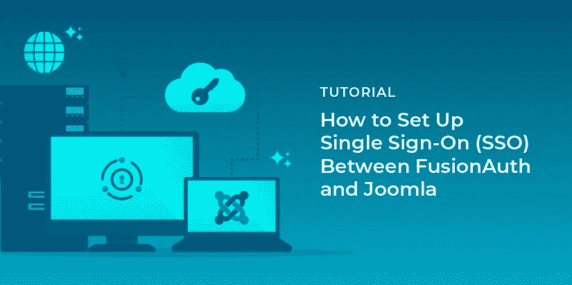

# 如何在 FusionAuth 和 Joomla 之间设置单点登录

> 原文：<https://medium.com/codex/how-to-set-up-single-sign-on-between-fusionauth-and-joomla-54fef310cf6?source=collection_archive---------13----------------------->

当您维护大量网站时，很难跟踪所有需要的管理员登录。更重要的是，如果你经常丢失密码，不得不重新设置密码，或者更糟糕的是，把密码记在某个地方，这可能会导致安全性的下降。