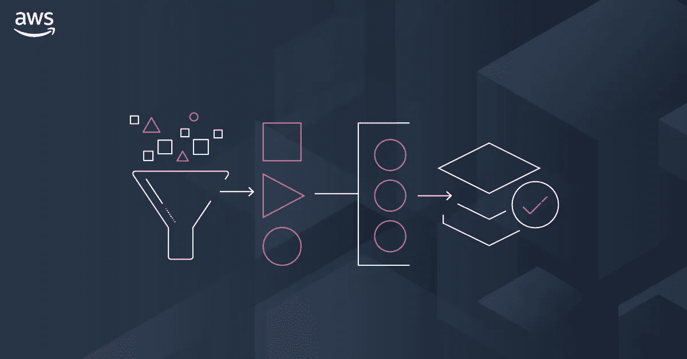
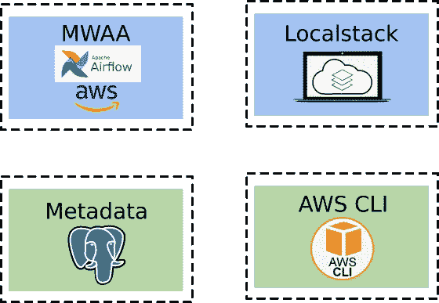
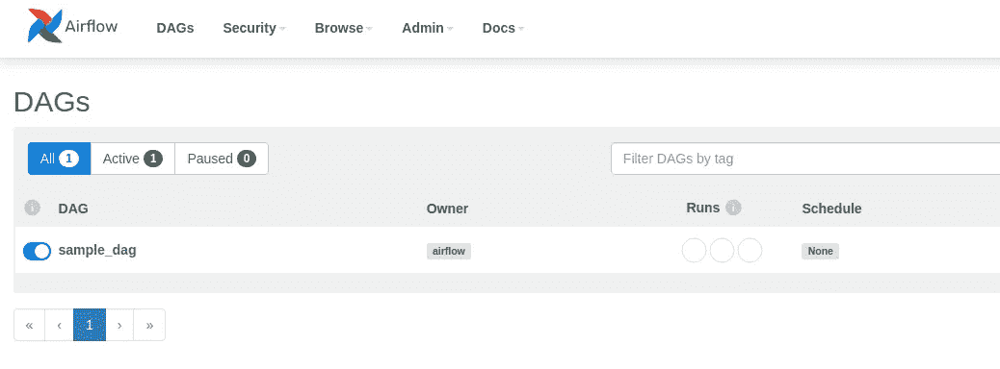
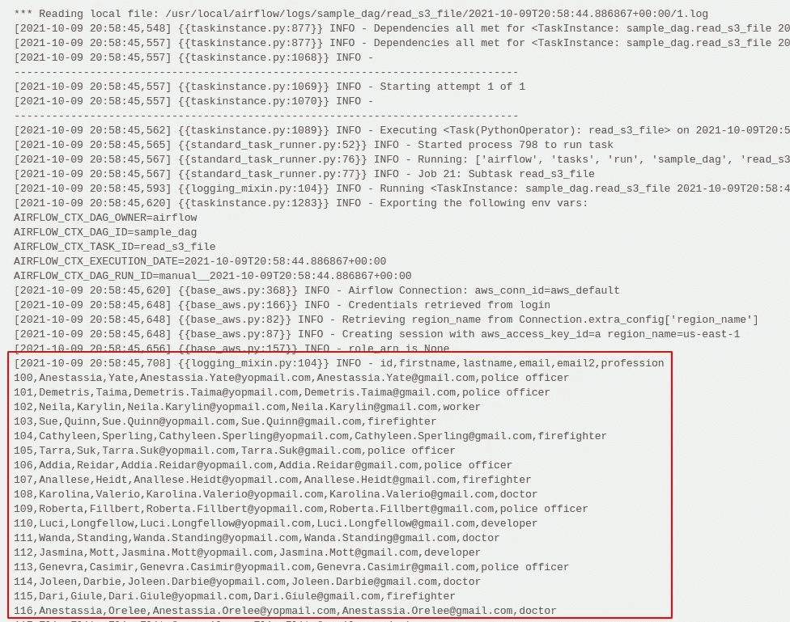

# 如何设置本地 MWAA 开发环境

> 原文：<https://medium.com/codex/how-to-setup-a-local-mwaa-development-environment-92e4e7557ecb?source=collection_archive---------0----------------------->

Apache Airflow 是一个开源工具，用于以编程方式创作、调度和监控工作流。它是数据工程师用于编排工作流或管道的最强大的平台之一。设置和管理这个工具以及底层基础设施需要相当大的努力。这就是亚马逊管理的 Apache Airflow (MWAA)工作流的亮点。MWAA 使得在云中大规模建立和操作端到端数据管道变得更加容易。有了 MWAA，许多管理和底层基础设施消失了，但这使得数据工程师很难在他们的本地机器上开发。本文将展示如何在本地复制一个 MWAA 环境，这样就可以轻松地进行开发活动，而不需要频繁地将代码和 Dag 推到 AWS S3 桶中。



# 先决条件:

*   Linux (64 位)
*   码头工人
*   docker-撰写

# 步骤 1:结构设置

为了模拟这个基础设施，我们将使用 docker-compose 构建四个不同的 docker 容器，如下所示。我们正在利用 [Locastack](https://hub.docker.com/r/localstack/localstack) docker 镜像，这是一个运行在单个容器中的云模拟器。我们正在利用亚马逊提供的本地 MWAA 码头图像，这是类似于 MWAA 生产图像。对于 MWAA 元数据的后端数据，我们使用公开可用的 [Postgres](https://hub.docker.com/_/postgres) docker 图像。最后，一个[容器化的 AWS CLI](https://hub.docker.com/r/mesosphere/aws-cli/) 初始化并设置 Localstack 容器中的任何服务。



在我们开始之前，让我们先回顾一下这个项目的文件夹结构。父文件夹`mwaa`包含四个文件夹-。aws、DAG、plugins 和 landing bucket，以及一个文件——docker-compose . yml。DAG 文件夹包含一个示例 DAG——sample _ DAG . py，我们将在最后执行它来演示我们的本地 MWAA 环境。其余文件夹用于支持 MWAA 配置设置。

```
mwaa
|__.aws
   |__config
   |__credentials
|__dags
   |__sample_dag.py
|__plugins
   |__plugins.zip
|__landing_bucket
   |__customer.csv
|__docker-compose.yml
```

# 步骤 2:定义 Localstack 服务

Localstack 是一个云服务模拟器，它提供了各种各样的服务，因此您可以完全在本地机器上运行 AWS 应用程序，而无需连接到实际的云提供商。在这个演示中，我们将只使用三个服务— S3、IAM 和 SecretsManager。你可以参考 Localstack 官方 [Github](https://github.com/localstack/localstack) 获得支持服务的完整列表。让我们开始创建一个`docker-compose.yml`文件，如下所示。我们正在公开端口 4566，这样我们就可以与 S3 和 SecretsManager 等服务进行交互。

```
version: "3"services:
  localstack:
    image: localstack/localstack:latest
    container_name: "localstack"
    ports:
      - "4566:4566"
    environment:
      - SERVICES=s3,iam,secretsmanager,ec2
      - DOCKER_HOST=unix:///var/run/docker.sock
      - DEFAULT_REGION=us-east-1
    volumes:
      - "/var/run/docker.sock:/var/run/docker.sock"
      - "/tmp/localstack:/tmp/localstack"
```

# 步骤 3:定义 Postgres 服务

MWAA 使用 Aurora PostgreSQL 数据库作为 Airflow 元数据库的后端，DAG 运行和任务实例存储在该数据库中。这个 Postgres 容器满足了本地模拟我们的 MWAA 环境的元数据库需求。让我们将下面的代码添加到`docker-compose.yml`文件中。

```
postgres:
      image: postgres:10-alpine
      environment:
          - POSTGRES_USER=airflow
          - POSTGRES_PASSWORD=airflow
          - POSTGRES_DB=airflow
      volumes:
          - "${PWD}/db-data:/var/lib/postgresql/data"
```

# 步骤 4:定义亚马逊本地 MWAA 服务

这个亚马逊本地 MWAA docker 映像允许您在部署到 MWAA 之前运行本地 Apache Airflow 环境来开发和测试 Dag、定制插件和依赖项。将以下代码添加到`docker-compose.yml`文件中。

```
local-runner:
      image: amazon/mwaa-local:2.0.2
      user: 1000:1000
      restart: always
      depends_on:
          - postgres
      environment:
          - LOAD_EX=n
          - EXECUTOR=Local
          - AIRFLOW_CONN_AWS_DEFAULT=aws://a:a@?host=[http://localstack:4566&region_name=us-east-1](http://localstack:4566&region_name=us-east-1)
          - AWS_DEFAULT_REGION=us-east-1
          - AWS_PROFILE=default
      volumes:
          - "${PWD}/dags:/usr/local/airflow/dags"
          - "${PWD}/plugins:/usr/local/airflow/plugins"
          - "${PWD}/.aws:/usr/local/airflow/.aws"
      ports:
          - "8080:8080"
      command: local-runner
      healthcheck:
          test: ["CMD-SHELL", "[ -f /usr/local/airflow/airflow-webserver.pid ]"]
          interval: 30s
          timeout: 30s
          retries: 3
```

# 步骤 5:定义 AWS CLI 服务

我们使用的是 mesosphere/aws-cli docker 映像，它包含 aws-cli 并允许我们通过发出 cli 命令在 Localstack 中轻松创建模拟资源。我们将本地`landing`文件夹从我们的主机映射到这个容器，因此我们可以将一个 CSV 文件推送到我们在这个容器中创建的 S3 桶`my-landing-bucket`。这是一个短命的容器，它将在完成创建一个 bucket 并将一个文件复制到 S3 bucket 之后很快终止。

```
aws-cli:
    image: mesosphere/aws-cli
    container_name: "aws-cli"
    volumes:
      - ./landing:/tmp/landing:ro
    environment:
      - AWS_ACCESS_KEY_ID=dummyaccess
      - AWS_SECRET_ACCESS_KEY=dummysecret
      - AWS_DEFAULT_REGION=us-east-1
    entrypoint: /bin/sh -c
    command: >
      "
        echo Waiting for localstack service start...;
        while ! nc -z localstack 4566;
        do
          sleep 1;
        done;     
        echo Connected!;

      aws s3api create-bucket --bucket my-landing-bucket --endpoint-url [http://localstack:4566](http://localstack:4566) aws s3 cp /tmp/landing s3://my-landing-bucket --recursive --endpoint-url [http://localstack:4566](http://localstack:4566)"
    depends_on:
      - localstack
```

# 步骤 6:创建用于测试的 DAG 和数据文件

这是一个示例 DAG 文件，展示了我们使用 S3 服务的 MWAA 工作环境。我们使用 PythonOperator 来执行一个`read_file`方法，该方法直接从 S3 桶中读取数据。使用下面的代码创建`sample_dag.py`并将其放在`dags`文件夹下。

```
from airflow import DAG
from airflow.operators.python_operator import PythonOperator
from airflow.hooks.S3_hook import S3Hook
from datetime import datetimedefault_args = {
    "owner": "airflow",
    "start_date": datetime(2021, 10, 1),
}def read_file():
    hook = S3Hook()
    file_content = hook.read_key(
        key="customer.csv", bucket_name="my-landing-bucket"
    )    
    print(file_content)with DAG("sample_dag", schedule_interval=None, catchup=False, default_args=default_args) as dag:t1 = PythonOperator(
        task_id='read_s3_file',
        python_callable=read_file
    )
```

让我们创建一个新文件 customer.csv，我们在 DAG 中使用它来读取数据。

```
id,firstname,lastname,email,email2,profession
100,Anestassia,Yate,Anestassia.Yate@opmail.com,Anestassia.Yate@gmail.com,police officer
101,Demetris,Taima,Demetris.Taima@opmail.com,Demetris.Taima@gmail.com,police officer
102,Neila,Karylin,Neila.Karylin@opmail.com,Neila.Karylin@gmail.comworker
....
```

# 步骤 7:为 localstack 创建一个凭证文件

在`.aws`文件夹下创建下面的`credentials`文件，这样我们的本地 MWAA 就可以使用它与 Localstack 资源进行交互。

```
[default]
aws_access_key_id = dummyaccess
aws_secret_access_key = dummysecret
```

# 步骤 8:部署本地 MWAA

如果一切都配置正确，您应该能够从`mwaa`目录执行下面的命令。如果您在启动 docker 容器时遇到任何问题，请检查您的配置文件。

```
docker-compose up -d
```

让我们通过执行以下命令来确认所有容器都已启动并运行:

```
docker ps
```

如果您看到所有三个容器都在运行，那么您已经在本地机器上成功地部署了您的 MWAA 环境。请注意，我们的第四个 aws-cli 容器可能不会出现在列表中，因为它在完成执行我们的`docker-compose.yml`文件中定义的 cli 命令后不久就终止了。现在，让我们通过执行示例 DAG 文件来验证它是否正常工作。导航到 [http://localhost:8080](http://localhost:8080) 的气流 UI，使用用户名`admin`和密码`test`登录。



如果运行成功，您应该检查任务的日志，并且应该看到来自 S3 存储桶的 CSV 文件的内容，如下所示。



如果您做到了这一步，那么您已经成功地在您的机器上部署了一个本地 MWAA 环境。恭喜你！

# 结论

在本文中，我解释了如何通过在本地机器上使用 docker 来快速建立 MWAA 开发环境。该设置将在工作流开发和测试阶段为您提供帮助。我希望这篇文章中的所有脚本可以帮助您作为一个起点，快速建立一个满足您需要的环境。希望这些逐步说明对你有用。请在下面留下你对这篇文章的评论。

如果您喜欢在本地机器上使用 Redis 和 Celery 构建分布式气流环境，可以阅读我的文章[如何使用 Redis 和 Celery 扩展 Apache air flow 2.0](/codex/how-to-scale-out-apache-airflow-2-0-with-redis-and-celery-3e668e003b5c)。