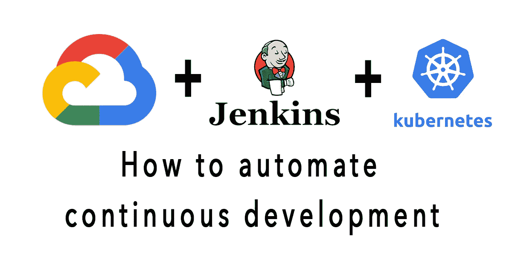
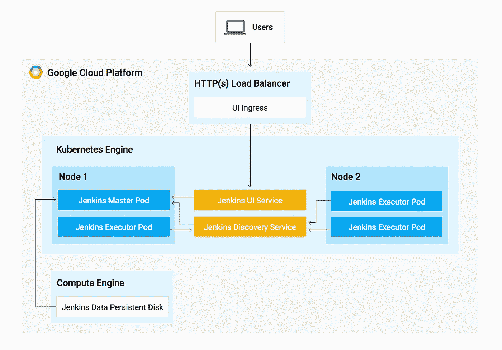

# 如何用 Jenkins 在 GCP 的 Kubernetes 上设置自动化服务器

> 原文：<https://medium.com/codex/how-to-setup-automation-server-on-kubernetes-in-gcp-c57ab66605bb?source=collection_archive---------3----------------------->

## [法典](http://medium.com/codex)

这是一个关于使用谷歌 Kubernetes 引擎的最佳实践的教程。

# 什么是 Kubernetes 发动机？