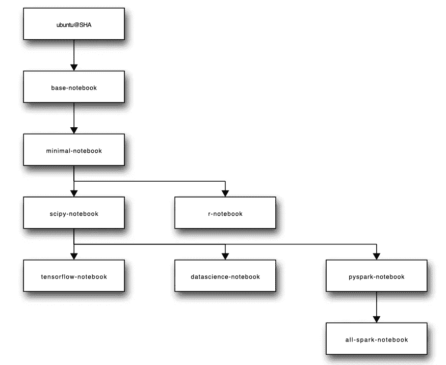
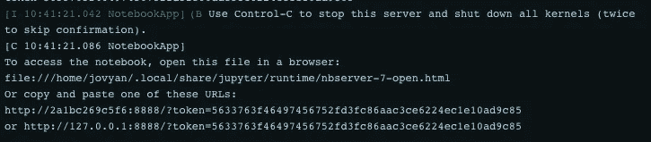
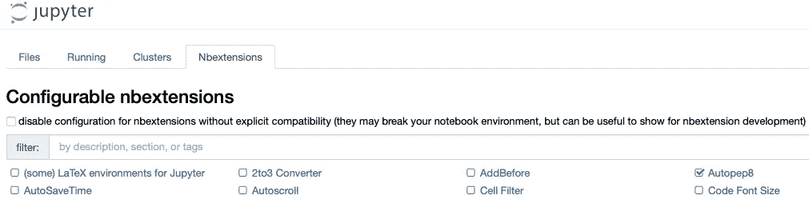

# 如何在 Mac 上使用 Docker 对 Jupyter 笔记本进行干净的设置

> 原文：<https://medium.com/codex/how-to-setup-jupyter-notebook-on-mac-b0c2e3c66e60?source=collection_archive---------1----------------------->

## [法典](http://medium.com/codex)

使用 Docker 在 3 分钟内轻松在 Mac 上安装 Jupyter 笔记本


由[粘土银行](https://unsplash.com/@claybanks?utm_source=medium&utm_medium=referral)在 [Unsplash](https://unsplash.com?utm_source=medium&utm_medium=referral) 上拍摄

如果您已经尝试在 Mac 上安装 Jupyter notebook，那么您很可能会遇到虚拟环境的问题或打算使用 Python 3 而不是默认 Python 2 的解决方法。

让我来解除你的忧虑，告诉你一个更简单的方法。

如果您愿意先快速设置好所有东西，请转到**摘要**部分，并按照那里的说明进行操作。对于那些想了解我们将要做什么并发现一些有效使用 Jupyter 的技巧的人来说——靠在你的椅子上继续阅读。一般来说，更好的做法是了解您在机器上运行的所有内容。你永远不知道陌生人想用你的 Mac 做什么(开个玩笑)。

# 码头工人

我知道我答应过帮你在 Mac 上设置 Jupyter book，但是我们需要从 Docker 开始，因为它是一个神奇的工具，可以帮你完成所有这些工作。你可以阅读[的“官方”定义](https://en.wikipedia.org/wiki/Docker_(software))，但我会尽量用通俗易懂的语言来表达。

Docker 在你的电脑上启动应用程序，而不需要把所有东西直接安装到你的系统上。它创建了一个虚拟环境，其中包含应用程序所需的所有包和依赖项。此外，使用 Docker，您可以控制将多少计算机资源分配给应用程序。

您需要理解两个主要概念:图像和容器。

一个**映像**是系统文件与所需语言、库和其他依赖项的组合，所有这些都放在一个文件中。可以从 [docker Hub](https://hub.docker.com) 下载各种 Docker 图片，类似于 GitHub，人们存储图片而不是代码。

**容器**是基于您指定的映像的运行环境。每个容器都有分配给它的资源:例如内存量、CPU 数量。您可以基于同一个映像创建几个同时运行的容器。

这意味着当你下载并运行一个图像时，你可以在运行环境中做任何你想做的事情。如果你搞砸了什么，你总是可以通过删除容器并运行新的来重新开始。这真的很方便，因为你的 Mac 保持干净。

你可以使用[指令](https://docs.docker.com/docker-for-mac/install/)将 Docker 应用安装到你的 Mac 上。

# 下载图像

安装了 Docker 之后，我们来到了最有趣的部分——选择符合您需求的 Jupyter 笔记本的图像。

有许多 Jupyter 映像，这取决于安装的 Python 库的种类以及 R 和/或 PySpark 的附加设置。你可以在官方网站上查看所有的[，但是为了方便起见，我在这里带来了一张对比图。](https://jupyter-docker-stacks.readthedocs.io/en/latest/using/selecting.html)



图由 [Jupyter](https://jupyter.org) 在 [Jupyter Docker 栈](https://jupyter-docker-stacks.readthedocs.io/en/latest/using/selecting.html)上(开源[许可](https://github.com/jupyter/docker-stacks/blob/master/LICENSE.md)使用)

图表上的每个后续图像都基于前一个图像。例如， *scipy-notebook* 映像包含来自 *minimal-notebook* 映像的所有内容，而后者又包含来自 *base-notebook* 的所有内容。如果您不知道选择哪一个——不要担心，您可以安装基础版本，然后在它上面安装所有需要的软件包。

我个人使用 *scipy-notebook* ，它包含了我需要的大部分基础数据科学库。它包含[达斯克](https://dask.org/)、[熊猫](https://pandas.pydata.org/)、 [numexpr](https://github.com/pydata/numexpr) 、 [matplotlib](https://matplotlib.org/) 、 [scipy](https://www.scipy.org/) 、 [seaborn](https://seaborn.pydata.org/) 、 [scikit-learn](http://scikit-learn.org/stable/) 、 [scikit-image](http://scikit-image.org/) 、 [sympy](http://www.sympy.org/en/index.html) 、 [cython](http://cython.org/) 、 [patsy](https://patsy.readthedocs.io/en/latest/) 、

我认为它包含了你可能需要的几乎所有东西。此外， *scipy-notebook* 图像包含用于交互式可视化的 [ipywidgets](https://ipywidgets.readthedocs.io/en/stable/) 和 [ipympl](https://github.com/matplotlib/jupyter-matplotlib) 以及用于可视化机器学习数据集的[facet](https://github.com/PAIR-code/facets)。

要下载映像，请启动 Docker 并在您的终端中运行以下命令:

`docker image pull jupyter/scipy-notebook`

如果您想尝试其他图像，不要忘记用您喜欢的图像名称替换`scipy-notebook`。它会将它的最新版本下载到您的 Docker 应用程序中，并出现在*图像*选项卡中。

# 发射容器

下载完映像之后——是时候启动容器了，可以用下面的命令来完成。

```
docker container run --name jupyter -p 8888:8888 -v <local_path>:/home/jovyan/ jupyter/scipy-notebook
```

让我们详细看看这个命令中写了什么:

`docker container run`不言自明。它从图像中创建一个容器。

`--name jupyter`为我们的容器提供一个名称。这样就可以不用一个很长的技术名称来指代了。

`-p 8888:8888`指明哪些端口将用于容器和系统之间的通信。由于 Jupyter 是一个基于 web 的应用程序，您需要告诉系统哪个端口将被分配给它。

`-v <local_path>:/home/jovyan/`定义应该将计算机中的哪个文件夹安装到容器中。通常，这是一个包含项目工作文件的文件夹。别忘了用你的路径替换`<local_path>`和。例如，我的桌面上有项目文件，我会使用`/Users/ann/Desktop/ds_project`。

之后，你应该在*容器* / *应用*标签中看到你的 Docker 容器在运行。

要找到 Jupyter 笔记本的 URL，点击容器，然后从 Docker 日志中复制 URL`Or copy and paste one of these URLs`:



作者截图

恭喜你！就是这样——你可以在你的 Mac 上享受 Jupyter 笔记本。

要安装额外的软件包，您可以通过在终端中运行以下命令进入容器:

`docker container exec -it jupyter bash`

当您在里面时，您可以运行通常的 pip 安装命令。

此外，在 Docker 应用程序中，在*设置* / *资源*选项卡中，您可以指定容器将使用的最大 CPU 和内存量。

# 奖金:生产力提示

有时人们会抱怨 Jupyter 笔记本缺乏功能，使用起来也不那么舒服。只有最基础的笔记本才是这样。但是你甚至增加了扩展的几率。完整的扩展列表可以在[这里](https://jupyter-contrib-nbextensions.readthedocs.io/en/latest/nbextensions.html)找到，我准备了一个我最常用的扩展的简要概述。

可以使用 docker 容器中启动的以下命令来安装扩展。

```
pip install jupyter_contrib_nbextensions && jupyter contrib nbextension install --user
```

安装后，您应该停止并再次启动容器，以便在 Jupyter 中看到一个带有扩展的新选项卡。



作者截图

如果删除，您的容器扩展也将被删除。

## 拼写检查器

拼写检查器检查您的减价单元格中的拼写。这非常有帮助，因为有时很难注意到错别字。您不需要安装额外的软件包来使它工作，只需在扩展选项卡中选中复选框。

## 隐藏输入

您想隐藏代码块以便只查看图书中的降价和结果吗？隐藏输入扩展将帮助您做到这一点，但是您需要在扩展选项卡中选中它的复选框。

## 内地

heartback 将启用一个代码自动完成菜单，就像在流行的 ide 中一样，比如 PyCharm，它提供了几乎相同的功能:你键入几个字符，得到一个包含所有可能的自动完成选项的下拉列表。就像以前的扩展一样——您需要在扩展选项卡中选中复选框。

## 目录(2)

该扩展基于 markdown 单元格中的标题为您的笔记本创建了一个目录，并允许您单击特定的项目以转到笔记本的这一部分。当您的笔记本变得如此之大，以至于您可以花几分钟来找到所需的分析部分时，它就派上了用场。

## 变量检查器

这个扩展收集所有已定义的变量，并在一个单独的浮动窗口中显示它们。当您想检查某个变量的值，但不想去某个地方打印它或搜索它已经被打印的地方时，它就变得很有用。

## Autopep8

名称本身就说明了问题:当你点击这个扩展按钮时，它会重新格式化/美化代码单元的内容。

# 摘要

要在 Mac 上安装和运行`scipy-notebook`版本的 Jupyter notebook，您应该:

1.  使用本指南中的[安装 Docker 应用程序](https://docs.docker.com/docker-for-mac/install/)
2.  用 Jupyter 笔记本
    下载图片`docker pull jupyter/scipy-notebook`
3.  启动容器，将`<local_path>`替换为项目文件夹
    `docker container run --name jupyter -p 8888:8888 -v <local_path>:/home/jovyan/ jupyter/scipy-notebook`的路径
4.  将 URL 从 Docker 日志复制到浏览器


作者截图

我真的希望它是有帮助的，如果你在评论中发现任何错误，请让我知道。