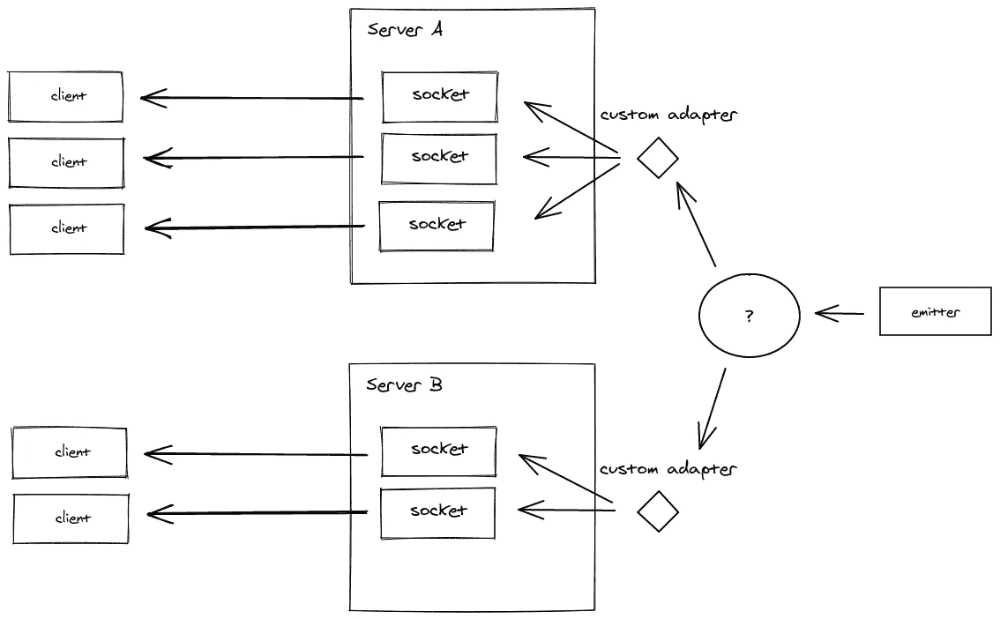
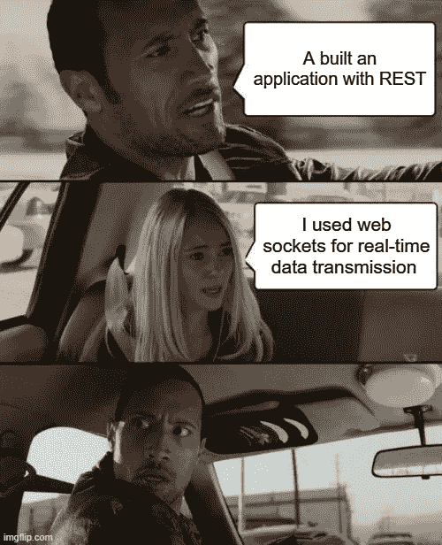

# 如何像专业人士一样设置 WebSockets

> 原文：<https://medium.com/codex/how-to-setup-websockets-like-a-pro-8fcf920353d9?source=collection_archive---------5----------------------->


我最近才开始大规模使用 WebSockets，有很多事情是我在做小项目时没有考虑到的。在这篇文章中，我将分享我所学到的一些东西。

什么是网络套接字🤔

如果您正在开发一个应用程序，并且想要实时发送数据或者跟踪实时发生的变化，那么您将需要使用 WebSockets

WebSocket 是一个单一的 TCP(传输连接协议),支持节点之间的全双工通信。

我们来分解一下🤓

TCP 是数据在互联网上传输的方式；全双工通信意味着双方可以同时传输和接收数据；节点可以是连接到网络的任何设备

按照 [Socket.io](https://socket.io/docs/v4/) 基本文档或任何其他 WebSocket JS 库，在 Node.js 中设置 WebSockets 可以非常快速简单地完成

这很好，但是在处理更大的项目时，您可能需要考虑运行认证中间件、其他中间件、处理自定义错误和伸缩，这是我将在本文中向您展示的。

我将用 [Socket.io](https://socket.io/) 来解释。我们首先要看的是在您的套接字连接上运行中间件。


**认证&定制中间件🕵️**

可以通过这种方式向您的套接字连接添加中间件

```
io.use((socket, next) => {
    // Middleware function
    return require("./middleware/auth")(socket, next);
})
```

在套接字实例上，您可以访问随连接传递的任何身份验证凭证或查询

```
// Client
const socket = io.connect("ws://localhost:4000", {
    auth:{
        token: `${token}`
    },
    query:{
        field: `${value}`
    }
});
```

要访问这些信息，服务器端的中间件函数应该看起来有点像这样。您还可以将经过身份验证的用户的信息附加到套接字上

```
async function auth(socket, next) {
    try {
        const { token } = socket.handshake.auth;
        const { field } = socket.handshake.query; if (!token) return next(new Error("No token provided"));
        if (!field) return next(new Error("No field provided"));

        const user = await decode(token)
        socket.$user = user } catch (error) {
        return next(error);
   }
}
```

为了捕捉中间件中的任何错误，客户端应该监听“connection_error”

```
// Client
socket.on("connect_error", function (error) {
    console.log(error);
});
```

一旦当前用户已经附加到“套接字”上，就可以在连接中使用它来执行自定义检查和逻辑

```
io.use((socket, next) => {
    // Middleware function
    return require("./middleware/auth")(socket, next);
})
.on("connection", (socket) => {
    console.log(socket.$user)
})
```

**接球&投掷失误⚠️**

对于一些套接字事件，您可能需要查询数据库或调用外部 API 或运行一些复杂的逻辑；这些事情中的任何一个都可能导致错误

与其让错误导致停机，不如充分捕捉它并向客户机发送一条包含相关信息的消息

实现这一点的一个简单方法是在 try/catch 块中 rap 所有的套接字事件，并发出一个错误(如果有的话)

```
io.use((socket, next) => {
    // Middleware function
    return require("./middleware/auth")(socket, next);
})
.on("connection", (socket) => {
    try{
        // Emit and listener events
    }catch{
        socket.emit("error", error);
    }
})
```

这个解决方案还为您提供了抛出自定义错误并捕获它们的空间

```
if (userNotAllowed) throw new Error("Access blocked")
```

在客户端处理它的方法是这样的

```
socket.on("error", function (error) {
    console.log(error);
});
```

**回调🙋‍♂️**

回调允许您调用服务器上的客户端函数；我知道这很疯狂🤓

你可以这样想，服务器决定何时在客户端调用回调函数

一个很好的用例是当你加入一个房间或发送一条消息时；您可以使用它在客户端确认事件已成功处理

```
// Client
socket.emit("send-msg", { sender, msg, recipient }, (data) => {
    if(data.success) console.log("message sent succesfully")
    else console.log("message not sent")
})
```

回调函数不是自动调用的，而是服务器调用的

```
// Server
socket.on("message", (payload, cb) => {
    socket.to(payload.recipient).emit("new-msg", payload)
    cb({ success: true })
})
```

这种实现意味着当消息被发送时，确认消息被记录到客户机上的控制台

回调函数应该总是最后一个参数

**在多个服务器上扩展&适配器🚀🚀**

如今，水平扩展变得越来越普遍，同一个应用程序的多个实例同时运行，并由一个负载平衡器负责

WebSockets 的水平扩展不像简单地增加新的服务器实例那么简单

这是因为当事件发送到服务器时，信息不会在所有服务器实例间传播

为此，您需要使用一个套接字适配器

其工作原理是，当一个事件被发送到一个服务器实例时，它被发送到一个适配器，该适配器将数据转发到一个数据库，然后该数据库被转发到所有服务器实例



来源:[https://socket . io/assets/images/emitter-e18de 5957 df 3 bbd CB 7425 a 405 af5b 823 . png](https://socket.io/assets/images/emitter-e18de5957df3bbdcb7425a405af5b823.png)

这是一个如何使用 [Socket.io Mongo 适配器](https://socket.io/docs/v4/mongo-adapter/)和 MongoDB 作为数据库的例子

添加适配器后，您还需要在负载平衡器上启用粘性会话，并减少连接超时

如果您使用的是 AWS ALB，您可以将默认超时从 60 秒更改为稍长一点的值；然后在目标组上启用粘性会话

**带有 Socket.io 🧑‍的管理用户界面💼**

Socket.io 可能是一件非常复杂的事情，能够监控正在发生的事情是一个巨大的优势

只需添加几行代码，您就可以将 Socket.io 实例连接到官方的[管理控制台仪表板，](https://admin.socket.io/)在那里您可以监视正在发生的事情并拥有完全的控制权

您还可以设置一个接受用户名和 bcrypt 加密密码的基本身份验证类型，或者您可以使用 JWT 或其他选项执行更复杂的身份验证

在这里查看[代码示例](https://socket.io/docs/v4/admin-ui/)

**结论**

我想我越来越擅长写中型文章了😅😅💃💃

WebSockets 如果设置不当，将来可能会导致严重的问题

记下本文中的所有内容，这将为您节省大量调试时间。我是根据🥲的经验说这番话的



伸出手来给我，[这里](https://toluolatubosun.com/contact)还有一个驼子 time🖖