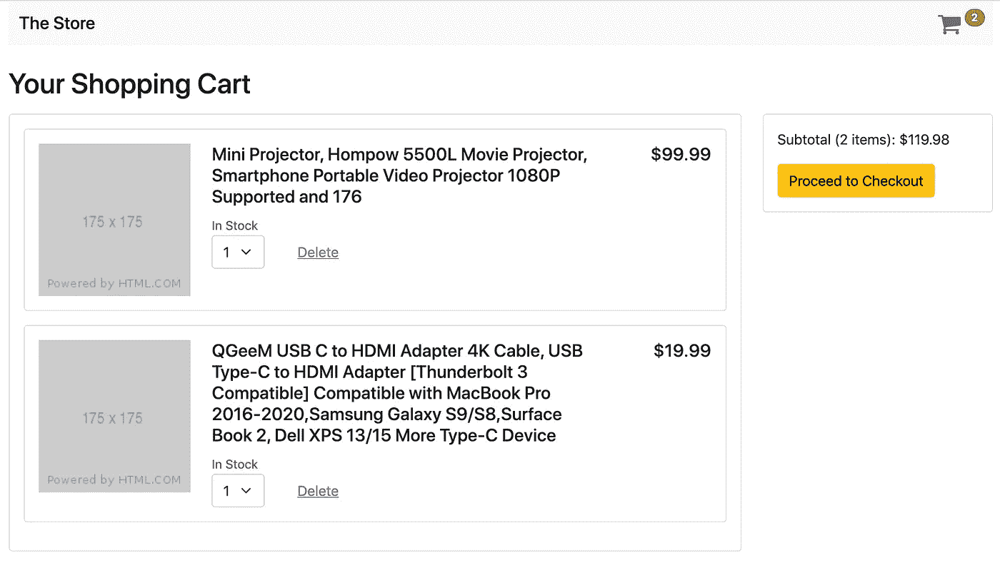
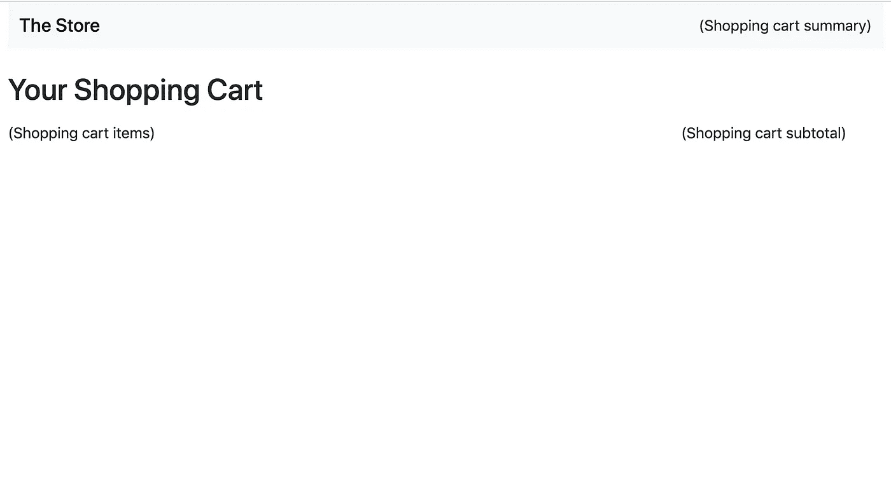
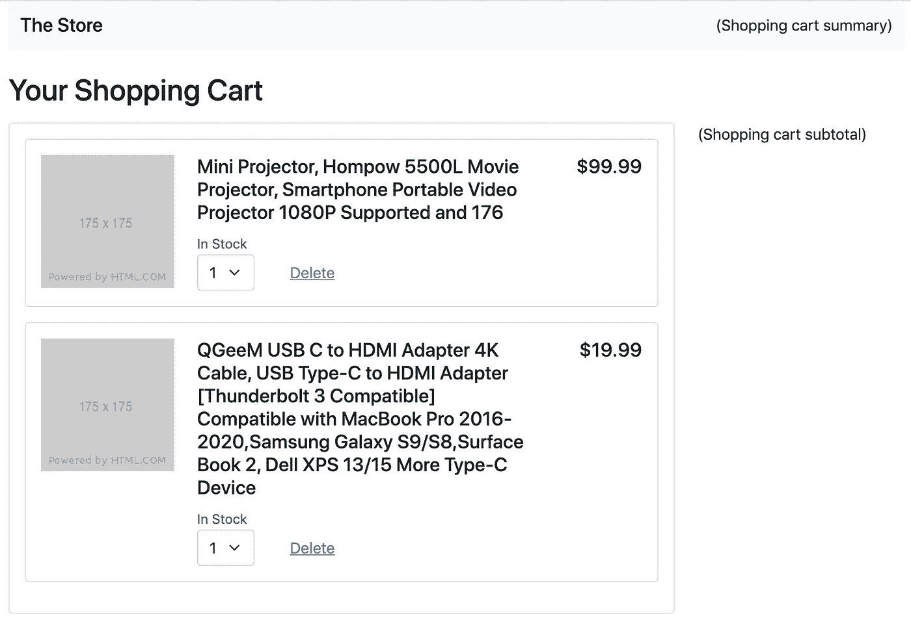
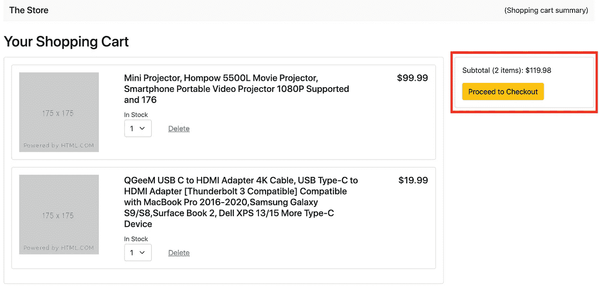
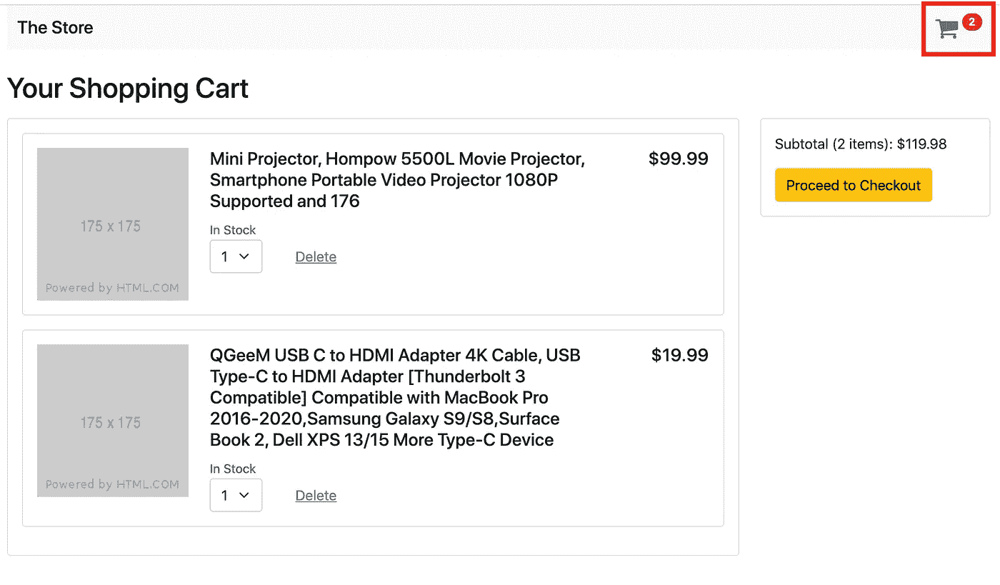
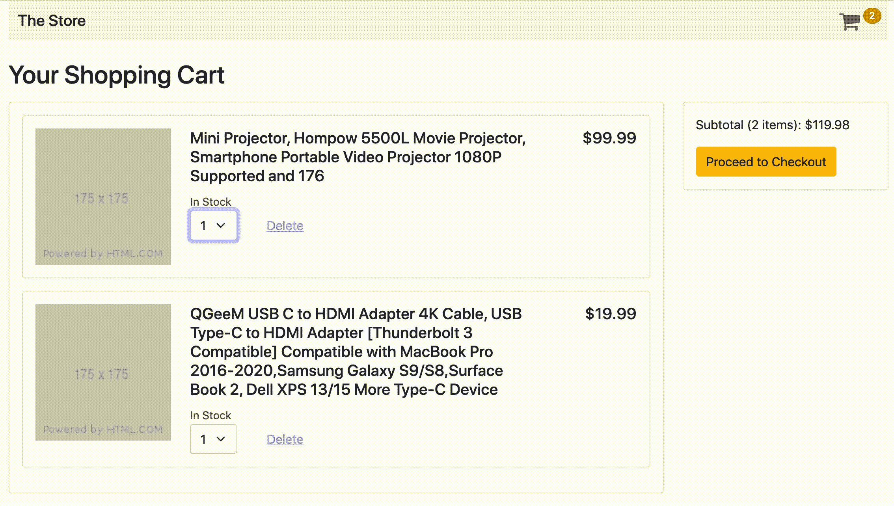
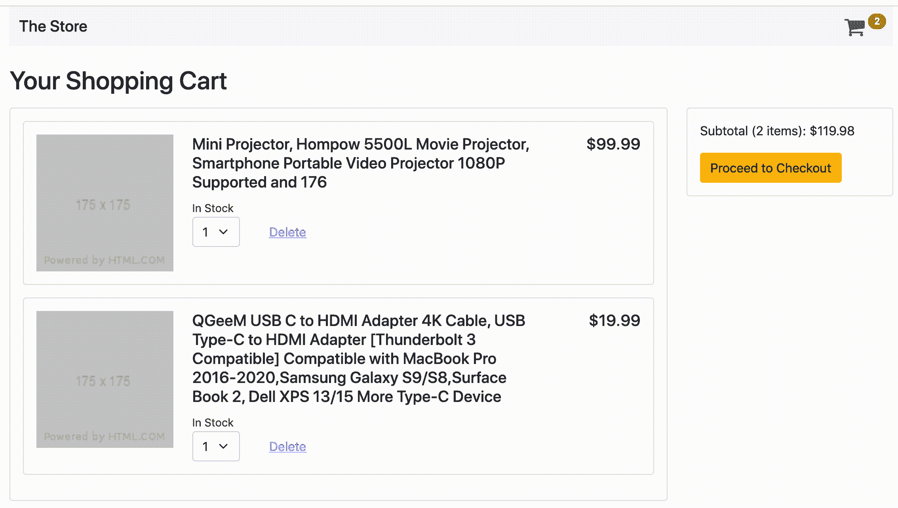

# 如何在 Angular 组件之间共享数据:购物车示例

> 原文：<https://medium.com/codex/how-to-share-data-between-components-in-angular-a-shopping-cart-example-b86ce8254965?source=collection_archive---------1----------------------->


如果你已经用 [Angular](https://angular.io/) 开发了现代 web 应用程序，你不可避免地会遇到这样的情况，你需要在组件之间共享数据(从父到子，子到父，子到祖父，或者兄弟姐妹到兄弟姐妹)。

Angular 提供了许多不同的方式让[在组件](https://angular.io/guide/component-interaction)之间共享数据，比如`@Input()`和`@Output()`模式，或者通过使用`@ViewChild()`访问另一个组件的实例。然而，这些方法往往在范围上受到限制，并且可能很快变得难以维护，尤其是当数据需要在嵌套很深或者根本没有直接连接的组件之间共享时。

幸运的是，Angular 中的[服务](https://angular.io/guide/architecture-services)是一个强大的特性，可以为在组件之间共享数据和业务逻辑创建公共参考点。此外，[当与 Observables](https://coryrylan.com/blog/angular-observable-data-services) 结合时，更具体地说，与 [BehaviorSubjects](https://www.learnrxjs.io/learn-rxjs/subjects/behaviorsubject) 结合时，我们可以进一步增强它们，以创建有状态的、反应式的服务，这可以帮助我们在整个应用程序中更有效地同步状态。

# 购物车示例

为了说明利用可观察对象和行为主体的服务的威力，我们将建立一个基本的购物车应用程序。该购物车将具有一个项目列表，一个小计部分，以及一个显示购物车中项目数量的摘要。该应用程序还允许用户编辑物品的数量，以及删除物品的能力。

总的来说，购物车将是这样的:



该应用程序将分为以下组件/服务:

*   `AppComponent`，它会托住 app 的脚手架。
*   一个`SummaryComponent`，它将在标题中显示购物车的商品数量摘要。
*   一个`ItemsComponent`，它将显示购物车中的商品列表。
*   一个`SubTotalComponent`，将显示小计。
*   最后，也是最重要的，一个`ShoppingCartService`，它将保存所有组件共享的状态和业务逻辑。

# 设置

*在我们开始之前，请注意，您可以在*[*stack blitz*](https://stackblitz.com/edit/angular-ivy-zyhakh)*上运行完成的应用程序，或者在*[*Github*](https://github.com/VidalQuevedo/angular-shopping-cart)*上克隆它的 repo。*

## 创建应用程序

首先，安装 [Angular CLI](https://angular.io/cli) (如果您还没有安装的话)，打开您的终端并运行:

```
$ npm install -g @angular/cli
```

接下来，使用 Angular CLI 创建一个新的`shopping-cart`应用程序(选择“N”作为路由，选择“SCSS”作为样式表格式)。接下来，`cd`到新的`shopping-cart/`并启动应用程序。一旦应用程序被加载，进入 [localhost:4200](http://localhost:4200/) 打开它。

```
$ ng new shopping-cart
$ cd shopping-cart
$ npm start
```

## 添加引导 CSS 和 FontAwesome

为了节省时间，我们将使用 Bootstrap 的 CSS 库和 FontAwesome web 字体来设计我们的项目，所以添加一个直接指向它们的 cdn 的链接，以便在`index.html`中加载它们:

## 向 AppComponent 添加基本 HTML 搭建

`AppComponent`视图将保存我们应用程序的基本框架，所以用下面的代码替换`app.component.html`中的默认 HTML(我们将从放置组件的占位符开始，并随着我们的进展替换它们):

此时，在保存您的更改并重新加载后，您的应用程序应该如下所示:



## 创建数据接口

我们的应用程序将有一个购物车，其中将包含项目，每个项目将包含一个 SKU ( [库存单位](https://en.wikipedia.org/wiki/Stock_keeping_unit))，或产品项目。构建该数据的接口将在我们的`models.ts`文件中声明如下:

## 创建购物车数据文件

对于这个应用程序，我们的样本数据将来自`/assets/data.json`，这是一个 JSON 文件，其中包含一个购物车，里面有两件商品。继续将该文件添加到应用程序的`assets/`目录中，数据如下:

# 功能

## 创建购物车服务

`ShoppingCartService`将是我们应用程序的大脑，有两个主要用途:

1.  它将在它的`shoppingCart$`属性中保存购物车的基本状态。这个属性将是一个`[BehaviorSubject](https://www.learnrxjs.io/learn-rxjs/subjects/behaviorsubject)`，它将发出一个`ShoppingCart`数据对象。
2.  它将包含计算和处理数据所需的业务逻辑，以及处理编辑购物车中商品的事件。

现在，为什么要使用一个`BehaviorSubject`来保存状态并作为应用程序的唯一来源呢？一个`BehaviorSubject`是一种具有本地属性的`Observable`，这使得它非常适合以一种反应的方式设置应用程序的状态:

*   它在实例化时需要一个初始值，这允许我们为状态设置一个默认值。
*   它在 subscription 上发出它的最新值(默认值或其他值)，这允许我们立即开始处理它发出的数据。
*   它允许我们通过它的`.getValue()`方法或`.value`属性获得它的最新值的“快照”,而不需要订阅。当我们需要将`BehaviorSubject`作为只读的同步变量时，这很有用。
*   最后(也是最重要的)，由于`BehaviorSubject`是`Observable`的一种类型，它允许我们使用 RxJS 操作符创建新的*投影*来导出更有意义的*数据，而无需修改原始状态*。由于这些投影也是可观察的，它们可以成为为我们的服务创建反应式 API 的构建块，然后将更改传播到整个 UI，并帮助我们保持所有组件无缝同步。

那么，什么是投影呢？

简而言之，创建一个投影意味着从原始数据源(或者它的一部分)中创建一个新的、更加专门化的数据*，而不需要修改原始数据源本身*。例如:

*   从购物车数据中，我们可以创建一个投影来计算购物车中的**商品列表。**
*   从购物车数据中，我们可以创建一个投影来获得购物车中的商品列表，然后将每件商品的数量相加来计算购物车中的商品总数。
*   从购物车数据中，我们可以创建一个投影来提取商品列表，将每个商品的数量乘以其价格，然后将它们相加，得到购物车的**小计。**

现在，关于这些投影的重要一点是**它们会在每次原始数据源更新时自动运行**。

在我们的例子中，这转化为使用 RxJS 操作符从源发出的原始数据创建投影，a `BehaviorSubject`，然后订阅结果`Observables`以在每次源发出新值时实时更新视图。

记住这些基本概念，让我们继续创建我们的反应式的、基于投影的服务(我保证，随着我们的进展，你会开始看到这些模式；)):

```
$ ng generate service services/shopping-cart
```

接下来，新的`shopping-cart.service.ts`将增加两件重要的东西:

*   我们将把`shoppingCart$`私有属性声明为一个`BehaviorSubject<ShoppingCart>`对象，然后在构造函数中用一个代表空购物车的默认值初始化它。
*   我们将添加一个`getShoppingCart()`私有方法，该方法将放置一个 HTTP 请求来获取构造函数中的数据。成功后，我们将调用`setShoppingCart()`私有方法，其中`shoppingCart$`属性将发出新的购物车数据。如果失败，我们将简单地在浏览器的控制台中显示一个错误。

请注意，由于服务使用`HttpClient`来发出 HTTP 请求，我们需要将`HttpClientModule`添加到`app.module.ts`中的导入列表中，以使它在我们的应用程序中可用:

## 创建购物车商品组件

`ItemsComponent`将显示购物车中的商品列表(专业提示:`--export`标志将自动将新组件添加到最近模块的`exports`列表中，在本例中是`AppModule`，节省了我们手动添加组件的工作)。

```
$ ng generate component items --export
```

在新的`items.component.ts`文件中，我们将把`items$`属性设置为一个可观察对象，它将发出一个项目列表，`Observable<Items[]>`:

在`items.component.html`中，我们将使用`[async](https://angular.io/api/common/AsyncPipe)`管道来订阅`items$`以显示项目列表。每个商品都有图片、标题、价格(使用`[currency](https://angular.io/api/common/CurrencyPipe)`管道进行格式化)和数量，以及一个“删除”按钮，用于将其从购物车中删除。如果购物车是空的，组件将显示一个"*你的购物车是空的。*谓消息相反。

现在，让我们将占位符“(购物车商品)”替换为`<app-items></app-items>.`，将商品组件添加到`app.component.html`

## 用购物车中的数据填充购物车商品列表

在这里，我们将开始使用`ShoppingCartService`来管理我们的应用程序的状态。

首先，我们需要`ShoppingCartService`来允许我们访问购物车中的当前商品列表。为此，我们将把`getItems()`方法添加到`shopping-cart.service.ts`中。该方法将是从`shoppingCart$` `BehaviorSubject`派生的*投影*，并且将在每次`shoppingCart$`更新时返回一个发出项目列表`Observable<Item[]>`的可观察对象:

`[pluck](https://www.learnrxjs.io/learn-rxjs/operators/transformation/pluck)`操作符是一个 RxJS 操作符，它简单地允许你返回一个特定的属性，由可观察对象发出。当您知道需要从传入的数据中获得什么属性，并且不需要在每次发射时传递整个数据对象时，这当然很方便。

接下来，让我们使用来自`ShoppingCartService`的`getItems()`方法将`items.component.ts`中的项目列表加载到`ngOnInit()`上，确保首先将`shoppingCartService`作为依赖项注入到组件中以访问其功能:

保存并重新加载后，我们的应用程序现在应该显示如下所示的项目列表:



## 创建购物车小计组件

`SubtotalComponent`将显示购物车中商品的小计、商品数量和“继续结账”按钮。当然，在产品实现中，我们最有可能为这个按钮提供一个专用组件来保存任何复杂的显示/业务逻辑，但是为了简洁起见，我们只在这里显示它。

```
$ ng generate component subtotal --export
```

两个属性，`subTotal$`和`count$`，将保存可观察到的数字，`Observable<number>`:

在`subtotal.component.html`中，`count$`属性不仅用于显示商品数量，还用于为“继续结账”按钮添加基本的“禁用”逻辑(即当`$count`等于`0`时，购物车为空，因此用户不能继续结账)。

在`ShoppingCartService`中，添加两个方法`getSubstotal()`和`getCount()`进行检索。

与`getItems()`方法类似，`getSubtotal()`方法将是从`shoppingCart$` `BehaviorSubject`派生的一个投影，这意味着它将是一个每次`shoppingCart$`更新时发出一个数字`Observable<number>`的可观察对象。

为了计算小计，我们将每个购物车商品的数量乘以其 SKU 价格，然后将结果相加，如下所示:

类似地，`getCount()`方法也将是从`shoppingCart$` `BehaviorSubject`派生的一个投影(您在这里开始看到一个模式，对吗？)将返回并发出购物车中所有商品的计数的 Observable，`Observable<number>`。

现在，我们可以将这些新方法与`SubTotalComponent`挂钩，开始向视图发出这些值。首先，我们需要在构造函数中注入`ShoppingCartService`作为依赖项，然后在`subtotal.component.ts`中分配对`ngOnInit()`上这些方法的调用:

最后，我们将用`<app-subtotal></app-subtotal>`标签替换“(购物车小计)”占位符来显示小计。

保存并重新加载后，我们购物车的小计区域现在应该有两(2)件商品，小计金额为 119.98 美元:



## 创建购物车汇总组件

`SummaryComponent`将被放置在标题中，并将显示一个购物车图标和购物车中的商品数量。

```
$ ng generate component summary --export
```

`SummaryComponent`将有一个`count$`属性。为了填充它，我们将在`ngOnInit()`中初始化它，引用我们已经在`ShoppingCartService`中创建的`getCount()`方法。通过这样做，我们将重用我们在`SubtotalComponent`中使用的相同业务逻辑和状态，有效地利用服务在组件之间共享数据和功能:

在视图中，我们将显示计数和购物车图标:

最后，我们将用`<app-summary></app-summary>`替换“(购物车摘要)”占位符来创建组件。

在保存和重新加载之后，我们的应用程序现在应该在标题上显示一个购物车图标，以及数字 2，因为我们在加载的购物车中有两个商品:



我们现在已经创建了所有需要的组件，并使用`ShoppingCartService`为它们供电！！！接下来，我们将创建几个方法来编辑状态，并让视图对所有组件的这种变化立即做出反应，而不必手动更新它们的状态。

## 更新项目的数量

每个项目都有一个反映其数量的`<select>`输入字段，取值范围从 1 到 3(请注意，这个限制是为了说明)。我们的下一步是处理数量的任何变化，并相应地更新购物车。

在`ShoppingCartService`中，让我们为此创建一个`updateQuantity()`方法。这个方法将简单地通过 id 找到传递的项目，然后相应地更新它的数量。

这里有两个重要的步骤:首先，我们将通过访问`shoppingCart$` BehaviorSubject 的`value`属性来创建当前状态的副本。然后，在找到物品并计算其数量后，我们将让`shoppingCart$`通过它的`next()`方法发出这个新值。通过这样做，我们从`shoppingCart$`创建的所有`Observables`，比如在`getItems()`、`getTotals()`和`getCount()`方法中的那些，也将发出那些值给它们所有的订阅者，有效地用新状态更新所有组件的视图。

请注意，在生产应用程序中，任何编辑购物车商品的事件都很可能由后端处理，然后后端将提供购物车数据的更新副本，我们可以用它来刷新前端。然而，在我们的例子中，出于说明的目的，我们只在前端编辑状态，因为支持后端架构的设置超出了本文的范围。

现在，让我们通过`ItemsComponent`中一个类似名称的方法调用`updateQuantity()`，该方法将使用`$event`对象提取视图中`select`数量输入元素的每个`change`事件上的选定值:

最后，让我们调用`change`上的方法:

保存并重新加载后，继续更改任何项目的数量。虽然变更是在`ItemsComponent`中生成的，但是数量和小计在`SubTotalsComponent`和`SummaryComponent`中无缝更新，这是多个组件通过公共服务进行通信的一个很好的例子。



## 删除项目

作为我们的应用程序的最后一个功能，我们将为用户添加一个选项，通过按下项目上的“删除”链接来删除项目。

为此，我们将在`ShoppingCartService`中添加一个新的`deleteItem()`方法。它将获取要删除的项目的 id:

请注意，在`updateQuantity()`方法中，我们首先从`shoppingCart$`属性创建状态的副本，对副本执行删除操作，并将副本传递给`shoppingCart$`作为其新值发出，再次更新基于该行为主体的所有观察对象及其跨所有组件的订阅。

接下来，我们将在`ItemsComponent`中创建一个类似命名的方法来调用`ShoppingCartService`的`deleteItem()`方法:

最后，让我们在用户点击任何项目上的“删除”按钮时调用上面的方法:

保存并重新加载后，现在继续删除一个项目。该项应该会从视图中消失，计数和小计也会相应地更新。删除所有商品也应该显示一个"*你的购物车是空的。*"消息。



## 结论

通过这个基本的购物车应用程序，我们探索了使用服务和可观察对象(更具体地说，是行为主体)在组件之间共享应用程序的数据和业务逻辑的能力。鉴于这种方法的可复制性，它可以很快用于标准化您的 Angular 应用程序的状态管理方法，使其在未来更容易扩展和维护。

所以，一些要点:

*   Angular 中的服务是一个强大的特性，可以为在组件之间共享数据和业务逻辑创建公共的参考点，并作为驱动应用程序的单一事实来源。
*   BehaviorSubjects 可以用作创建反应式服务的起点，因为它们的固有能力允许我们在订阅或不订阅的情况下获取其最新发出的数据(通过其`.value`属性或`.getValue()`方法)。
*   通过使用 RxJS 操作符，我们可以从保持原始状态的`BehaviorSubject`创建*投影*，从而在不修改原始状态的情况下获得更有意义的数据。
*   这些投影可以用来为我们的服务创建一个反应式 API，然后组件可以使用它在整个应用程序中共享数据和业务逻辑。

谢谢，请随时分享您的意见或问题！