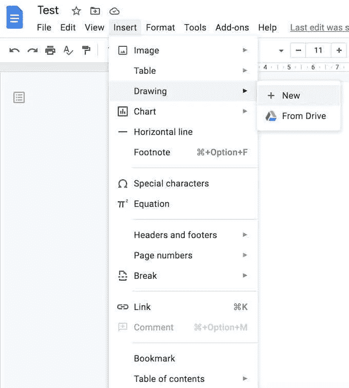
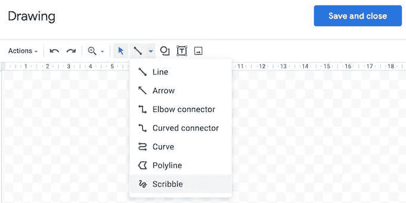
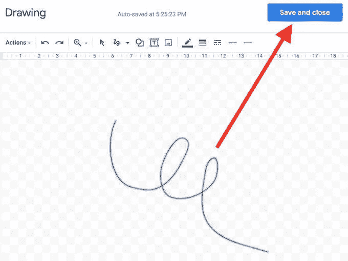
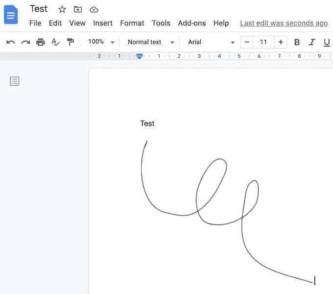
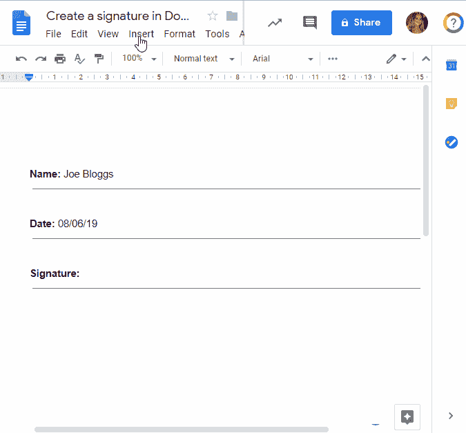

# 如何登录谷歌文档(新修订版)

> 原文：<https://medium.com/codex/how-to-sign-on-google-docs-51a10f7029d5?source=collection_archive---------6----------------------->

## 简要了解如何在谷歌文档中添加签名。我已经尽了最大努力让你明白如何在谷歌文档上签名的指南。

Pawel Czerwinski 在 [Unsplash](https://unsplash.com?utm_source=medium&utm_medium=referral) 上的照片

使用 Google Documents，您可以创建文档和电子表格，并在世界任何地方进行协作。

这是一个免费的在线协作工具。要访问谷歌文档，需要有一个 Gmail 帐户。

让我们从如何登录谷歌文档开始

1.  在“Google 文档”上打开要签名的文档。
2.  在 Google 文档中将光标放在您想要登录的位置。
3.  从屏幕顶部的功能区菜单中，选择插入。
4.  选择绘图>新建。

5.线条>在绘图窗口中涂鸦。

6.在指定的地方潦草地签上你的名字。

7.如果您对签名满意，请单击保存并关闭按钮。

> **快速提示**——下面列出的视频内容可以帮助你如何登录谷歌文档

如何登录谷歌文档

电子签名谷歌文档是由谷歌文档平台在前几年创建的，现在这种情况已经开始改变。

> 新的电子独立以地球村的形象重新创造了世界。 [**马歇尔·麦克卢汉**](https://www.brainyquote.com/authors/marshall-mcluhan-quotes)

使用 [**best free** **电子签名软件**](https://wesignature.com/) 创建销售文件和其他商业协议变得越来越流行。

本指南向您展示如何登录谷歌文档。你可以相信我会尽我所能让这篇教程对你来说更容易理解。我希望你喜欢这篇关于如何在谷歌文档中签名的文章。

无论如何，请在评论框中分享你的想法和掌声。当你读完它的时候，让我们知道你是否喜欢它。

# 查看如何登录谷歌文档

完成一份文件可能需要你在上面签名。在谷歌文档上插入签名可能会让它们看起来更正式，更个性化，或者满足其他法律需求。

将你的签名添加到在线文档中似乎比使用谷歌文档更困难，谷歌文档直观且用户友好。可以通过多种方式添加谷歌文档签名。

以下是最常见的。所有这些都像在纸页底部写下你的名字一样简单。

据估计，每月有超过 20 亿人使用 Google Workspace。企业和个人都可以从这个强大的生产力平台中受益，它包括各种有用的功能。

此外，Gmail 和 Google Drive 的功能是绝对免费的。虽然这可能会让一些人感到惊讶，但你可以在谷歌文档帐户中添加签名，而无需离开应用程序。

越来越多的企业和个人选择使用虚拟签名来代替耗时且容易出错的手工签名方法。

# 如何以电子方式登录谷歌文档

使用 Google Drive 或 Google Docs，我将在这一部分向您展示如何登录 Google Docs。

与普遍的看法相反，可以用电子方式签署合同和其他法律文件，而不用亲自到场。很多时候，您只想签署和传送一份文件，而不必创建手动模板。

使用 Google Drive 或 Google Docs 来签署文件是实现这一目标的好方法。登录 Google 文档后，您可以按如下方式继续操作:

*   **插入- >图纸- > +新**
*   **点击线路图标旁边的箭头**
*   **选择嘟嘟**
*   **画出你的签名**
*   **按照你认为合适的方式进行调整**
*   **点击保存并关闭**
*   **将您的签名移到它应该在的地方**

提交文档就像下载您选择的格式(Word 或 PDF)一样简单。

# 以下是如何登录谷歌文档的最终想法

个人文件永远不会丢失，因为谷歌文档是基于云的服务。一张照片，一个音频剪辑，甚至一个 Word 文档都可以存储在上面。

只需一点年费，您就可以增加存储容量。这意味着你的文件可以避免潜在的计算机错误，这是个好消息。

谷歌文档让添加签名变得轻而易举。 [**在 Google Docs 中为 PDF 文件**](https://wesignature.com/blog/electronic-signature-pdf/) 添加电子签名，可以轻松下载原始格式的内容。

# 登录谷歌文档的优势

Google Docs 是一款基于互联网的文字处理工具，由科技巨头 Google 开发。它为用户提供了同时生成、编辑和与其他用户共享文档的特权。谷歌文档的突出优势之一是它的电子签名功能。这里讨论的是利用电子签名在 Google Docs 上签署文档的一些好处。

F **首先**，附加电子签名比传统的打印、签署和扫描实体文件的方法要方便快捷得多。在谷歌文档上，用户只需点击几下就可以签署一份文件，并立即将其发送给发送者。这大大减少了花费的时间，并将错误或挫折的可能性降至最低。

其次，电子签名比手工签名更安全。Google Docs 已经实现了最先进的加密和认证协议，以确保签名是真实的，不会被篡改。因此，电子签名作为具有法律约束力的文书在大多数法域中已被广泛接受。

第三，电子签名的生态优势再怎么强调也不为过，因为它们最终会大大减少纸张浪费和对物理存储的需求。通过使用 Google Docs 签署文档，您可以在减少碳足迹和促进可持续未来的到来方面发挥作用。