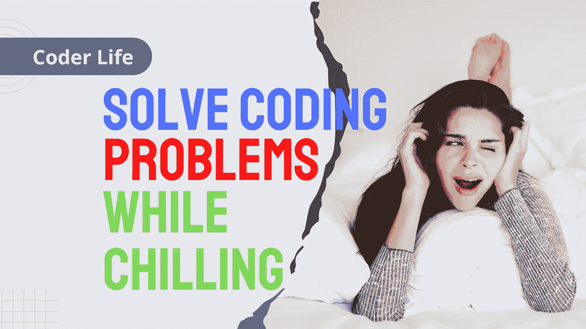

# 如何通过一开始真的什么都不做来解决任何代码问题

> 原文：<https://medium.com/codex/how-to-solve-any-code-problem-by-really-doing-nothing-at-first-b9c99adfc2fa?source=collection_archive---------8----------------------->

## 采取下一步措施，将设计放在实施之前

图片由[作者](http://www.arnoldcode.com)经由 Canva.com 制作

当面临问题时，直接进入代码没有什么不好意思的。不管你是否已经知道如何解决它。这种技术很快就变成了大型复杂问题的灾难。