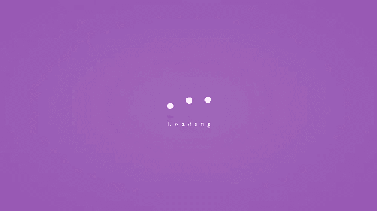

# 如何让你的 React / Angular / Vue 应用程序更有趣:预加载应用程序

> 原文：<https://medium.com/codex/how-to-spice-up-your-react-angular-vue-app-pre-app-loader-12179e885132?source=collection_archive---------4----------------------->

艾哈迈德·埃姆兰的装载机

当加载像 React、Vue 或 Angular 这样的单页面应用程序时，您会花几秒钟时间盯着一个空白的 HTML 页面。这几秒钟是你的内部 UI/UX 疯狂的最佳时间——用户不需要点击任何东西，他们只需要分散注意力，这样他们就不会点击了！