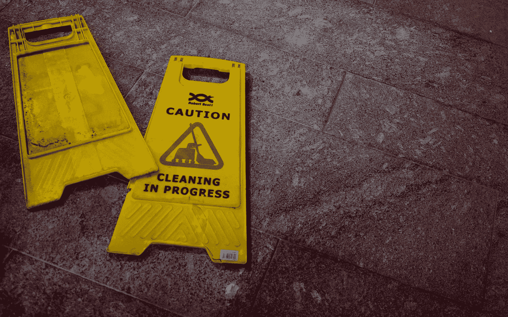

# 如何压缩提交以清除提交历史记录

> 原文：<https://medium.com/codex/how-to-squash-commits-for-clean-commit-histories-f73a2a68c332?source=collection_archive---------6----------------------->

## 一个简单的分步指南，总结大型软件开发项目中的多次提交，以保存高质量的变更日志

奥利弗·黑尔在 [Unsplash](https://unsplash.com?utm_source=medium&utm_medium=referral) 上拍摄的照片

在更大的软件开发项目中，编码通常被分成不同的特性开发。这些单独的特性被编码、测试，然后…