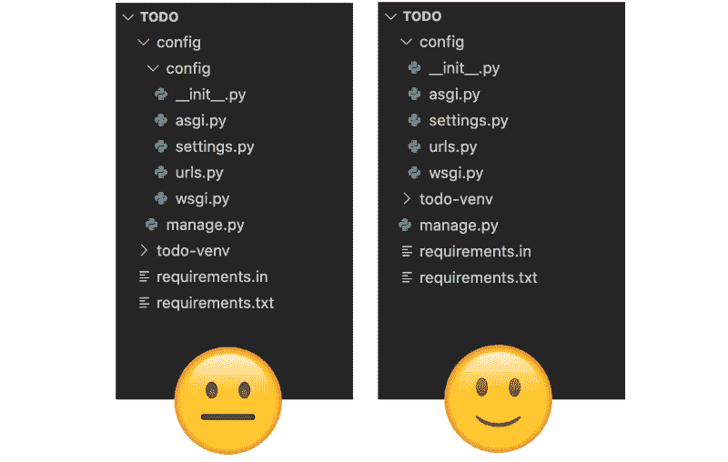
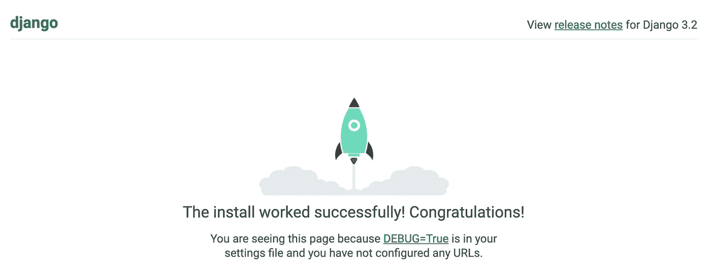
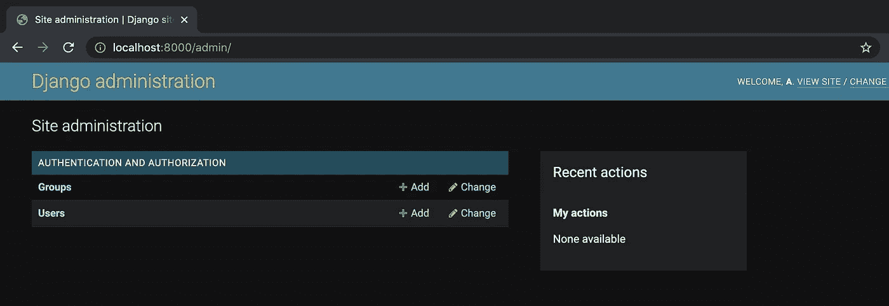

# 如何启动 Django 项目

> 原文：<https://medium.com/codex/how-to-start-a-django-project-42c7fbf740ec?source=collection_archive---------2----------------------->


在本教程中，我们将从头开始一个 Django 项目。

该项目将贯穿:

1.  创建虚拟环境
2.  使用 pip 安装软件包
3.  创建 Django 项目
4.  初始化 Django 应用程序
5.  运行开发服务器
6.  运行迁移
7.  创建超级用户
8.  保护您的环境变量，比如您的密钥
9.  向 git 推进

最后，您将准备好开始在应用程序中定义模型、URL 和视图。

如果你卡住了，这里有一个**库**:

[](https://github.com/alicecampkin/set-up-django) [## GitHub-alicecampkin/设置-django

### 在 GitHub 上创建一个帐户，为 alicecampkin/set-django 的发展做出贡献。

github.com](https://github.com/alicecampkin/set-up-django) 

## 姜戈女孩的荣誉

建立一个 Django 项目，尤其是第一次，有很多步骤。《Django 女孩教程》让我第一次明白了这一点，并成为此后所有项目的重要参考。

如果您在这个演练中遇到困难，或者想要阅读更多关于这个过程的细节，我强烈推荐他们的教程。

[](https://tutorial.djangogirls.org/en/) [## 介绍

### 本作品根据知识共享署名-相同方式共享 4.0 国际许可协议进行许可。查看…的副本

tutorial.djangogirls.org](https://tutorial.djangogirls.org/en/) 

# 1.装置

## 创建项目目录

我们将启动一个待办事项应用程序。

```
$ mkdir todo$ cd todo
```

## 创建并激活虚拟环境

```
$ python3 -m venv todo-venv
```

这将创建一个名为' *todo-venv* '的虚拟环境。您的虚拟环境将包含所有第三方依赖项的文件，并帮助您确保对每个软件包使用正确的版本。

现在，激活你的虚拟环境。

```
$ source todo-venv/bin/activate
```

## 安装 pip

你将需要 *pip* 来安装 python 包。确保您拥有最新版本:

```
$ python -m pip install — upgrade pip
```

## 安装 django-admin

现在您已经安装了 pip，您可以安装 django-admin

```
$ pip install django-admin
```

## 安装 pip 工具

我们将需要 pip 工具，这样我们就可以编译我们的要求。

```
$ pip install pip-tools
```

# 2.安装 Django

我们将创建一个文件来跟踪我们的项目需求，并用它来安装 Django。

## 创建需求

创建一个文件来存储您的需求。

```
$ touch requirements.in
```

在 VScode 中打开项目目录:

```
$ code .
```

现在，在`requirements.in`中，只需输入‘django’

```
django
```

## 编译需求

在您的终端中，运行下面一行。这将从`requirements.in`编译`requirements.txt`。

```
$ pip-compile --output-file=requirements.txt requirements.in
```

编译过程将添加运行`requirements.in`中的包所需的所有附加包。这使得我们的需求更容易管理。

## 安装要求

```
$ pip install -r requirements.txt
```

# 4.启动 Django 项目

```
$ django-admin startproject config
```

这将创建一个名为`config`的目录，其中包含另一个文件夹，也称为`config`。

## 重新组织你的文件夹

这一步是可选的，但我更喜欢像这样去掉外层文件夹:



# 5.创建应用程序

你可能想知道为什么我们把这个项目命名为*‘config’*，而不是*‘todo’*。

在 Django，我们使用应用程序构建我们的项目。例如，在一个电子商务项目中，您可能有一个名为“产品”、“订购”和“库存”的应用程序，以保持项目不同部分的代码独立。

我更喜欢包含`settings.py`‘config’的文件夹，这样我就可以很快把它和我的应用文件夹区分开来。

这个项目将只需要一个应用程序。我们称之为“托多”。

确保您与`manage.py`在同一个目录中，并运行下面一行。

```
$ django-admin startapp todo
```

## 注册应用程序

这是重要的一步。跳过这一步，Django 将不会识别你的应用程序中的任何代码。

进入你的配置文件夹，打开`settings.py`。

向下滚动，直到找到一个名为`INSTALLED_APPS`的列表，然后将新应用的名称添加到列表中。

**config/settings.py**

```
INSTALLED_APPS = [
'django.contrib.admin',
'django.contrib.auth',
'django.contrib.contenttypes',
'django.contrib.sessions',
'django.contrib.messages',
'django.contrib.staticfiles',
'todo'
]
```

# 6.启动服务器

通过启动服务器检查您的项目设置是否正确。

```
$ python manage.py runserver
```

您可能会得到如下错误:

```
File “manage.py”, line 17
 ) from exc
 ^
SyntaxError: invalid syntax
```

如果出现该错误，请重新激活虚拟环境，然后重试。

```
$ source todo-venv/bin/activate
```

当您的服务器正在运行时，打开浏览器并导航到 [http://localhost:8000/](http://localhost:8000/) 。您应该会看到如下图所示的屏幕。



如果您看到这个屏幕，那么您已经成功地启动了您的开发服务器——祝贺您！

# 7.运行迁移

迁移描述了对数据库的更改。Django 是一种内置电池的框架(它内置了许多特性来帮助您的工作流)，所以它需要创建一些表来启用这些特性。

要运行迁移，使用`CTRL C`停止您的开发服务器，并运行以下命令:

```
$ python manage.py migrate
```

# 8.创建超级用户

您将需要创建一个超级用户，以便您可以访问管理面板。

```
$ python manage.py createsuperuser
```

Django 会提示您输入用户名、电子邮件和密码。

完成后，重启您的开发服务器。

```
$ python manage.py runserver
```

现在，回到您的浏览器并导航到[http://localhost:8000/admin](http://localhost:8000/admin/)

您应该能够使用刚刚设置的凭据登录。

如果成功，您将看到如下屏幕:



# 9.让您的密钥保密

## 安装 django 环境

打开`requirements.in`并将`django-environ`添加到新的一行。您的文件应该如下所示:

```
djangodjango-environ
```

使用以下命令编译`requirements.in`:

```
$ pip-compile — output-file=requirements.txt requirements.in
```

然后安装要求:

```
pip install -r requirements.txt
```

以这种方式安装软件包是一种很好的做法，因为它有助于您跟踪已安装的软件包。与 JavaScript 生态系统中的`package.json`不同，当安装新的包时，pip 不会自动更新`requirements.txt`。

## 创建一个. env 文件

在与`settings.py`相同的目录下，创建一个名为`.env`的文件

在`.env`中，以下面的代码片段为例添加一行密钥。

确保等号周围没有空格！

```
SECRET_KEY=4335956fc5ec4f96djsk5b29414b067d8ff4b
```

## 将您的密钥导入 settings.py

转到`config/settings.py`

添加以下代码片段:

```
import environ
env = environ.Env()
environ.Env.read_env()
```

停留在`config/settings.py`，向下滚动到定义`SECRET KEY`的那一行。

将该行替换为:

```
SECRET_KEY = env('SECRET_KEY')
```

# 10.准备好了

现在我们已经获得了我们的密钥，我们离将我们的项目推向 Github 又近了一步。

## 初始化存储库

转到 Github(或者您选择的 git 客户端)并创建一个新的存储库。

然后，在终端中:

```
$ git init $ git remote add origin [git@github.com](mailto:git@github.com):<username>/django-tutorial-part-one.git
```

## 创建一个. gitignore

有一些文件不应该推送到 Github。

其中包括必须保持私密的`.env`和你的虚拟环境，浪费空间的`todo-venv`。

在项目的根目录下，创建一个名为`.gitignore`的文件，并复制/粘贴到以下位置:

```
.env
__pycache__
db.sqlite3
todo-venv
```

这将跟踪的文件数量从 5000 个减少到了 16 个。VScode 可能需要几分钟来更新源代码管理选项卡。

## 提交您的文件

暂存您的文件:

```
git add .
```

然后提交它们

```
git commit -m "initial commit"
```

最后，

```
git push origin master
```

# 贮藏室ˌ仓库

[](https://github.com/alicecampkin/set-up-django) [## GitHub-alicecampkin/设置-django

### 在 GitHub 上创建一个帐户，为 alicecampkin/set-django 的发展做出贡献。

github.com](https://github.com/alicecampkin/set-up-django)