# 如何开始用 Git 做饭(见 Git #4)

> 原文：<https://medium.com/codex/how-to-start-cooking-with-git-meet-git-4-a286e4e08109?source=collection_archive---------17----------------------->

## 创建一个 Git 存储库，并记录您的项目是如何发展的

吉米·菲利波夫斯基在 [Unsplash](https://unsplash.com?utm_source=medium&utm_medium=referral) 上的照片

你好，欢迎来到 *Meet Git* 系列的另一篇文章。

在上一篇文章中，我向您展示了如何完成 Git 的初始设置。今天，当我们准备好出发的时候，我们终于可以做一些酷的事情了，例如… **写一本烹饪书**。

为什么是烹饪书？好吧，当我开始考虑制作这个系列时，我很饿。

更严重的是，我本可以用一些源代码片段写另一篇文章，但事实是，正如我在*会见 Git #1* 中提到的，我想超越编程，向您展示版本控制系统(例如 Git)在计算机科学之外的其他领域也是极好的工具。

我们开始吧！

# 先决条件

*   在您的计算机上安装和配置 Git(如果您还没有阅读我以前的文章，请查看它们！)
*   一撮想象力，因为我们要创造一个皇家早餐！

# 用例:使用 Git 创建食谱

总的想法是写几个食谱，用它们做实验，并让 Git 管理我们将应用到食谱中的所有更改。

哦，还有一件事:我们要把我们的食谱写在白纸上*。txt* 格式，所以忘了 LibreOffice Writer 或者微软 Word 吧。

## 为什么要写一本烹饪书？txt 文件？

我知道，真正的烹饪书，像其他的书一样，不仅仅是一篇简单的文章。

大多数情况下(如果不是总是)，书籍包含章节名称、段落、旁注和其他部分，其风格不同于常规文本。甚至章节的内容本身也有参数，比如合适的字体大小和类型。

因为我们会把食谱写在。txt 文件，我们将无法使用上述属性。你可能认为这是一种限制，但在我看来，这种方法有显著的优势:

*   首先，我想向您展示 Git 如何操作简单的文本文件，因为 Git 在这方面确实很出色。
*   一旦你理解了 Git 的基础知识，你就会更容易理解为什么。doc，。docx 和其他常见的文本格式对 Git 来说非常特殊(这也是为什么它们在跟踪变化方面很棘手)
*   然后，您将能够就如何在 Git 存储库中存储以及存储什么做出正确的决定

你可能会问:*这是否意味着我可以单独使用 Git 来保存 plain 的历史？txt 文件？*

我的回答是:*完全不会，但是你需要注意某些陷阱。*

现在，让我们坚持。txt 格式，在接下来的文章中，我们将升级我们的食谱。在某些时候，我们会考虑是否有更合适的文本格式来表示食谱。

# 写第一份食谱

## 创建 git 存储库

好吧，我已经饿了，所以没时间理论了。

首先，我们需要选择目录，我们将在那里工作我们的第一个配方**(这个位置也将是我们的 Git 仓库)**。打开 Git Bash 或您最喜欢的终端，转到您选择的目录。在我的例子中，我选择了我的 Windows 用户的`Documents`目录。

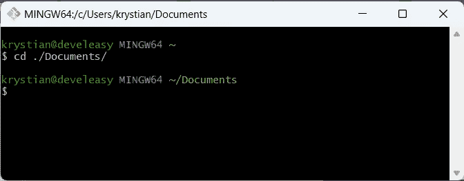

我要去文档目录

如果您使用的是 Git Bash，那么 Git Bash 很有可能是在用户的主目录中启动的。怎么知道的？`~`字符代表用户的目录。

这里有一个如何在命令行中导航的简短备忘单:

*   如果你想知道你的确切位置，输入`pwd`，你会看到你当前目录的绝对路径
*   要列出当前目录的内容，输入`ls`命令
*   要改变当前目录，使用`cd`命令，后跟你想去的路径(如果你不习惯从命令行导航目录，你可以在网上找到很棒的教程，就像这个)

好了，让我们创建一个空的存储库。输入`git init cookbook`，这会告诉 Git 创建一个名为`cookbook`的新子目录:

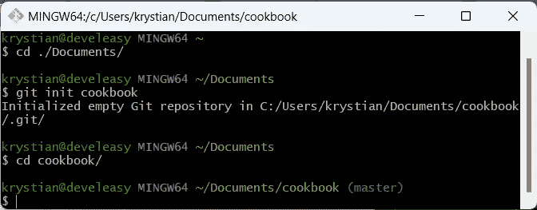

Git 创建的空存储库

您可能想知道为什么不能手动创建这个目录。**提醒一下:Git 存储库是一个包含隐藏的** `**.git**` **目录的目录。通过输入`git init`命令，Git 完成了所有的魔术，并相应地准备了它的`.git`目录。**

## 关于 Git 仓库的状态

如果您正在使用 Git Bash，并且您看到蓝色文本显示`master`或`main`，那么您可以确定您在 Git 存储库中。另一方面，如果您在 Linux 上使用终端，默认情况下您可能看不到当前的分支。

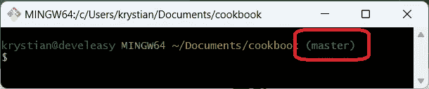

Git Bash 显示当前分支

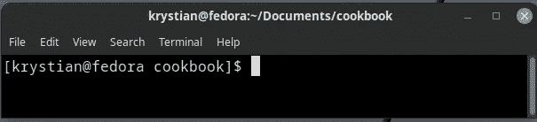

默认情况下，Linux 终端不显示与 Git 相关的信息

一般来说，`master`和`main`是 Git 中默认的*分支*的名称，但此时你不需要知道分支是什么。

我们可以执行的第一个操作是检查存储库状态。您的存储库应该是空的—输入`git status`，您应该会看到类似这样的内容:

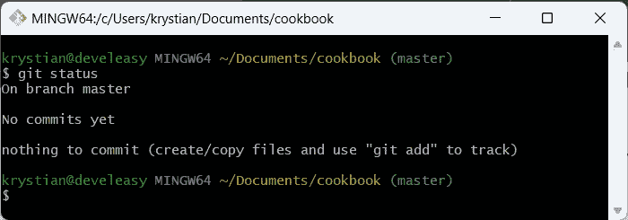

Git 说食谱储存库是空的

## 写食谱

是时候为我们的皇家早餐写食谱了！在`cookbook`目录下创建一个名为`royal_breakfast.txt`的新文件，并编写以下内容:

> 成分:
> 
> - 1 卷
> 
> -奶油奶酪
> 
> -豆芽
> 
> 准备工作:
> 
> 将面包切成两半，在面包上涂上奶油奶酪，然后放上豆芽。

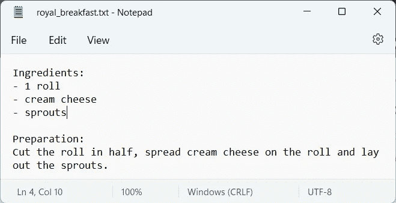

在你最喜欢的文本编辑器中写下食谱

## 检查您的存储库的状态

保存文件后，在终端中输入`git status`，您会注意到 Git 找到了您的食谱，但是文件还没有被 Git 跟踪。

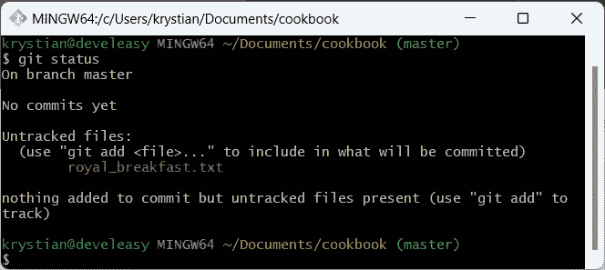

Git 已经注意到了这个新文件，但是它还没有跟踪它

## 选择下次提交的文件

要让 Git 跟踪你的食谱，输入`git add royal_breakfast.txt`，这会将食谱添加到*暂存区*。通过将文件标记为 staged，您可以指示 Git 在下一次快照中存储哪些更改(在下一次提交期间)。

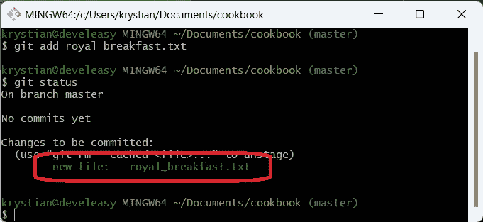

我们告诉 Git 为下一次提交选择我们的配方

## 告诉 Git 保存你的食谱

最终，我们可以告诉 Git 存储我们宝贵的食谱。为此，您有两种选择:

*   输入`git commit -m "<your_commit message>"`(短消息/一行程序的首选方法)
*   输入`git commit`，然后在打开的文本编辑器中编写提交消息(对于较长的消息，这是更好的方法)。此外，该选项利用 Git 配置中指向的文本编辑器

如果您看到一条关于缺少用户名或电子邮件地址的错误消息，请参阅我以前的文章，在那里我解释了如何配置这些设置。

如果配置正确，您应该会看到如下屏幕:

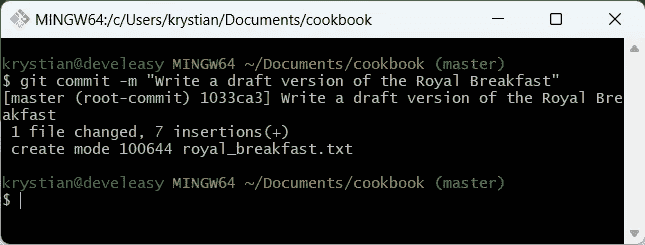

在 Git 存储库中创建第一次提交

**恭喜，您刚刚在 Git 中执行了第一次提交！**但这到底是什么意思呢？

您的早餐的*版本*现在由 Git 存储和维护，这意味着无论何时您更改了`royal_breakfast.txt`文件的内容，或者您甚至删除了该文件，Git 都会注意到这一点，然后您可以在先前提交的基础上保存(提交)新版本，或者您可以将文件恢复到上次提交时的状态。

## 提交后检查存储库状态

可选地，您可以在提交配方后使用`git status`检查存储库状态。这一次，Git 告诉您没有要提交的内容，这是因为当您执行提交时，暂存区已经被清空，因此它已经准备好进行下一轮提交。

我说的另一轮是指:

*   编辑配方
*   准备变更(选择将要提交的变更)
*   提交更改

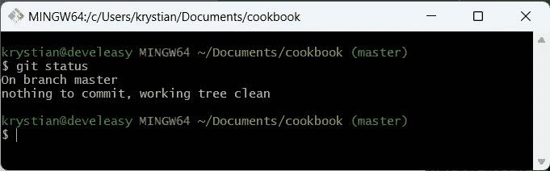

提交后，“git status”显示暂存区是干净的，并为下一轮做好准备

## 展示你的食谱的历史

在某些情况下，我们想知道*如何*和*何时*我们的项目发生变化。时*的答案是`git log`。*

每次提交都包含以下信息:

*   作者(王南钧·什皮查科夫斯基)
*   创建日期(2022 年 10 月 27 日，星期四)
*   信息(写一份皇家早餐的草稿)
*   SHA-1 校验和(1033ca3420…)，通常只有前五个字符重要

校验和是每次提交的 ID，这在使用 Git 的过程中至关重要，但是您将在稍后了解到它。

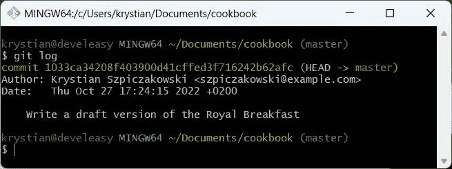

“git 日志”显示了存储库的历史

# 下一步是什么？

下一集，我们将升级皇家早餐，让它真正皇家化。此外，我们将进一步了解提交以及它们之间的关系。

# 参考

[1]王南钧·什皮查考斯基，*安装 Git 并开始像专业人士一样使用它(Meet Git # 2)*[https://medium . com/@ kszpiczakowski/Install-Git-and-start-using-it-like-a-Pro-Meet-Git-2-B3 C2 DD 96942 f](/@kszpiczakowski/install-git-and-start-using-it-like-a-pro-meet-git-2-b3c2dd96942f)

[2]王南钧·什皮查考斯基，*像专业人士一样配置 Git(遇见 Git # 3)*[https://medium . com/@ kszpiczakowski/Configure-Git-like-a-Pro-Meet-Git-3-e48f 82 B1 c 346](/@kszpiczakowski/configure-git-like-a-pro-meet-git-3-e48f82b1c346)

[3] Marshall Gunner，*如何在 Windows 10 上的命令提示符下更改目录*[https://www . How togeek . com/659411/How-to-Change-directory-in-Command-Prompt-on-Windows-10/](https://www.howtogeek.com/659411/how-to-change-directories-in-command-prompt-on-windows-10/)