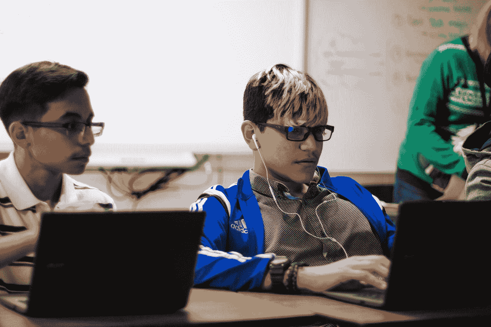
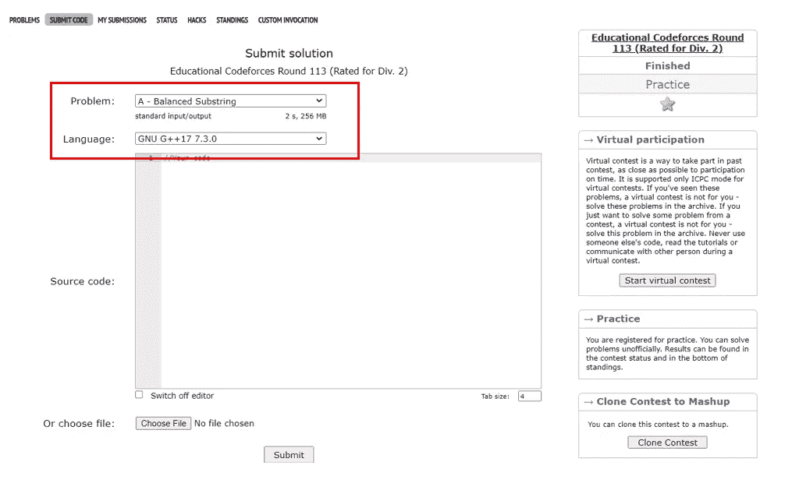
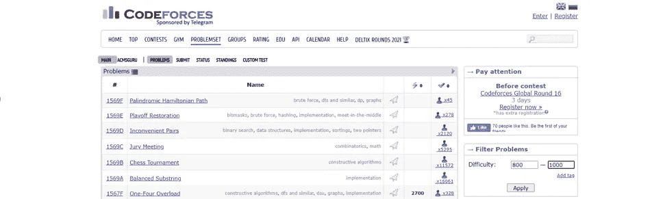
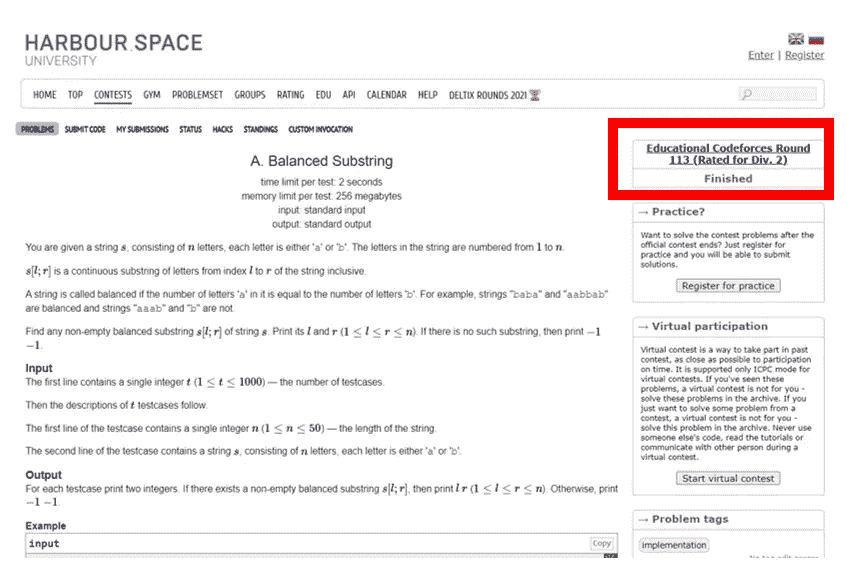
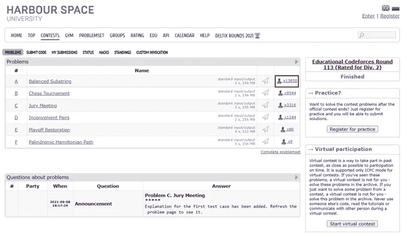
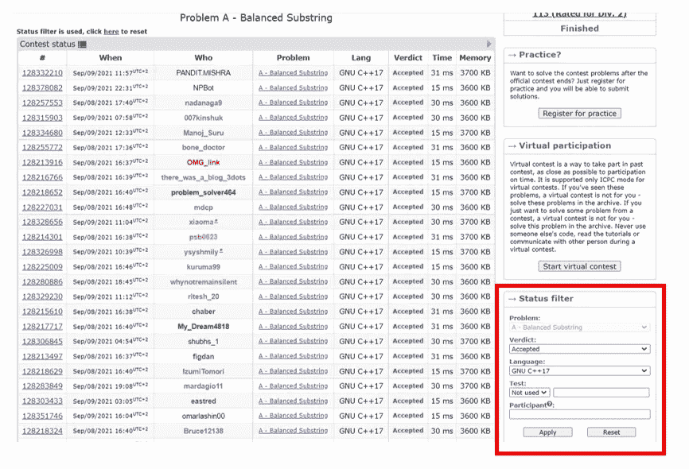
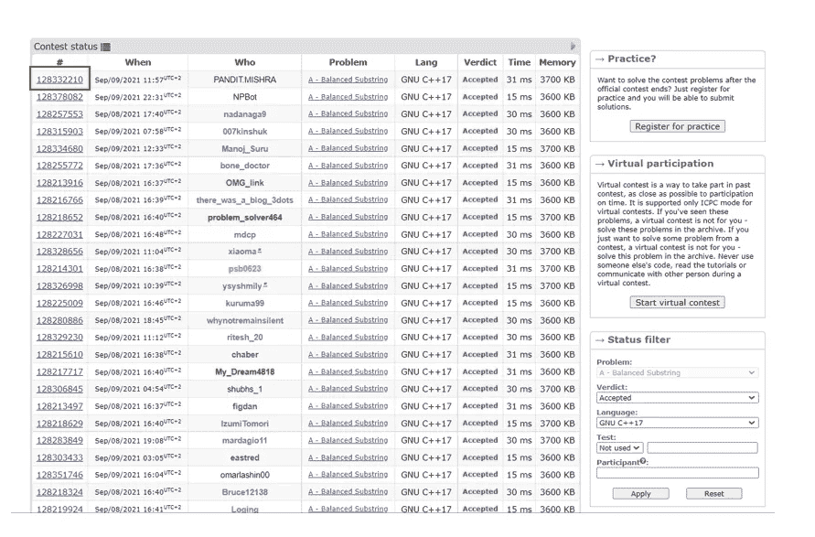

# 如何开始学习竞技编程

> 原文：<https://medium.com/codex/how-to-start-learning-competitive-programming-6b49f77ff2ea?source=collection_archive---------0----------------------->

## 学习竞争性编程的材料、资源和技巧的初学者指南

杰斯温·托马斯在 [Unsplash](https://unsplash.com?utm_source=medium&utm_medium=referral) 上的照片

# **什么是竞争性编程？**

竞技编程是一项脑力运动，依赖于解决问题的技巧、数学和编程知识。竞争性编程竞赛通常每年举行一次。有些是为高中生举办的，比如 IOI，有些是为大学生举办的，比如 ICPC，还有一些是为任何人举办的，比如 google code jam 和脸书黑客杯。

# **为什么要学竞技编程**

即使您对参加竞争性编程竞赛不感兴趣，花些时间解决问题也会对您有所帮助:

1.  掌握一门你选择的编码语言
2.  这将有助于你更好地编写面试代码
3.  它帮助你进行逻辑思考，更好地解决你面临的问题。

照片由 [Gia Oris](https://unsplash.com/@giabyte?utm_source=medium&utm_medium=referral) 在 [Unsplash](https://unsplash.com?utm_source=medium&utm_medium=referral) 上拍摄

# **进入竞争性编程之前你应该了解的事情**

1.  英语——基本阅读技巧——我不知道有什么好的资源可以学习英语，但我个人是从看电影和玩游戏中学到的
2.  **触摸打字** — 60 wpm
    我建议你在解决问题之前不要练习你的触摸打字，如果你不愿意参加比赛，那么根本没有必要在一个好的网站上练习 [**keybr**](https://www.keybr.com/)
3.  **数学** —代数和基础几何足以开始
    可汗学院是一个很好的资源，他们有很棒的教程，而且是免费的。如果你想认真地进入竞争性编程领域，你需要学习的不仅仅是代数和几何，但是代数和基本几何已经足够让你前进了。
    其他数学领域包括:
    *概率
    *组合学
    *线性代数
    *数论

# **竞争性编程使用什么编程语言**

我推荐 C++，因为它速度快，而且由于运行时间的限制，一些最高级的问题只能用 C++或 java 来解决。如果你的目标是参加像 ICPC 这样的比赛，C++是必须的，因为裁判有时不接受用 python 写的问题(c++，java 和 python 是唯一允许的语言)。但是如果你已经掌握了一门编程语言的知识，我建议你把它作为一个起点，因为一开始你用什么语言并不重要。

# 如何学习 C++

你可以用任何你喜欢的方式学习 C++，这里有一些资源会给你一个良好的开端。

*   你可以通过免费代码营的 [YouTube 初学者基础课程获得基础知识](https://www.youtube.com/watch?v=vLnPwxZdW4Y&t=6972s)
*   在那之后，你可以在 [HackerRank](https://www.hackerrank.com/domains/cpp) 的 C++赛道上做一些问题，直到你觉得自己已经掌握了基本知识
*   如果你想获得更高级的知识，你可以使用[exercisem c++ track](https://exercism.org/tracks/cpp)(我建议你结合解决其他网站的问题)

# **按顺序学习竞争性编程主题**

1.  数据类型和运算符
2.  情况
3.  环
4.  嵌套循环
5.  数组
6.  n 维数组
7.  复杂性分析和排序
8.  功能
9.  内置函数(如排序、幂、最小值和最大值)
10.  STLs(数据结构，如字符串、映射、队列、堆栈和链表)
11.  递归
12.  按位运算和位屏蔽
13.  数论
14.  图论
15.  动态规划
16.  在学习过程中，你会发现更多的主题

# 免费学习资源。

*   [**《竞争性程序员手册》**](https://cses.fi/book/book.pdf)
    这是一本由 Antti Laaksonen 编写的免费书籍，它将通过所有的算法和你需要了解的竞争性编程知识为你提供指导
*   **极客为极客** [尤其是算法列表](https://www.geeksforgeeks.org/fundamentals-of-algorithms/)
*   如果有一个话题你不明白，你可以使用谷歌，你会发现无数的文章解释它

# **优秀程序员的 YouTube 频道**

*   [**Errichto**](https://www.youtube.com/channel/UCBr_Fu6q9iHYQCh13jmpbrg)他是一个真正令人敬畏的 youtuber 用户，既解释具体的问题，也做关于算法和竞争性编程主题的教程。
*   [**科林·盖伦**](https://www.youtube.com/c/ColinGalen)
*   可能还有很多，但这些是我看的

# **竞争编程用什么 IDE？**

如果你没有使用 C++，你可以使用任何你喜欢的 IDE。如果你使用的是 C++的话，可以使用任何带有 gnu 编译器的 ide，比如 codeblocks，clion 和 eclipse。如果你是学生，clion 是最好的选择，因为它对学生是免费的。我个人更喜欢代码块而不是 eclipse，因为 eclipse 的设置是一个令人头疼的问题。只是不要使用 visual studio，因为它的编译器与 gnu 编译器有一些不同的规则(如果你愿意，你可以将 VISUAL STUDIO 代码与 gnu 编译器一起使用，但这会使你的速度慢一些，因为你必须先编译，然后用命令运行)。

# 解决问题的最佳网站(我在下面解释了如何使用每个网站)。

*   [代码强制](https://codeforces.com/)
*   [在编码器处](https://atcoder.jp/)
*   [黑客排名](https://www.hackerrank.com/)
*   还有其他类似 [code chef](https://www.codechef.com/) 和 [code wars](https://www.codewars.com/) 的网站，但我个人从未尝试过这些网站，但人们都说它们很棒。

# 如何不浪费时间解决问题？

## 一般问题:

*   给每个问题 30 分钟的试验时间。
*   如果你不能解决这个问题，看看教程，然后尝试解决它。
*   如果你仍然不能解决它，看看别人的解决方案。
*   如果你仍然不能解决它，搜索它的主题(通常你可以通过阅读教程知道问题的主题)并尝试理解它。
*   如果你仍然不能解决它，就跳过它，做另一个问题。

## 竞赛:

*   首先解决简单的问题，然后解决困难的问题，以最大限度地提高地位。
*   使用排名，你可以大致了解哪些问题比较容易(一般来说，解决问题的人越多，问题就越容易)。
*   最重要的事情是在比赛结束后，永远向上解决(解决你在比赛中不能解决的问题)。
*   要解决问题，看看问题的教程/社论，然后尝试解决它。

# **一般提示:**

*   试着每天花一些时间进行竞争性编程，尽量避免长时间休息，因为真正的进步来自于付出。
*   永远不要放弃相信我，开始的时候对我们所有人来说都很艰难，也许你认为自己太笨了，也许你认为这只是天赋，但是相信我，所有有竞争力的程序员都会经历这个。
*   避免仅仅阅读而陷入困境——一个好的规则是用 90%的时间解决问题，用 10%的时间阅读。因为解决问题是一种主要来自实践的技能。随着你的进步和学习越来越多，阅读和教程的比例会减少，直到你所做的 99%都是在解决问题。
*   当你陷入困境时，如果你没有在 stackoverflow、codeforces 和 [topcoder](https://www.topcoder.com/thrive/articles/Topcoder%20Forums) 等公共论坛上提问，尝试找到愿意回答你问题的人。

# **黑客等级**

开始练习使用 HackerRank 是明智的，因为它有各种级别的可怕问题，以及良好的用户界面和针对所有问题的惊人社论。我建议你从[算法技能](https://www.hackerrank.com/domains/algorithms)和[数据结构技能](https://www.hackerrank.com/domains/data-structures)开始做题。

# 使用 At 编码器指南解决问题

At coder 比 code forces 对初学者更友好，它有比 hacker rank 更高级的问题。我认为在代码强制适应竞赛风格的问题之前，在 coder 上解决
上的问题是一个不错的选择。

## 如何使用。

*   [At coder 表](https://kenkoooo.com/atcoder/#/table/)
    这是一张有很多 At coder 问题的表。
*   编码器竞赛定期举办竞赛，参加这些竞赛将极大地帮助你。

## 如何使用表格:

这是一个问题表，分成 8 个难点(A 到 H)。a 是最容易的问题，H 是最难的问题。

我建议你开始解决一个问题，直到它们变得容易，然后随着你的进展增加难度。

## 竞赛:

试着尽可能多的参加竞赛，一旦你完成了一场竞赛，你必须试着解决你以前不能解决的问题。

# 使用代码力解决问题指南

## 优点和缺点:

就问题的多样性和难度而言，它是最好的网站，但它缺乏友好的用户体验，有时教程很糟糕。

## 如何使用它:

1.  当你发现一个问题时，在 ide 上写下它的代码。完成后，点击提交，然后选择你的编译器并提交。

## 要解决的问题:

1.  你应该进入问题集页面，从右边选择难度 800-1000，然后点击应用。

2.然后使用勾号图标按最受欢迎的进行排序

3.继续解决，直到你觉得问题很容易，然后把难度增加 200(会是 1000–1200)。重复这一过程，直到你成为竞争性编程的大师

## 如何查看其他解决方案:

1.  转到问题页面。在右边找到它参加的比赛。然后点击它。

2.找到你的问题，点击蓝色的人类图标

3.使用状态过滤器，选择接受的裁决和您使用的语言，然后应用

4.点击竞赛状态代码查看代码

## 竞赛:

在 code forces 中有许多竞赛，这是一种很好的练习方式。比赛分为三个级别。Div 1 最难，Div 2 中级，Div 3 初级。你应该参加尽可能多的比赛，尽你所能！

# 恭喜你，你现在应该准备好了

现在你应该准备好开始了，不会迷失方向，不知道该做什么。如果你有任何问题，请随意评论，我会尽快回复。我希望这个指南能帮助你知道该做什么以及如何开始解决问题。