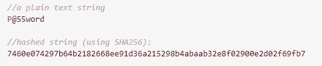
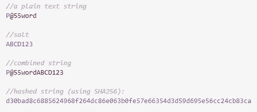
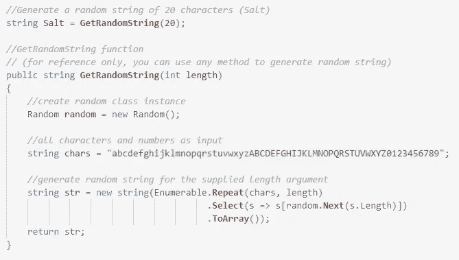
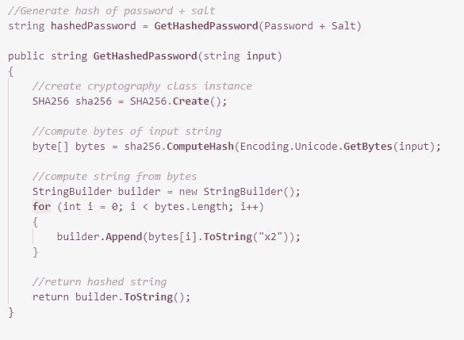
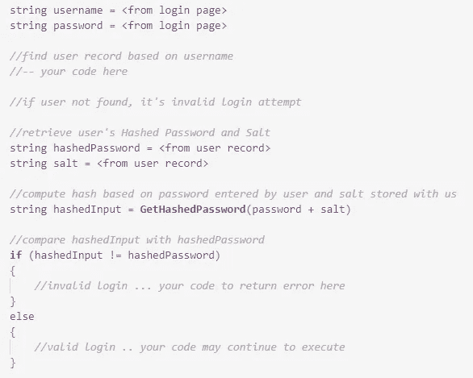

# 如何在数据库中存储用户密码？

> 原文：<https://medium.com/codex/how-to-store-user-passwords-in-a-database-1237c37bc52?source=collection_archive---------0----------------------->

在数据库中安全地存储用户密码

如果您仍然以纯文本格式保存用户密码，请遵循本指南来实施简单而可靠的策略来保存用户密码。

用户认证是几乎所有类型的 web 应用程序都需要的基本实现之一。这听起来很简单，但需要小心操作，以确保您的用户免受数据泄露或潜在安全故障的影响。

简而言之，您永远不应该将用户密码存储在数据库中！是的，你没看错。用户密码(也称为纯文本)不应被存储。相反，我们应该通过将密码转换成散列来存储它们。本指南通过一个非常简单的循序渐进的过程，解释了散列密码并将其存储在数据库中的过程。

# 哈希是什么？

哈希的简单定义:

> 哈希是将给定的键转换成另一个值的过程。使用**散列函数**根据数学算法生成新值。哈希函数的结果被称为**哈希值**，或者简称为**哈希**。— [教育性 io](https://www.educative.io/edpresso/what-is-hashing)

哈希通常是单向函数，由此产生的哈希无法转换回原始源。在用户密码的情况下，一旦你散列它们，你得到一串代表原始文本的字符，但是没有办法把它转换回原始文本。

请参见下面的哈希字符串示例:

简单的字符串散列

# 不要单独哈希密码！

单独散列用户密码不是一个好的做法。因此，在执行散列之前，您需要将*或其他*与密码混合。这个*‘别的东西’*叫做‘盐’。

# 什么是盐？

让我们先来看看定义:

> 在密码学中，salt 是随机数据，用作散列数据、密码或密码短语的单向函数的附加输入。— [维基百科](https://en.wikipedia.org/wiki/Salt_(cryptography))

因此，在哈希密码时，我们会在密码中添加一个随机字符串，然后对其进行哈希处理。这里有一个例子:

密码结合盐进行哈希运算

您可能会注意到，即使新字符串(P@55wordABCD123)的长度比旧字符串(P@55word)长，哈希值在字符数方面也具有相同的长度。这是由于哈希的工作方式。但是我们在这里不深入讨论这个话题。你可以[在这里](https://en.wikipedia.org/wiki/Cryptographic_hash_function)阅读更多关于哈希的内容。

关于盐需要注意的要点:

1.  盐的长度不应该像上面例子中所示的那么短。我会推荐 20 到 40 个字符的内容。
2.  盐应该对每个用户都是独一无二的。使用相同的 Salt 对所有用户密码进行哈希运算是不安全的，也不推荐使用。

不要被术语“T1”哈希“T2”和“T3”盐“T4”弄得不知所措。这些只是由算法生成的字符串。你不需要学习算法，除非你真的有兴趣知道幕后发生了什么。为了在应用程序中实现散列，您只需要调用几个函数。我们将在下面详细讨论这些步骤。

# 在数据库中实现散列密码存储

## 在数据库中设置用户表

首先，在用户表中创建两列(除了已经有的其他列，如姓名、电子邮件、电话等。)

1.  PasswordHash(字符串)
2.  PasswordSalt(字符串)

名字可以是任何东西，以上名字仅供参考。

## 新用户注册

每当一个新用户注册时，您都可以将他们的用户名和密码(由用户输入)以及其他字段保存在数据库中。

现在，不要将用户密码直接保存为纯文本，而是按照以下步骤操作:

1.  随机生成 ***盐*** :

生成一个随机字符串作为“盐”

2.计算组合字符串(密码+ Salt)的 ***哈希***

计算字符串的散列值

注意，在上面的例子中，我使用了 ***SHA256*** 加密类来计算散列。这个类在`System.Security.Cryptography` C#中可用。几乎所有的编程语言都有其他的选择。你可以在这里找到更多关于其他流行加密提供商的信息——[MD5](https://en.wikipedia.org/wiki/MD5)、[惠而浦](https://en.wikipedia.org/wiki/Whirlpool_(hash_function))、[布雷克](https://en.wikipedia.org/wiki/BLAKE_(hash_function))。

3.在数据库中保存 ***哈希密码*** 和 ***盐***

现在，您可以将 ***散列密码*** 和 ***Salt*** 保存在数据库中上述相应的列中。这样，我们完全不知道用户的实际密码。您可能会注意到，即使有人可以访问数据库，他们也看不到任何用户的实际密码。此外，即使可以访问 ***散列密码*** 和 ***Salt*** ，也不可能逆向工程找到任何用户的密码。

# 登录时验证用户密码

您可能想知道在这个阶段，当用户下次尝试登录时，如何验证他们是否输入了正确的密码？因为我们不再存储用户的密码，所以我们不能简单地验证用户输入的纯文本密码的正确性。因此，我们需要遵循相同的散列过程来验证用户输入。下面是它的工作原理:

使用哈希比较用户输入密码

这就是如何在应用程序中实现健壮的密码存储机制。这是大多数应用程序遵循的标准方法，还有其他方法可以进一步增强安全性。

希望你喜欢这篇文章，今天学到了一些新东西。如果你有更多的东西要分享，请在评论中留下你的想法。

为了阅读我所有的故事，以及媒体上成千上万的其他作家，考虑选择媒体会员。如果你使用我的链接加入，我将从你的加入费中获得佣金。祝你好运！