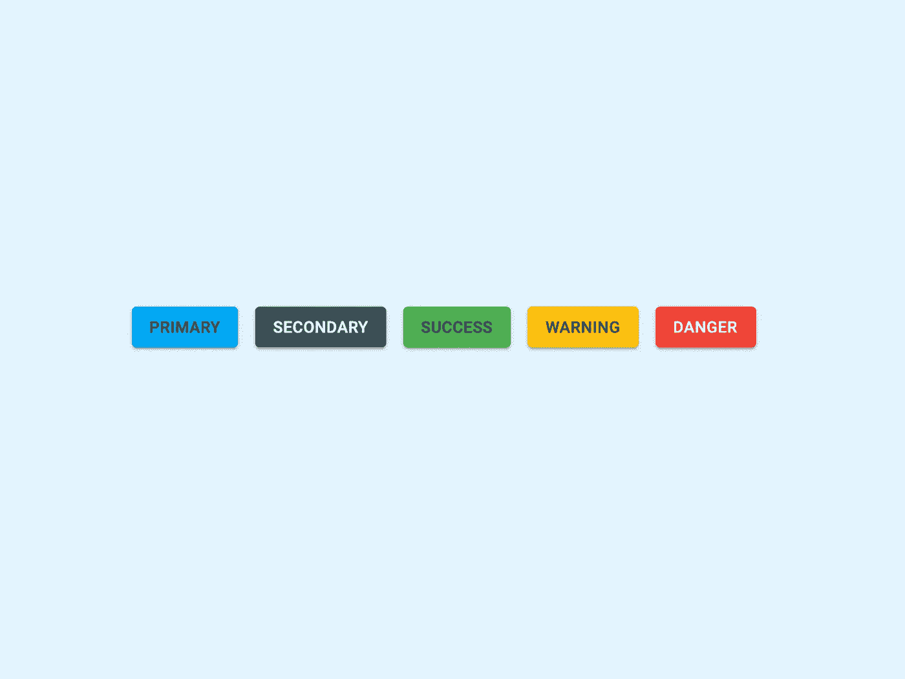

# 如何设计材质 UI 组件的样式

> 原文：<https://medium.com/codex/how-to-style-material-ui-components-6b21ad1e1d8f?source=collection_archive---------3----------------------->

## 了解如何使用材质 UI 框架在 React 中创建自定义按钮



Material UI 是最著名的 React UI 框架之一。
它允许您轻松地将[材料设计](https://material.io/design)组件集成到 React web 应用程序中。

通过使用 Material UI，您首先要学习的事情之一是定义一个在整个应用程序中工作的全局主题。
这有很大的好处，因为只需改变主题定义中的一些属性，就可以更容易地调整你的样式。

但是，如果您需要为某些组件(如按钮)定义不同的样式，您需要定义一个自定义组件并使用组件级主题。

在本文中，我将解释如何定义一个适用于整个应用程序的全局主题，并定义一些带有特定主题的自定义可重用组件。

# 设置

首先，需要将 Material UI 框架安装到 React 应用程序中。
为此，您只需使用终端导航到 React 项目主文件夹，然后键入命令:

```
npm install @material-ui/core
```

这将安装框架的核心组件以及管理主题的工具。

# 定义一个全局主题

接下来，您需要为您的应用程序定义一个全局主题。
一个好的做法是在你的`/src`文件夹中定义一个`theme.js`文件。这将使你的主`App.js`代码更简洁，使你的应用程序结构更整洁。

```
import { createTheme } from "@material-ui/core"; import { blueGrey, lightBlue } from "@material-ui/core/colors"; export const theme = createTheme({  
    palette: {    
        primary: {      
            main: lightBlue[500],      
            light: lightBlue[300],      
            dark: lightBlue[700],    
        },    
        secondary: {      
            main: blueGrey[700],      
            light: blueGrey[500],    
        },
    }
})
```

这段代码通过使用`createTheme`函数创建一个新的材质 UI 主题。
该函数接受一个对象作为参数。
通过定义其属性，您可以覆盖默认的材质 UI 主题。

在上面的文件中，我指定了`palette`属性，这样我的整个应用程序将使用`lightBlue`作为主色，`blueGrey`作为副色。

最后一步，要开始使用这个主题，你需要将它导入到你的`App.js`文件中，并将其指定到一个`ThemeProvider`组件中。
该组件的作用是获取指定的`theme`属性，并使其对其中的所有组件可用。

```
import { ThemeProvider } from "@material-ui/core";
import { theme } from "./theme"const App = () => {
    return (
        <ThemeProvider theme={theme}>
            <!-- Your application content -->
        </ThemeProvider>
    )
}
```

有了这个环境设置，您可以开始创建不同的按钮，这些按钮将使用主题调色板中指定的颜色。

```
import { 
    ThemeProvider,
    Button
} from "@material-ui/core";
import { theme } from "./theme"const App = () => {
    return (
        <ThemeProvider theme={theme}>
            <Button 
                color="primary"
                variant="contained"
            >Primary</Button>
            <Button 
                color="secondary" 
                variant="contained"
            >Secondary</Button>        
        </ThemeProvider>
    )
}
```

如您所见，您可以通过使用`color`属性轻松地指定组件外观。
但是，按钮 API 的颜色属性只接受 4 个值:`default` `inherit`、`primary`和`secondary`。

如果你需要应用不同的主题怎么办？

Bootstrap 允许指定*成功*、*警告*、*危险、*和其他类，与 Bootstrap 不同，在 Material UI 中，您需要使用自己的本地主题创建自己的自定义组件。

我们来看看怎么做。

# 定义自定义按钮

首先，您需要创建自己定制的可重用组件。
在我的例子中，我将为*成功*、*警告*和*危险*动作重新创建经典按钮。

您需要将所有这些组件保存在一个单独的文件夹中，以保持项目的有序性。
让我们创建一个新的文件夹结构:`/src/components/views`。

在其中创建三个不同的文件，分别叫做`SuccessButton.js`、`WarningButton.js`和`DangerButton.js`。

由于所有三个组件的程序都是相同的，我将只解释`SuccessButton`。

```
import { 
    createTheme, 
    ThemeProvider, 
    Button 
} from "@material-ui/core"
import { green } from "@material-ui/core/colors";const theme = createTheme({
    palette: {
        primary: {
            main: green[500]
        }
    }
})const SuccessButton = ({ title, variant, onClick }) => {
    return (
        <ThemeProvider theme={theme}>
            <Button 
                color="primary" 
                variant={variant}              
                onClick={onClick}
            >{ title }</Button>
        </ThemeProvider>
    )
}export default SuccessButton
```

正如你所看到的，我指定了一个组件级的主题，它的主要颜色是`green`，就像引导成功的颜色一样。

使用组件内的`ThemeProvider`组件*，该调色板将仅应用于组件中指定的按钮。*

此外，为了应用自定义属性和手势侦听器，我为组件指定了三个自定义属性，这将覆盖本地组件属性。

然后，您可以导入这些按钮，并在您的应用程序中轻松重用它们:

```
import { 
    ThemeProvider,
    Button
} from "@material-ui/core";
import { theme } from "./theme"import SuccessButton from "./components/views/SuccessButton"
import WarningButton from "./components/views/WarningButton"
import DangerButton from "./components/views/DangerButton"const App = () => {
    return (
        <ThemeProvider theme={theme}>
            <SuccessButton 
                title="Success" 
                variant="contained"
                onClick={ () => console.log("Success clicked!") } />
            <WarningButton 
                title="Warning"
                variant="outlined" 
                onClick={ () => console.log("Warning clicked!") } />
            <DangerButton 
                title="Danger" 
                variant="text"
                onClick={ () => console.log("Danger clicked!") } />       
        </ThemeProvider>
    )
}
```

你可以在[这个 GitHub repo](https://github.com/Pizzo15/react-styled-buttons) 中查看示例项目的完整代码。

起初，与用于经典引导组件的代码相比，它可能看起来有很多代码。

无论如何，一旦你熟悉了 React 组件和材质 UI 主题化的工作原理，你会发现创建定制的和可重用的组件在你的整个应用程序中使用是多么容易。

我希望这个指南能帮助你使用 React 和 Material UI 这些令人惊叹的工具来创建漂亮的 web 应用程序。

编码快乐！