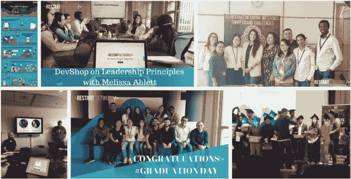

# 粉碎你的编码训练营:成功的技巧和策略

> 原文：<https://medium.com/codex/how-to-succeed-in-a-coding-bootcamp-41e8eb88e1a5?source=collection_archive---------10----------------------->

## 学习编码并在几个月内获得一份开发人员的工作。

我在荷兰精彩的编码训练营生活。照片由[李冠仪](https://medium.com/u/9f2dc23bfffa?source=post_page-----41e8eb88e1a5--------------------------------)拍摄。

作为一名自学成才的开发人员，我参加了一个为期 6 个月的编码训练营— [RestartNetwork](https://restart.network/) ，在鹿特丹(荷兰)，我于 2017 年底完成了医学领域的博士学位。