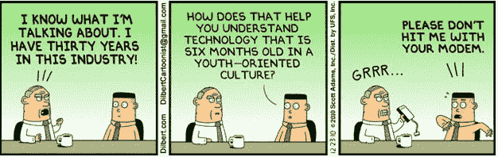

# 如何管理软件项目

> 原文：<https://medium.com/codex/how-to-suck-at-managing-software-projects-4e6e47007473?source=collection_archive---------2----------------------->

## [法典](http://medium.com/codex)

## 项目管理不是一门精确的科学，更不用说软件项目了。在软件工程中，在方法、评估、表示等方面存在一些不确定性。

与其他工程领域不同，软件很容易失败，因为没有如何做好事情的通用方法。一个人本身可以是复杂的；一群人可以多得多。

经理和开发人员需要意识到当项目在时间和成本上停滞不前时，什么会失败。重要的是他们“后退两步”来理解随着时间的推移出现的模式。有许多技术可以用于这一目的(例如: [5 个为什么](https://en.wikipedia.org/wiki/5_Whys)，失败案例分析)，但在这里，我将尝试总结我整个职业生涯中观察到的错误。

# 管理模式不完善

我发现的主要缺陷之一是**不充分和过时的管理模式**；许多经理认为他们在经营一家工厂或一条装配线，而事实是软件开发不是一个机械的过程，而是涉及创造力和灵感。

[*查理·卓别林—摩登时代*](http://www.imdb.com/title/tt0027977/)

**程序员不是机器人**；编程过程包括迭代、优化和协作。你甚至可以认识到与艺术的相似之处:

*   它涉及灵感；
*   具有个人风格；
*   做好编程没有秘诀。

因此，理想的算法/程序是某种东西的顶点；这不是一个可自动化或可重复的任务。

与艺术家或设计师一样，向开发人员施压，要求他们加快工作速度，延长工作时间，只会带来短期效果。从中长期来看，产品质量受到损害，程序员的积极性受到影响(两者都很难恢复)。没有意识到这一点的经理可能入错行了。

另一个常见的问题是不灵活。有些管理人员认为，在一些项目中成功使用的管理模式可能会无限期地、不加区别地应用到其他项目中。即使是流行的[敏捷](http://agilemanifesto.org/)方法学 [Scrum](https://en.wikipedia.org/wiki/Scrum_(software_development)) ，也不是所有事情的解决方案(例如，考虑 XP 或看板)。另一方面，一些经理喜欢强制使用通常不合适或不必要的工具；如果团队能够决定什么给项目带来更多的价值(因此，给公司)会更好。

方法的不正确使用会产生很大的影响，并且[会戏剧性地改变项目的进程](https://en.wikipedia.org/wiki/Butterfly_effect)。例如，大多数管理者完全贬低了众所周知的技术，如任务分析、[纸上原型](http://www.ivogomes.com/blog/wp-content/uploads/2006/07/prototipagem1.jpg)、[结对编程](https://en.wikipedia.org/wiki/Pair_programming)，甚至迭代开发的价值。众所周知，几个小时的分析可以节省大量的编程时间。

# 缺乏透明度

经理应该与团队沟通，告知业务、目标、背景、后续步骤、路线图、合作伙伴等。必须对团队隐瞒很少或没有。只有在拥有项目元数据的情况下，开发者才能发挥出自己的最大能力。每个人都应该被允许尽自己最大的努力。例如，如果一个程序员知道某个特性以后会发展，他可以为此准备代码。

全面分析一个问题，然后交给团队去实施，只是对他们的技能缺乏信心。没有人喜欢做一个简单的执行者，在事情上没有发言权，或者受到阻碍去质疑事情。大多数程序员喜欢利用他们的批判性思维。**一个** **请求背后的原因馈给开发者实现它的动力。**

将需求分析与开发人员分离会损害他们的动机，从而损害项目。分析和实施应该齐头并进。

**底线是每个人都在为同一个目标而奋斗**:项目和公司的成功，所以所有人都应该分享相同的信息。将开发者与业务、客户，尤其是用户隔离开来确实是非常糟糕的。

# 强加技术

项目管理中最严重的一点是当有人强制使用某些技术时。不管是经理用过，喜欢过，CTO 在博客里看过，某个开发者突发奇想，还是因为朋友告诉他的；这些都不是动机。更糟糕的是在[需求分析](https://en.wikipedia.org/wiki/Requirements_engineering)之前完成。

**技术必须源于需求，并应由团队**决定，也就是说，它们必须是必然的结果，而不是相反。强加只会导致团队士气低落。即使技术再完美的道理，也需要通过逻辑和推理来“取人”。程序员喜欢这样。

[*呆伯特漫画 2010 年 12 月 23 日*](http://dilbert.com/strip/2010-12-23)

# 错误的团队规模

另一个经常发生在项目结束时的严重问题是，在绝望中，经理(他们几乎不了解团队)开始添加元素，确信这将加速项目的完成。说明这种情况的经典故事是 [9 个女人一个月生不出来](https://www.goodreads.com/book/show/13629.The_Mythical_Man_Month) …

新元素的增加需要现有团队的额外时间，从而延迟了整个流程。此外，这一时期的相对生产率较低。因此，增加程序员可能会适得其反。

所以一个团队的成长一定是循序渐进的，可持续的。新的元素应该事先添加并正确引导，但是这需要很好的预测需求的能力，这反过来需要团队能力的知识。

另一个问题是，当经理们发现将一个项目分散到世界各地的多个地点很有趣，他们相信这将加快进程或“创造量子协同效应”。事实上，处理许多时区只能使事情变得更难。除非我们谈论的是具有良好分离的组件和良好定义的边界的维护阶段，否则很难以这种方式工作。

# 疏远的领导人

我一直主张更非正式的管理模式，老板是领导者，而不是经典的“独裁者”。领导者不发号施令；一个领导者控制“船”的方向和速度，避开障碍物。老板，或者更确切地说，领导者，可以在可能的情况下自然出现。理想情况下，领导者应该是团队的一部分(可能会时不时地“亲自动手”或减少分配)。这具有如下有益效果:

*   通过分享问题和成功创造更有凝聚力的团队精神；
*   允许实时了解项目的当前状态；
*   在团队中灌输自主权和决策权；
*   允许更多地了解团队成员(例如他们的问题)。

比掌握 MS Project 更重要的是与人共情，对他们的潜力、关注和愿望保持敏感。

的确，项目管理本身就是一门学科，适用于任何领域。然而，当谈到没有软件培训/经验的“[通用经理](https://en.wikipedia.org/wiki/Dilbert_principle)”时，我持怀疑态度。他们能把这种类型的项目成功吗？

任何程序员都会对毫无根据的高水平评估感到恼火和沮丧，比如“那需要 5 分钟”，“那只是把点连接起来”或者“那只需要 5-10 行代码”，[表现出对技术的完全无知](https://www.youtube.com/watch?v=BKorP55Aqvg)，不尊重团队和他们的工作。最令人恼火的是，那些认为软件只是一块块乐高积木，你可以随意移动，平稳地连接和断开(尽管如此，你还是应该渴望[关注点分离](https://en.wikipedia.org/wiki/Separation_of_concerns))。

那些只会泛泛而谈的经理，那些给人留下深刻印象的流行语和晦涩难懂的术语对团队来说是陌生的。一个经理必须了解团队，只有在团队附近才能起到保护和支持的作用。孤立办公室里的经理和领导属于过去。

[*大卫·布伦特—办公室*](http://www.imdb.com/title/tt0290978)

# 总之，不要做什么:

*   像流水线一样管理软件，像机器一样对待团队(其实他们和设计师一样都是有创造力的人)；
*   隐藏重要细节，在团队、管理层和业务之间制造隔阂；
*   强制使用方法、技巧或技术；
*   盲目地添加新元素，幻想这样可以加快项目的执行。

[*最初，我在 Pplware 用葡萄牙语发表了这篇文章。*](http://pplware.sapo.pt/software/como-nao-gerir-um-projecto-de-software/)