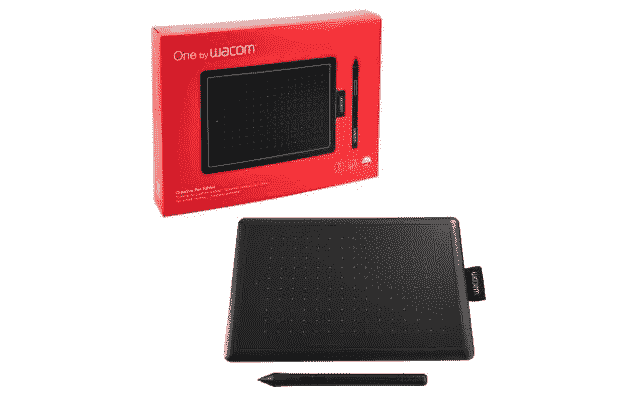

# 如何在 M1 MacBook Air 上做手写笔记

> 原文：<https://medium.com/codex/how-to-take-handwritten-notes-on-an-m1-macbook-air-aee92731819f?source=collection_archive---------1----------------------->

## Wacom 绘图板做笔记用的那个

图片由 Wacom 提供

我是一个到了一定年龄的人。我正以极快的速度奔向我的 52 岁生日。嗯，‘飞奔’可能有点夸张。尤其是我这双老膝盖。关键是，我有点固步自封。说到记笔记，我是一个喜欢用纸和笔的人。根据……