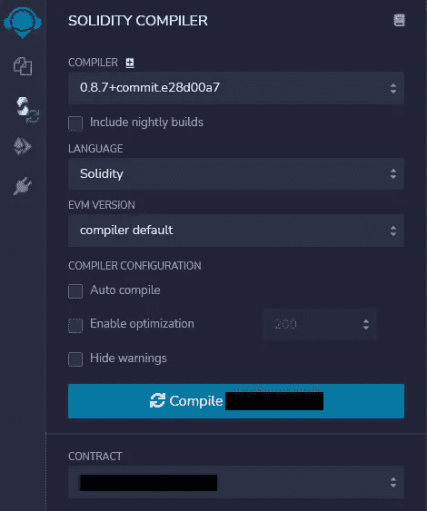
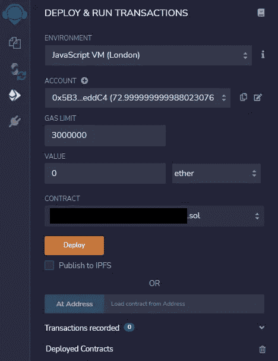
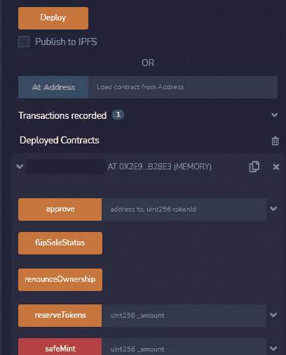
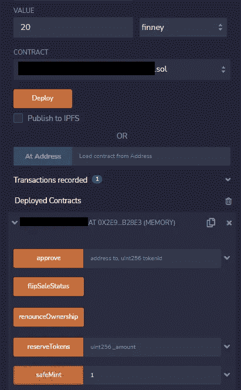
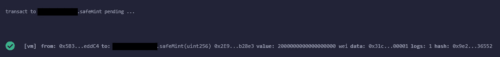
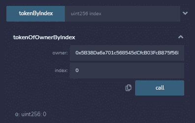

# 如何用 Remix 测试智能合约

> 原文：<https://medium.com/codex/how-to-test-a-smart-contract-with-remix-b2e9669997dd?source=collection_archive---------2----------------------->

*无需部署到测试网即可轻松测试。*


[行政](https://unsplash.com/@executium?utm_source=unsplash&utm_medium=referral&utm_content=creditCopyText)在 [Unsplash](https://unsplash.com/s/photos/ethereum?utm_source=unsplash&utm_medium=referral&utm_content=creditCopyText) 上拍照

Remix 已经成为以太坊和其他基于 Solidity 的区块链上最著名的智能合约开发 ide 之一。它易于使用，具有您想要的所有适当的代码突出显示，并且具有集成的编译器和部署器。

然而，这种部署可以用 Ethereum 的 Web3 来完成，或者在 JavaScript 虚拟机上本地完成。在本地部署契约是用 remix 提供的漂亮 GUI 测试它的一种非常简单的方法，所以让我们快速看一下如何使用 Remix 测试我们的智能契约。

# 合同

我将使用下面的[智能合同](https://gist.github.com/mbvissers/a2145e511e6b16d9acb92641b51e9f88)。这是一个基本的 NFT 契约，带有一些我们可以用来学习使用 Javascript VM 进行测试的功能。

你可以使用任何契约，它不必遵循 ERC721 之类的特定标准，只要它有一些公共函数、一些公共变量、一些`onlyOwner`函数，以及一个我将在本文中展示如何使用的`payable`函数。

# 在 JavaScript 虚拟机上部署合同

当您部署一个契约时，必须首先编译它。这可以使用 Remix 提供的编译器功能来完成。它是左边菜单中的第二个标签。选择您的合同(不是子合同)，然后单击编译。



编译后，您可以部署该协定。这可以通过单击左侧菜单上的第三个选项卡来完成。选择一个`JavaScript VM`，再次选择右边的合同，所以不是子合同，点击橙色的`deploy`按钮。你不必把它发表到 IPFS。

这些帐户是测试帐户，不会使用任何 testnet 以太坊工作。你可以从一个大列表中选择，但选择哪个并不重要。请记住，您部署的契约是**所有者**。



您现在应该会看到一个新部署的契约出现。打开选项卡，您将看到所有可用的功能。这些功能通过可见性和是否接受付款来进行颜色编码。有参数的函数旁边会有一个文本字段。如果契约有多个参数，可以打开它们，或者可以像在代码中一样用逗号分隔这些值。



# 测试合同

要测试这些功能，您可以输入参数并单击按钮来发送交易或查看值。

对于`payable`功能，您需要在`value`字段中添加一定量的乙醚。请务必检查您选择的值的类型。



发送 0.02ETH 或 20 芬尼

当您现在点击`SafeMint`功能时，它应该会在底部屏幕上返回一个交易状态。如果成功，旁边会有一个勾号。您可以打开事务信息来查看更详细的信息。



成功发送

`View`功能不会添加勾号，它们会在日志中显示为`call`。它们将在函数下面显示检索到的值。



该地址拥有的第一个令牌的令牌 Id 为 0

除了打开参数字段之外，您还可以以双引号括起来的字符串形式输入所有者，并在逗号后面添加数字。

```
"0x5B38Da6a701c568545dCfcB03FcB875f56beddC4", 0
```

如果你有很多功能要测试，这就更容易了，它让界面更整洁。

# 结论

当我遇到这种测试方式时，我大吃一惊。因为当时我对合同开发还很陌生。还有其他工具，如 Ganache，应该在本地而不是在网页上提供相同的功能，这可能是可取的。

非常感谢你的阅读，祝你有美好的一天。

[用支持介质支持我，成为会员](https://mbvissers.medium.com/membership)。

[在 Twitter 上关注我](https://twitter.com/MVissers4)跟上我。

点击这里查看我最新的 [NFT 收藏。](https://www.pixel-pizzas.com/)