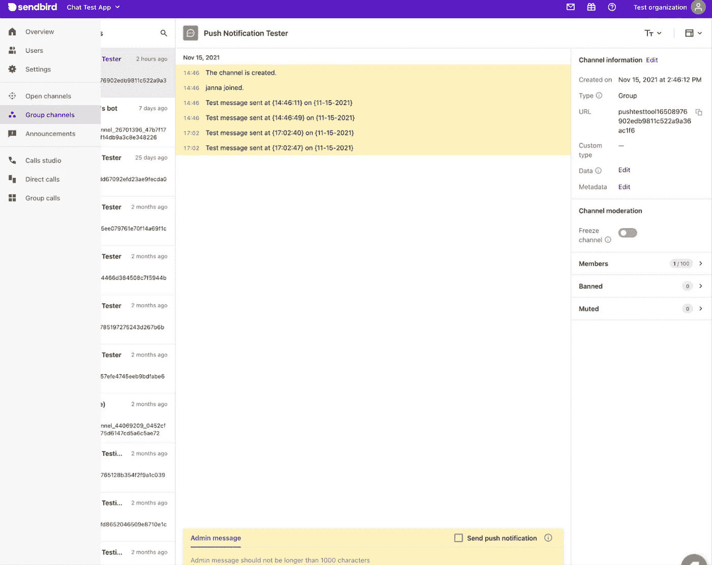

# 如何使用 Sendbird 测试工具测试和调试移动推送通知

> 原文：<https://medium.com/codex/how-to-test-and-debug-mobile-push-notifications-with-the-sendbird-tester-tool-585a34a150ac?source=collection_archive---------24----------------------->

仙鸟

## iOS (APN)、Android (FCM)和华为(HMS)设备推送通知测试指南

由迦娜·麦克劳克林
解决方案工程师| [Sendbird](https://www.sendbird.com)

*更多指导请参考* [*文档*](https://sendbird.com/docs/chat/v3/ios/guides/push-notifications#2-push-notification-tester) *。登录* [*Sendbird 仪表盘*](https://dashboard.sendbird.com/auth/signin?next=/) *开始。*

> *为了第一时间了解新教程、开发者相关聊天/电话发布以及其他重要更新，* [*注册*](https://get.sendbird.com/dev-newsletter-subscription.html) *获取我们的开发者简讯。*

# 介绍

推送通知是应用程序的重要移动提示。它们不仅有助于传递重要信息，还有助于重新吸引那些转向不同应用或离开手机的用户。正因为如此，推送通知在移动应用程序开发中是非常宝贵的实现。事实上，[数字表明](https://onesignal.com/blog/deciding-when-and-how-to-use-email-vs-push-notifications/)推送通知比电子邮件(另一种广泛使用的沟通方式)更能吸引用户，让你的应用程序走上前台。例如，推送通知的打开率为 20%，而电子邮件的打开率不到 2%！

然而，在你的应用中实现推送通知并不总是那么简单。为了帮助开发人员排除故障并测试他们的推送通知实现，我们已经构建了一个推送通知测试工具，您可以在 [Sendbird 仪表板](https://dashboard.sendbird.com/)上使用它。

在本教程中，我们将首先介绍推送通知测试工具，并列出一些我们建议在继续之前完成的先决条件。复习完前提条件后，可以跳到正在测试的设备部分；在本教程中，我们将涵盖 iOS、Android 和华为设备的测试。

我们开始吧！

# 什么是推送通知测试工具？

推送通知测试器允许您向应用程序中任何注册用户的设备发送测试推送通知。例如，您可以向用户迦娜的 iPhone 发送测试推送通知！

推送通知也可以发送到 Android 和华为设备，完全支持 Firebase 云消息(FCM)、华为移动服务(HMS)和苹果推送通知服务(APNs)。

要查看推送通知测试工具，请选择您的 Sendbird 应用程序并导航至设置>聊天>通知部分，如下图所示。

# 先决条件

在使用推送通知测试程序测试发送推送通知之前，您需要:

1.  将推送通知证书、密钥或应用 ID 上传到 [Sendbird 仪表板](https://dashboard.sendbird.com/)
2.  在应用程序中实现推送通知
3.  创建用户，运行已实施推送通知的应用，并通过应用注册设备令牌

如果你需要额外的指导，请查看我们关于 [iOS](https://sendbird.com/docs/chat/v3/ios/guides/push-notifications) 、 [Android](https://sendbird.com/docs/chat/v3/android/guides/push-notifications) 、 [JavaScript](https://sendbird.com/docs/chat/v3/javascript/guides/push-notifications) (React Native)和 [Flutter](https://sendbird.com/docs/chat/v3/flutter/guides/push-notifications) 的文档。

# 第 1 部分:iOS 设备

## 在 iOS 上测试您的第一个推送通知

导航到 Sendbird 控制面板的通知部分，并选择与您正在测试的应用程序的捆绑包 ID 相匹配的 APNs 证书旁边的“发送”选项。

小贴士:

*   如果您通过从 Xcode 运行应用程序来测试推送通知，请确保使用“开发”证书进行测试。
*   我们建议使用物理设备而不是 iOS 模拟器进行测试。

选择“发送”按钮，您将看到“APNs 推送通知测试程序”弹出窗口，如下所示。

在“昵称”部分，输入您要向其发送推送通知的用户名。或者，通过“用户 ID”搜索用户。

如果该用户在 APN 文件中注册了设备令牌，则会在用户搜索框下方的框中自动填充一个令牌。如果用户注册了多个设备令牌，您可以通过单击填充的令牌并从下拉框中选择另一个令牌来选择不同的令牌。

一旦选择了您的用户和设备令牌，您就可以发送到您的设备了！单击“发送”按钮，等待 30 秒钟在您的移动设备上接收通知。

如果推送通知发送成功，您将在手机上看到该通知:

在 Sendbird 仪表板上，会有一个弹出窗口显示您的推送通知已成功发送。它还会显示发送的时间戳。

当推送通知发送到设备时，Sendbird 会为该用户创建一个新的群组通道，通道名称为“推送通知测试器”。推送通知的一种实现方式允许您点击推送通知，这样应用程序将打开群组频道列表。在那里，您可以看到“推送通知测试器”通道，并选择它来查看来自该工具的消息。测试消息将采用以下日期和时间格式，以便您可以找到想要的确切通知:

**“在<日期>的<时间戳>发送的测试报文”，**

当向同一用户和设备令牌发送后续推送通知消息时，这些消息将被插入到现有的已创建的信道中。

您还可以在 Sendbird 仪表板上看到新频道。如果你有 Sendbird 的审核工具，你可以看到通道查看测试消息。

## iOS 推送通知问题故障排除

当推送通知没有发送到您的设备时，这可能是一个挑战。为了帮助您解决问题，Sendbird 的推送通知测试器会传递从 APNs 收到的响应。本节涵盖了 Sendbird 团队在进行故障诊断时遇到的最常见问题。

## BadDeviceToken

**可能的原因**

注册的设备令牌用于生产，但您正在通过从 Xcode 运行应用程序来测试开发中的推送通知。

**可能的解决方案**

*   使用 TestFlight 对临时构建进行测试。
*   通过在您的生产应用程序中以用户身份连接来注册用户的设备令牌。
*   如果证书仅用于开发目的，请将其更新为开发。
*   再次上传证书作为开发证书。

**另一个可能的原因**

用户的文件上有过期的设备令牌。当应用程序被重新安装，但设备令牌未向 Sendbird 重新注册时，可能会发生这种情况。

**可能的解决方案**

*   通过 app 再次注册设备令牌[。这将刷新令牌。](https://sendbird.com/docs/chat/v3/ios/guides/push-notifications#2-how-to-register-push-notification-credentials-3-step-4-register-a-device-token-to-sendbird-server)
*   尝试通过 Sendbird 的平台 [API 端点](https://sendbird.com/docs/chat/v3/platform-api/guides/user#2-add-a-registration-or-device-token)注册用户的设备令牌。

## DeviceTokenNotForTopic

这意味着用户注册的设备令牌与文件中的证书不匹配。当用户的设备令牌从具有不同于证书捆绑 ID 的捆绑 ID 的应用程序注册时，可能会发生这种情况。

**可能的解决方案**

*   运行应用程序时，使用匹配的捆绑包 ID 作为证书的捆绑包 ID，再次注册用户的设备令牌。
*   在您的应用中调整捆绑 ID，以匹配文件中的证书。
*   测试从不同的证书发送推送通知。
*   向 Sendbird 注册一个可用于多个应用程序的 p8 身份验证密钥。根据苹果官方文档，“你可以在一个提供商和 APNs 之间使用一个单一的基于令牌的连接，可以向其捆绑包 id 列在你的在线开发者账户中的所有应用发送推送通知请求。”

# 第 2 部分:Android 设备

## 测试你的第一个 Android 推送通知

导航到 Sendbird 仪表板的通知部分，选择与您正在测试的应用程序的 Android 包相匹配的 FCM 服务器密钥旁边的“发送”选项。

提示:

*   我们建议用物理设备测试，而不是用 Android 模拟器测试。

选择“发送”按钮，您将看到“FCM 推送通知测试器”弹出窗口。

在昵称部分，键入要向其发送推送通知的用户。或者，通过“用户 ID”搜索用户。

如果该用户在 FCM 文件中注册了设备令牌，则会在用户搜索框下方的框中自动填充一个令牌。如果用户注册了多个设备令牌，您可以通过单击填充的令牌并从下拉框中选择另一个令牌来选择不同的令牌。

一旦选择了您的用户和设备令牌，您就可以发送到您的设备了！单击“发送”按钮，等待 30 秒钟在您的移动设备上接收通知。

在 Sendbird 仪表板上，会有一个弹出窗口，显示您的推送通知已成功发送以及发送的时间戳，如下图左侧所示。

如果推送通知发送成功，您会在手机上看到通知，如下图右侧所示。

当推送通知发送到设备时，Sendbird 会为该用户创建一个新的群组通道，通道名称为“推送通知测试器”。推送通知的一种实现方式允许您点击推送通知，这样应用程序将打开群组频道列表。在那里，您可以看到“推送通知测试器”通道，并选择它来查看来自该工具的消息。测试消息将采用以下日期和时间格式，以便您可以在正确的时间找到您想要的通知:

**“在<日期>时间戳>发送的测试报文”，**

当向同一用户和设备令牌发送后续推送通知消息时，这些消息将被插入到现有的已创建的信道中。

## Android 推送通知问题故障排除

当推送通知没有发送到您的设备时，这可能是一个挑战。为了帮助您解决这个问题，Sendbird 的推送通知测试程序会传递从 FCM 收到的响应。本节涵盖了 Sendbird 团队在进行故障诊断时遇到的最常见问题。

## MismatchSenderId

这意味着用户注册的设备令牌与文件上的服务器密钥不匹配。当用户的设备令牌是从应用程序注册的，而该应用程序的包名称不同于与服务器密钥关联的包名称时，可能会发生这种情况。

**可能的解决方案**

*   为您的用户注册新的设备令牌。作为最佳实践，Sendbird 建议用户每次连接到 Sendbird 时注册设备令牌。这可确保设备令牌始终是最新的，因为 FCM 令牌在某些情况下可能会自动过期，例如在重新安装应用程序或删除数据时。
*   尝试通过 Sendbird 的平台 [API 端点](https://sendbird.com/docs/chat/v3/platform-api/guides/user#2-add-a-registration-or-device-token)注册用户的设备令牌。
*   根据 Firebase 中的 FCM 项目检查您的 Android 应用程序的配置。为 FCM 项目注册的 google-services.json 文件和包名应该与清单文件中应用程序的包名相匹配。FCM 项目中的服务器密钥应该与上传到 Sendbird 仪表板的服务器密钥相匹配。
*   您的应用程序可能在 Sendbird 仪表板上注册了多个 FCM 服务器密钥，而这个设备令牌与测试的 FCM 服务器密钥不匹配。请尝试向文件上的不同服务器密钥发送通知。

# 第三部分:华为设备

## 为华为测试您的第一个推送通知

导航到 Sendbird 仪表板的通知部分，选择与您正在测试的应用程序的 HMS 服务的类名相匹配的 HMS 应用程序 ID 旁边的“发送”选项。您将看到“HMS 推送通知测试器”弹出窗口，如下所示。

在“昵称”部分，输入您要向其发送推送通知的用户。或者，通过“用户 ID”搜索用户。

如果该用户在 HMS 文件中注册了设备令牌，则会在用户搜索框下方的框中自动填充一个令牌。如果用户注册了多个设备令牌，您可以通过单击填充的令牌并从下拉框中选择另一个令牌来选择不同的令牌。

一旦选择了您的用户和设备令牌，您就可以发送到您的设备了！单击“发送”按钮，等待 30 秒钟在您的移动设备上接收通知。

在 Sendbird 仪表板上，将有一个弹出窗口，显示您的推送通知已成功发送以及发送的时间戳。如果推送通知发送成功，您将在手机上看到该通知。

当推送通知发送到设备时，Sendbird 会为该用户创建一个新的群组通道，通道名称为“推送通知测试器”。推送通知的一种实现方式允许您点击推送通知，这样应用程序将打开群组频道列表。在那里，您可以看到“推送通知测试器”通道，并选择它来查看来自该工具的消息。测试消息将采用以下日期和时间格式，以便您可以在正确的时间找到您想要的确切通知:

**“在<日期>的<时间戳>发送的测试消息”，**

当向同一用户和设备令牌发送后续推送通知消息时，这些消息将被插入到现有的已创建的信道中。

## 华为推送通知问题故障排除

当推送通知无法发送到您的设备时，这可能是一个挑战。Sendbird 的推送通知测试器是为了让您知道从 Sendbird 的服务器向华为发送推送通知到设备时出现了问题。

## 使用设备令牌发布

这意味着用户注册的设备令牌与文件上的应用 ID 不匹配。如果用户的设备令牌是从一个应用程序注册的，而该应用程序使用的 HMS 应用程序 ID 和类名与您正在测试的应用程序的 HMS 服务不同，则可能会发生这种情况。

**可能的解决方案**

*   通过应用程序为您的用户[注册一个新的设备令牌。作为最佳实践，Sendbird 建议用户每次连接到 Sendbird 时注册设备令牌。这可确保设备令牌始终保持最新，因为在某些情况下，HMS 令牌可能会自动过期，例如在重新安装应用程序或删除设备数据时。](https://sendbird.com/docs/chat/v3/android/guides/push-notifications#2-push-notifications-for-hms-3-step-4-register-a-registration-token-to-sendbird-server)
*   尝试通过 Sendbird 的平台 [API 端点](https://sendbird.com/docs/chat/v3/platform-api/guides/user#2-add-a-registration-or-device-token)注册用户的设备令牌。
*   根据 AppGallery Connect 中的 HMS 项目检查您的应用程序配置。为项目注册的应用程序 ID 和类名应该与清单文件中应用程序的类名相匹配。您项目的应用 ID 和密码应该与上传到 Sendbird 仪表板的应用 ID 和密码相匹配。
*   可能您的应用程序在 Sendbird 仪表板上注册了多个 HMS 应用程序 ID，而此设备令牌与测试的 HMS 应用程序 ID 不匹配。在这种情况下，请尝试向文件上的不同 HMS 应用程序 ID 发送通知。

# 结论

我们希望本指南能够帮助您解决使用 Sendbird 发送推送通知的问题！如果您需要更多信息，请阅读我们的[推送通知常见问题解答](https://learn.sendbird.com/f70c2afc-ce9c-43af-b6a5-c6fb2cb7ac5b)。如需更多帮助，请随时[通过 Sendbird 仪表板联系 Sendbird 团队](https://dashboard.sendbird.com/settings/contact_us)。

开心聊楼！

> *成为第一个了解新教程、开发者相关聊天/电话发布以及其他重要更新的人，* [*注册*](https://get.sendbird.com/dev-newsletter-subscription.html) *获取我们的开发者简讯。*