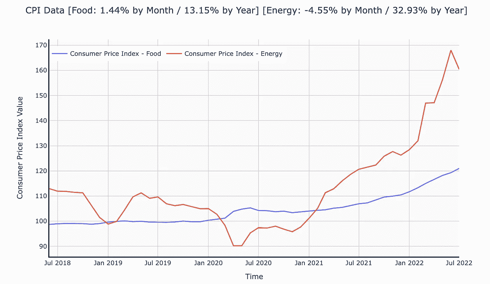

# 如何跟踪通胀指标

> 原文：<https://medium.com/codex/how-to-track-indicators-for-inflation-25b6361b4f27?source=collection_archive---------24----------------------->

作者图片

在我之前的文章中，我承诺会涉及一点通货膨胀。所以，开始了。

先从消费者说起吧。经济合作与发展组织(OECD)公布了消费者信心指数的数据。根据经合组织，消费者信心指数(或 CCI)根据对预期财务状况、对经济形势的看法、失业和储蓄能力的回答，表明家庭的未来消费和储蓄。一般来说，指标值超过 100 表示态度乐观，指标值低于 100 表示态度悲观。现在是 2022 年初，CCI 值低于 100，并且似乎在急剧下降，如图所示。

现在，让我们回到通货膨胀上来。根据[美国劳工统计局](https://www.bls.gov/)的说法，消费者价格指数(CPI)是“衡量城市消费者为一篮子消费品和服务支付的价格随时间的平均变化”和“CPI 衡量消费者在日常生活支出中经历的通货膨胀”。

那么，谁负责控制通货膨胀呢？美国美联储。是什么导致了美国美联储对此负责？这里有一点历史，从 1946 年的[就业法案](https://www.federalreservehistory.org/essays/employment-act-of-1946)和 1977 年的[美联储改革法案](https://www.federalreservehistory.org/essays/fed-reform-act-of-1977)(该法案因 1965 年至 1982 年的[大通胀](https://www.federalreservehistory.org/essays/great-inflation)事件而颁布)开始。如果您还想知道 CPI 值在一段时间内是如何变化的，请查看[美联储经济数据(或 FRED)](https://fred.stlouisfed.org/series/CPIAUCSL) 中的数据。

下面是我对如何跟踪食品和能源的 CPI 的实现。这是笔记本的 GitHub 要点。

# 密码

这是 2022 年初的食品和能源 CPI 值，数据截止到 2022 年 2 月。食品类 CPI 环比上涨 1.44%，同比上涨 13.15%。能源消费价格指数一个月内下降了 4.55%，一年内上升了 32.93%。

作者图片

# 结论

在学习了这篇博客中分享的材料后，你应该能够使用笔记本自己追踪通货膨胀的指标。此外，我希望你也获得了健康的历史剂量。

如果你对我如何改进某些事情有建议，请不要犹豫留下评论。我感谢任何建设性的反馈。如果你想支持我，让我产生更多这样的内容，你可以[给我买杯咖啡](https://www.buymeacoffee.com/tonmoyroy)。

# 参考

[1]经合组织。(未注明)。*消费者信心指数(CCI)* 。[https://data . OECD . org/leaind/consumer-confidence-index-CCI . htm](https://data.oecd.org/leadind/consumer-confidence-index-cci.htm)

[2]美国劳工统计局。(未注明)。*常见问题解答*。[https://www.bls.gov/bls/faqs.htm](https://www.bls.gov/bls/faqs.htm)

[3]美联储历史。(2013 年 11 月 22 日)。1946 年就业法案。[https://www . federalreservehistory . org/essays/employment-act-of-1946](https://www.federalreservehistory.org/essays/employment-act-of-1946)

[4]美联储历史。(2013 年 11 月 22 日)。1977 年美联储改革法案。[https://www . federalreservehistory . org/essays/fed-reform-act-of-1977](https://www.federalreservehistory.org/essays/fed-reform-act-of-1977)

[5]美联储历史。(2013 年 11 月 22 日)。大通货膨胀。https://www . federalreservehistory . org/essays/great-inflation

[5]美国劳工统计局。(2022 年 4 月 6 日)。*所有城市消费者的消费价格指数:美国城市平均值中的所有项目【CPI uacsl】*。[https://fred.stlouisfed.org/series/CPIAUCSL](https://fred.stlouisfed.org/series/CPIAUCSL)