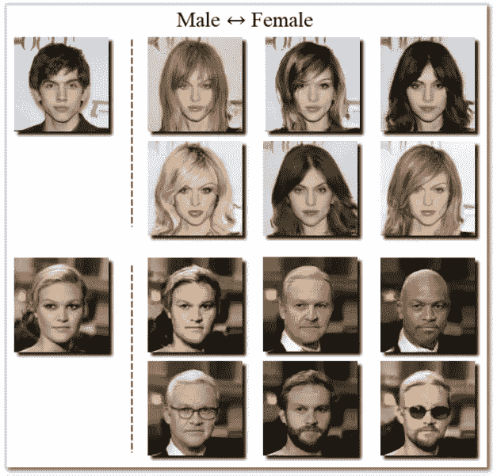
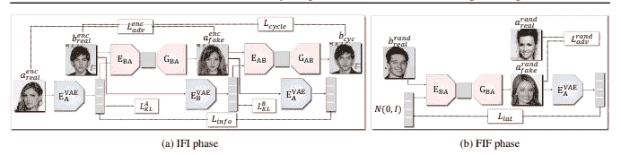
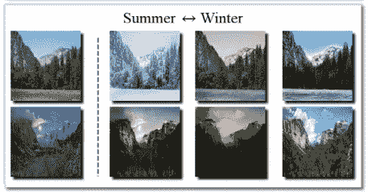
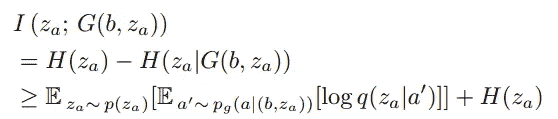
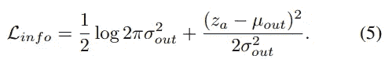
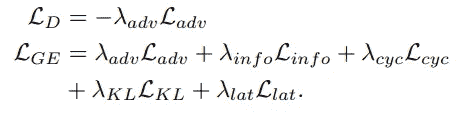
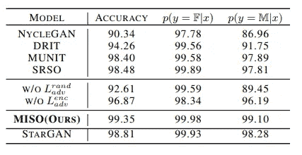
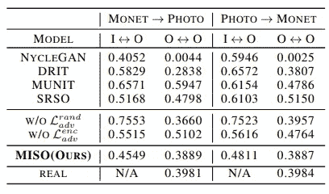
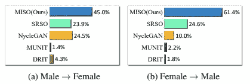
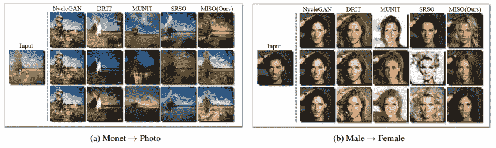

# 如何使用 MISO 训练多模态图像到图像的翻译

> 原文：<https://medium.com/codex/how-to-train-multimodal-image-to-image-translation-using-miso-a5f6b081e220?source=collection_archive---------17----------------------->

论文中的例子

图像到图像的翻译是将一个特定领域的图像翻译到另一个领域，同时保留特定的语义内容。图像到图像的翻译主要有两个问题，即成对数据的学习和不成对数据的学习。在现实世界的问题中，收集成对的数据集可能会有问题，而基于不成对数据的学习算法(如流行的 CycleGAN)已经获得了更多的兴趣。

图像到图像翻译的另一个特性是问题固有的多模态性质。如上图所示，单个图像可以转换为多个同样真实的图像。关于*不成对多模态图像到图像转换的研究*例如本文旨在从不成对数据集中的单个图像生成不同的图像。

这篇论文…

*   根据来自目标域(MISO 管道)的样式表示，使用来自源域的*内容表示*。
*   提出互信息损失作为损失函数。
*   将不成对的多模式图像到图像翻译的性能提高到令人惊讶的水平*。*

[*原始论文:MISO:用于多模态图像到图像翻译的具有随机风格表示的互信息损失*](https://arxiv.org/pdf/1902.03938.pdf)

## 以前的方法

我们将很快讨论以前关于不成对的多模态图像到图像翻译的工作的想法。这一节是根据 MISO 的论文写的。有关更多详细信息，请参考每篇论文。

多模态映射可以通过将一对(噪声，源图像)映射到目标图像来学习。BicycleGAN 提出了一个在图像和*特征*之间进行翻译的两阶段训练，用于多模态成对翻译。准确地说，训练包括平移 X → Z → X(图像-特征-图像，IFI)和 Z → X → Z(特征-图像-特征，FIF)，每个阶段用不同的损失函数进行训练。

关于不成对的多模态图像到图像翻译的工作，例如穆尼特和 DRIT，通过解开*风格*和*内容*扩展了两阶段训练。确切地说，领域不变的特征(内容)如背景、脸部角度，以及领域特定的特征(风格)如区分每个领域的长发和胡须。两种方法的 IFI 阶段都使用自重建损失，即源和重建图像之间的 L1 损失(类似于循环一致性损失？).

## 随机风格表示的互信息(MISO)

*随机…？*

综上所述，我们的目标是学习一个从域 A 到 B，或者从源域 S 到目标域 T 的一对多映射，严格来说，一对多映射是通过学习 p(t|s，z)实现的，其中 t **∈** T，s **∈** S，z∽*N*(0，I)。

两阶段训练 MISO

流水线由用于每个域的两个**风格编码器**和**鉴别器**以及用于每个方向的两个**生成器**和**条件编码器**组成。在上图中，E_A 和 E_B 代表样式编码器，E_BA 和 E_AB 代表条件编码器，D_A 和 D_B 代表鉴别器，G_AB 和 G_BA 代表对应于其下标的域的生成器。

z 向量在概念上代表了图像的期望样式，因为它直接影响映射的多模态性。风格编码器(不是条件编码器)从域 A 或 B 接收图像，并预测相应的 z 向量。为了避免单一的确定性映射，编码器是断言潜在空间中的噪声的值。

关键是*样式*是从源域 A 的图像中编码的，而*内容*是从目标域 b 中编码的。

论文中的例子

## 相互信息损失

接下来，作者指出在多模态翻译中广泛使用的自我重建损失可能会有问题。先前的工作表明，SR 损失未能捕捉细节特征，因为该损失会促使平均像素值。MILO 损耗被认为是 SR 损耗的一种替代。

多模态翻译旨在学习条件分布 p(t|s，z)。作者将 z 视为后验概率为 p(z|x)，x ∈ X 的随机变量。这也给条件编码器提取的特征带来了随机性。从概念上讲，MILO 的设计是为了在测量损耗时更好地利用这种随机性。

MILO 损失使特征 z_a=E_A(z)和从该特征 G_BA(b，z_a)生成的图像之间的*互信息*最大化。基于 InfoGAN，互信息近似为下面的等式。

在基于 MISO 成分的各种统计特性近似分布之后，这被重写为下面的公式。下面表示为 L_info 的公式可以直接计算，其中 _out 和σ_out 是编码器的输出。

欲知全部细节，请参阅原文。我承认，由于繁重的数学负担，我无法解释整个过程。

完整的目标函数包括这种 MISO 损失、KL 背离、周期一致性损失和对抗性损失的组合。这些损失与我们通常使用的经典方程相同，关于何时使用每个损失的详细信息在描述训练管道的图中描述。使用下面的等式来训练发生器，该等式计算每个损失的加权和。

## 实验

该方法在 4 个不成对的图像到图像翻译数据集上进行评估:雄性↔雌性，艺术↔照片，夏季↔冬季，和猫↔狗。MISO 能够在许多指标上超越其他不成对的多模态翻译模型。

与其他多模态和非多模态技术的分类精度相比，MISO 在 CelebA 性别条件图像生成上实现了最佳性能。这表明 MISO 生成的图像成功地包含了特定领域的特征。

在 CelebA 属性上训练的分类器可以成功地识别生成图像的预期性别。(F 和 M 表示女性和男性。)

平移时的 LPIPS 距离(I:输入，O:输出)

与其他不成对的翻译方法相比，MISO 是用户研究和感知度量(LPIPS)方面最可取的方法。↔O 之间较低的 lpip 意味着内容被保留，而 O↔O 之间较高的 lpip 意味着输出更加多样化。例如，NycleGAN 似乎正在生成逼真但不多样的图像。

用户研究结果

当我们实际比较示例时，结果有些明显。在下图中，MISO 生成了无与伦比的多样化和高质量的图像。

在原始论文中提供了关于潜在空间的更多定性分析和生成图像的例子。

## 摘要

*   本文提出了一种用于不成对的多模态图像到图像翻译的改进流水线，并且提高了各种设置下的感知质量。
*   本文提出了一种 MILO 信息损失方法，该方法通过将 z 视为随机变量来代替有问题的自重构损失。

我了解到图像到图像的翻译是一个固有的多模态问题。本文中提出的 MISO 框架很有趣，因为它模拟了样式和内容的抽象概念。