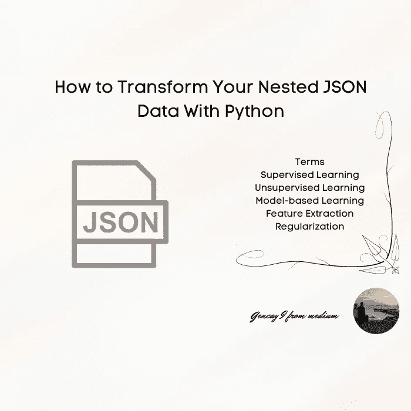

# 如何用 Python 转换嵌套的 JSON 数据

> 原文：<https://medium.com/codex/how-to-transform-your-nested-json-data-with-python-2af1df98cb7a?source=collection_archive---------2----------------------->



作者图片

数据传输是数据相关工作的重要组成部分之一。有时这需要太多的时间和网络搜索。这就是为什么我想与你分享，以节省时间，而做你的项目或工作。

```
Content ∘ [Libraries](#99d1)
  ∘ [Reading JSON Files](#59b0)
  ∘ [Converting JSON Dataset From Dictionary to Dataframe](#1fd3)
  ∘ [Resetting index for](#448e)…
```