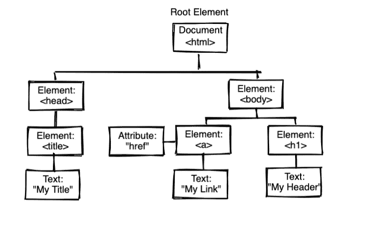

# 如何在 JavaScript 中遍历 DOM

> 原文：<https://medium.com/codex/how-to-traverse-the-dom-in-javascript-7fece4a7751c?source=collection_archive---------0----------------------->

## DOM 遍历中我最喜欢的 10 种方法

图片由 [gTheMesh](https://pixabay.com/users/gthemesh-12784768/?utm_source=link-attribution&utm_medium=referral&utm_campaign=image&utm_content=4342425) 来自 [Pixabay](https://pixabay.com/?utm_source=link-attribution&utm_medium=referral&utm_campaign=image&utm_content=4342425)

## 介绍

web 开发人员最重要的技能之一是 DOM 遍历和能够用 JavaScript 选择 HTML 元素。这将是我的 10 个必须知道的方法的指南，希望这将帮助你在指南结束时掌握 DOM 遍历。

***公平警告！*** 这是给至少有一些 HTML & JavaScript 基础知识的开发者的指南

## DOM 节点

在我们深入研究遍历方法之前，让我们看一下来自 [W3school](https://www.w3schools.com/js/js_htmldom_navigation.asp) 的 DOM 和节点关系的简要说明。

*根据 W3C HTML DOM 标准，HTML 文档中的所有内容都是一个节点:*

-HTML 节点树

*   整个文档是一个文档节点
*   每个 HTML 元素都是一个元素节点
*   HTML 元素中的文本是文本节点
*   所有注释都是注释节点

## **节点关系**

节点树中的节点相互之间具有层次关系。术语父、子和兄弟用于描述关系。

*   在节点树中，顶部节点称为根(或根节点)
*   每个节点只有一个父节点，除了根节点(它没有父节点)
*   一个节点可以有许多子节点
*   兄弟姐妹是具有相同父节点的节点

## 在节点间导航

这是我绘制的一个图表，显示了以下节点属性，用于在节点之间导航

-带有图像和一些信息的简介卡的 html 模型

*   parentNode
*   前兄弟姐妹
*   下一个兄弟姐妹
*   第一个孩子
*   最后一个孩子
*   子节点[ *节点号* ]

## 遍历方法

在我们进入方法之前，下面是我绘制的一个 HTML 节点树，它带有一个 div，代表一个*祖父节点*节点，它有两个父 div*，最后每个父 div 都有两个子节点*

*   **parent-1，parent-2 属于祖父母**
*   **子-1，子-2 属于父-1**
*   **子-3，子-4 属于父-2**

1.  ***getElementById -** 这个是经典的，通过定位 Id 找到单个元素节点*

*2.**getElementsByClassName-**这是我们一次选择多个元素的第二种经典方法，假设将两个父 div 都作为目标*

*3.这是我迄今为止最喜欢的，使用单一方法来定位类或 id 要容易得多*

*4. **querySelectorAll -** 类似于 querySelector，但用于选择多个元素节点*

*5. **parentElement -** 用于定位 DOM 树的上一级，以定位父节点*

*6. **previousElementSibling -** 用于定位 DOM 树左侧的一个节点*

*7. **nextElementSibling -** 用于定位 DOM 树右侧的一个节点*

*8. **firstElementChild -** 用于定位 DOM 树中的第一个节点*

*9. **lastElementChild -** 用于定位 DOM 树中的最后一个节点*

*10. **childNodes[node #] -** 在我的列表中是最后一个，但也是我最喜欢的一个，childNodes 方法接受一个数字来指向父节点的子节点*

*就是这样！感谢您阅读我的 DOM 遍历指南。我希望这有助于您更好地理解 DOM 树的上下遍历，并关注更多的编码指南。*

## *参考*

* [## JavaScript DOM 导航

### 使用 HTML DOM，您可以使用节点关系导航节点树。根据 W3C HTML DOM 标准…

www.w3schools.com](https://www.w3schools.com/js/js_htmldom_navigation.asp)*