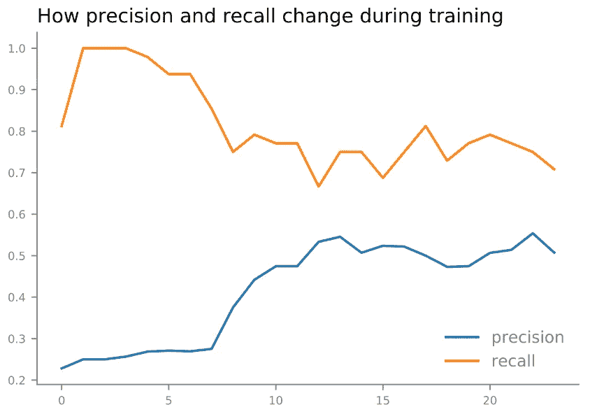

# 如何调整超参数以提高神经网络性能

> 原文：<https://medium.com/codex/how-to-tune-hyperparameters-for-better-neural-network-performance-b8f542855d2e?source=collection_archive---------1----------------------->

## 举个例子

马库斯·斯皮斯克在 [Unsplash](https://unsplash.com?utm_source=medium&utm_medium=referral) 上的照片

到现在为止，你应该知道 MLP 是一种包含许多变量的灵活方法。在上一篇文章中，我们谈到了调整参数来执行不同的分析。在本文中，我们将讨论优化超参数以获得更好性能的一般方法。

# **如何选择多个隐藏图层**

改变神经网络基本结构的超参数之一是隐藏层的数量，我们可以将它们分为 3 种情况:0、1 或 2、许多。

首先，如果数据集是线性可分的，你就不需要任何隐藏层。事实上，如果你需要的只是一个线性边界，你根本不需要使用神经网络，因为神经网络是用来解决复杂问题的。

第二，如果数据集不是线性可分的，那么你需要一个隐藏层。通常情况下，一个隐藏层就足够了，因为与您需要做的额外工作相比，通过添加隐藏层来改善模型的数量并不显著。因此，在许多实际设置中，一个或两个隐藏层发挥了它们的作用。

最后，如果你试图解决一个复杂的问题，比如对象分类，那么你需要多个隐藏层，它们对输入进行不同的修改。我们将在以后的帖子中更深入地讨论这一点。

隐藏层数汇总

# **如何选择神经元的数量**

下一件事你应该选择的是你要包括在隐藏层的神经元的数量。找到一个合适的数量是至关重要的，因为太少的神经元会导致欠拟合，而太多的神经元会导致过拟合加上更长的训练时间。根据经验，最好在输入和输出大小之间使用一个数字，这个数字会根据问题的复杂程度而变化。

如果一个问题很简单，投入和产出的关系很清楚，那么关于投入大小的⅔可以是一个很好的起点。但是如果关系很复杂，这个数字可以从输入大小变化到小于输入大小的两倍。

隐藏层中神经元数量的汇总

这似乎很模糊，但不幸的是，没有明确的答案可以遵循，因为神经网络仍然是一个活跃的研究领域，每个参数对于每个问题都是独特的。因此，您应该将这些视为起点，并需要通过反复试验来找到最适合您的特定问题的值。

# **如何选择批量、学习率、纪元**

最后，我们将看看与训练时间和表现相关的超参数。

当批次大小增加时，每个批次自然变得与完整数据集相似，因为每个批次开始包含更多的观察值。这意味着每一批不会有太大的差异。所以它的噪音会降低，所以用大的学习率来加快训练时间是顺理成章的。相反，当我们使用小批量时，噪声会增加。因此，我们使用小的学习率来抵消噪声。那么我们应该使用哪个批量呢？人们还在研究，但我们可以从别人的经历中找到答案。

经验表明，批量大可能导致泛化能力差。相比之下，当我们使用小批量时，噪声有助于网络摆脱局部最小值，并导致更高的精度。它也倾向于比大批量的网络更快地收敛到合理的解决方案。因此，一般来说，32 的批量可能是一个好的起点，但这个数字实际上取决于您的样本大小、问题的复杂性和您的计算环境。因此，使用网格搜索也是合适的。

对于学习率，我们通常从 0.1 或 0.01 开始，或者我们可以使用从 0.1 到 1e-5 的网格搜索。而当学习率较小时，你需要更多的迭代才能找到一个极小点。因此，需要更多的纪元，但是需要多少呢？

根据问题和随机初始化，收敛所需的历元数会有所不同。因此，不存在适用于所有情况的神奇的纪元数。因此，在实践中，我们通常将历元数设置得很高，并使用早期停止，以便当通过更新其权重获得的改进没有超过阈值时，神经网络停止训练。

学习率、时期、批量的摘要

# 优化超参数示例

以此为起点，让我们[重温一下告诉我喜欢哪首歌的算法](/codex/identifying-songs-i-like-with-an-algorithm-in-r-a0c51cc44ec5)。早在 7 月份，我将逻辑分类器与 lasso 结合使用，实现了 47.8%的准确率和 31.4%的召回率。所以 f1 的分数是 0.379。让我们看看如何通过使用神经网络来改善这些。

首先，我们需要选择隐藏层的结构。对于这个问题，一个隐藏层就足够了，因为这个问题不是线性的，也不像计算机视觉那样复杂。并且 6 个神经元可以是一个好的起点，因为总共有 10 个特征进入神经网络。然后对于输出层，我只需要一个使用逻辑(=sigmoid)激活函数的输出神经元，因为我正在尝试解决一个二进制分类。

mlp 基本结构/基本结构的代码

现在我有了神经网络的基本结构，我需要调整超参数。我可以从一般的起点 0.1 学习率开始，但最好尝试一个网格的值，选择最好的一个。所以我实现了 sklearn 包中的 gridsearchCV 来测试 0.1、0.01、1e-3、1e-4、1e-5 中的学习速率和 10、20、40、60 中的批量大小的哪个组合最适合这个问题。对于 epoch，我使用了早期停止，当 10 次迭代内没有改进时停止训练，并恢复最佳模型，而不是固定的数量。

网格搜索 CV 和提前停止代码

有一点需要深入研究，那就是损失函数。因为我正在处理一个不平衡的数据集，所以使用交叉熵是不合适的。比较 f1 分数更有意义，因为 f1 分数更重视我所关心的东西:真正的积极因素。不幸的是，我不能只使用 f1 分数，因为它是不可微的。因此，我需要修改 f1 分数，使它变得可微分。但是 sklearn 包并没有提供这个，所以我从 Kaggle 那里借了一个 [Michal Haltuf](https://www.kaggle.com/rejpalcz/best-loss-function-for-f1-score-metric) 写的代码。

由[迈克尔·哈尔图夫](https://www.kaggle.com/rejpalcz/best-loss-function-for-f1-score-metric)编写的 f1_loss 代码

最佳超参数

从结果中可以看出，在批量为 60 的情况下，最佳学习率为 0.1。并且使用 sklearn 提供的函数，我可以用这些超参数提取模型训练的历史。

学习率为 0.1、批量为 60 的培训历史记录

如上所示，预测增加，但回忆和 f1 损失减少。当我用这个模型进行预测的时候，显示它可以从测试集中检测出 8 TP 和 3 FP。所以大约 73%的积极结果是真正的积极。与上次的 48%相比，我认为这是一个进步。当我们查看 f1 分数时，该模型的 f1 分数比逻辑模型高 0.192。

最佳 mlp 网络的测试结果

# 反射

需要记住的一点是，每次运行模型时，这个结果都会发生变化。

试验 1

试验 2

这是因为权重和优化包含一定程度的随机性。解决方案之一是重复预测几次，并计算这些结果的统计数据。

30 次重复的代码/30 次重复的平均统计

于是，我又重复了一遍，统计表明，每一次的准确率和召回率分别约为 52.3%和 69.4%。这给了我们大约 0.596 的 f1 分数，这比使用逻辑分类器提高了大约 0.217。

所以神经网络确实表现出了一些改进，但是为什么我们不能获得更高的 f1 分数呢？

我相信原因之一是样本量小。与其他神经网络项目相比，300 是一个非常小的数据集。在这个数据集内，我必须划分训练集、验证集和测试集。因此，网络没有机会从数据集中了解更多信息。然而，我自己并不总是能够收集大量的数据。在这种情况下，我可以使用别人建立的网络，并应用迁移学习，这将是下一篇文章的主题。

# 参考

[1]本吉奥，Y. (2012 年 9 月 16 日)。*深度架构基于梯度的训练实用建议*。arXiv.org。检索于 2021 年 11 月 12 日，发自 https://arxiv.org/abs/1206.5533.

[2]布朗利，J. (2019 年 8 月 6 日)。*训练深度学习神经网络时如何配置学习率*。机器学习精通。检索于 2021 年 11 月 12 日，来自[https://machine learning mastery . com/learning-rate-for-deep-learning-neural-networks/。](https://machinelearningmastery.com/learning-rate-for-deep-learning-neural-networks/.)

[3]德农考特，F. (2016 年 9 月 22 日)。*训练神经网络的批量大小和迭代次数之间的权衡是什么？*交叉验证。2021 年 11 月 12 日检索，来自[https://stats . stack exchange . com/questions/164876/what-is-the-train-a-neu-batch-size-and-number-of-iteration-to-train-a-neu。](https://stats.stackexchange.com/questions/164876/what-is-the-trade-off-between-batch-size-and-number-of-iterations-to-train-a-neu.)

[4]道格。(2010 年 8 月 2 日)。*前馈神经网络的隐层和节点数如何选择？*交叉验证。2021 年 11 月 12 日检索，来自[https://stats . stack exchange . com/questions/181/how-to-choose-the-number-of-hidden-layers-and-nodes-in-a-前馈神经网络。](https://stats.stackexchange.com/questions/181/how-to-choose-the-number-of-hidden-layers-and-nodes-in-a-feedforward-neural-netw.)

[5]哈尔图夫，M. (2018 年 10 月 19 日)。*F1 得分指标的最佳损失函数*。卡格尔。检索于 2021 年 11 月 12 日，来自[https://www . ka ggle . com/rejpalcz/best-loss-function-for-f1-score-metric。](https://www.kaggle.com/rejpalcz/best-loss-function-for-f1-score-metric.)

[6]j .希顿(2009 年)。*用 Java 介绍神经网络*。希顿研究。

[7]r .凯米(2020 年 1 月 31 日)。*一个神经网络需要多少个隐层和隐节点？—技术文章*。关于电路的一切。检索于 2021 年 11 月 12 日，来自[https://www . allaboutcircuits . com/technical-articles/how-many-hidden-layers-and-hidden-nodes-do-a-neural-network-needle/。](https://www.allaboutcircuits.com/technical-articles/how-many-hidden-layers-and-hidden-nodes-does-a-neural-network-need/.)

[8]米乔斯，M. (2017 年 11 月 5 日)。*可视化学习速度与批量*。学习机器学习——我的 2 美分。2021 年 11 月 12 日，从[https://miguel-data-sc.github.io/2017-11-05-first/.](https://miguel-data-sc.github.io/2017-11-05-first/.)检索

[9]m .斯图尔特(2019 年 7 月 9 日)。*神经网络中超参数调整的简单指南*。中等。于 2021 年 11 月 12 日从 https://towardsdatascience . com/simple-guide-to-hyperparameter-tuning-in-neural-networks-3 Fe 03 dad 8594 检索。