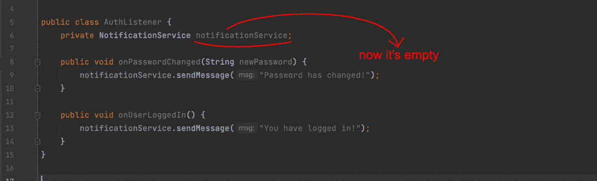

# 简而言之，什么是 IoC，为什么你应该使用它？

> 原文：<https://medium.com/codex/how-to-understand-an-ioc-and-get-use-it-in-real-life-5b8527f4fc2c?source=collection_archive---------11----------------------->

照片由[马克西米利安·魏斯贝克尔](https://unsplash.com/@maxweisbecker?utm_source=medium&utm_medium=referral)在 [Unsplash](https://unsplash.com?utm_source=medium&utm_medium=referral) 上拍摄

IoC 可能会让企业开发人员感到困惑，但简而言之，它是一个可以解决您的问题的工具。IoC 或控制反转是企业软件工程中普遍使用的原则。国际奥委会不是火箭科学，但它需要一点努力才能进入。我想展示为什么你应该使用 IoC，以及如何把它引入你的项目。

## 路标

1.  普通代码——这里我将展示为什么 IoC 很重要。
2.  国际奥委会的纯魔术概念——这是国际奥委会本身的核心理念。
3.  DI 作为一个现代 IoC 的配方——下面是如何实现 IoC。

我将使用 Java 来实现代码示例。但是如果你熟悉任何一种类似 C 语言的语言，你很可能在阅读它们时不会有任何困难。

# 普通代码

让我们假设您有一些服务，它通过各种事件发送通知。例如，当用户更改密码和登录你的应用时，你的应用会发送电子邮件。

AuthListener 的普通实现

这里没什么特别的，`AuthListener`以上按要求处理事件。但在企业中，你通常会遇到几十个事件，比如支付成功、应用崩溃或月度报告创建。你还会有一堆通知渠道，比如电子邮件、浏览器推送通知或 WhatsApp 消息。在上面的例子中，搜索和替换`new EmailNotificationService()`的单一用法不成问题。但是对于拥有庞大代码库的应用程序来说，这可能太单调了。不要忘记单元测试。为了进行单元测试，`AuthListener`你必须模拟所有第三方，包括`emailNotificationService`。对我来说，我不太清楚如何在不改变`AuthListener`类的情况下启用嘲讽。

因此，上面的问题是，由于一些代码基础规模进行手动搜索替换可能需要时间。作为一个懒惰的工程师，你更喜欢让你的生活简单一些。首先，这种批量替换可能会产生错误。并且不清楚如何将你的类从它们的依赖关系中分离出来以进行单元测试。

# 国际奥委会的纯魔术概念

你有很多像 AuthListener 这样的类，你想有一些神奇的工具把正确的实现放在正确的地方。您创建了一个通用的`NotificationService`接口。您希望源代码中的行为如下所示。

我希望我的代码如何工作

这是一个非常雄心勃勃的期望，不是吗？你不同意吗？

简单地说，IoC 就是说你的类应该依赖于抽象而不是实现。换句话说，你在你的类中使用像`NotificationService`这样的抽象，然后用具体的实现来代替*。*

*AuthListener 的神奇 IoC 实现*

*我们总结一下。控制反转就是不要在你的源代码中丢弃任何具体类型的变量。这是关于使用抽象类型的变量。有些魔法会将所需的实现替换成适当的抽象。国际奥委会没有说如何替代你的东西。但是它告诉了*你必须做什么*才不会像上面的普通代码例子那样一团糟。*

# *DI 是现代国际奥委会的秘方*

*实际上，实现 IoC 的方法有很多，我想写一篇关于它们的全新文章。但是现在，我将只通过构造函数展示 DI(依赖注入)。你很可能在你最喜欢的框架中遇到它。*

*在上面的`AuthListener`中，我们停留在魔法的概念上。但是有没有一些现实世界的方法来设置变量的值呢？嗯，`=`完全如你所愿。在调用任何一个`AuthListener`方法之前如何设置值？你需要的是构造函数。听起来很简单，不是吗？*

*DI 通过 AuthListener 的构造函数实现*

*现在我假设 AuthListener 的任何用户都提供了所需的 NotificationService 实现。在现实生活中的应用程序，你通常有某种集中的容器与所有的 bean 实例。这个容器可以通过 API 为你提供所需的实例。所以你不会写类似`new AuthListener(new EmailNotificationService())`的东西。但是写`new AuthListener(container.getBean(NotificationService.class))`之类的。*

*或者你甚至可以根本不使用`new`关键字，因为你的现代 DI 框架在注释的帮助下隐藏了`container.getBean(/* …stuff… */)`。[ *在 Java、Python 和 TS 中，它在类、字段或方法上看起来像@MyAnnotation，它在 Java 中调用 Annotation，在 Python 和 TS 中调用 decorator。在 C#中它调用属性，看起来像[MyAnnotation]* 。当您使用注释时，您的框架会创建所需的实例并将其注入 beans 中。这就是现代框架中 DI 的实际情况。*

*所以总的来说是这样的。关于*用什么确切的类蕴涵来实例化*的知识是一种独立的知识。请把它放在某个特别的地方是很自然的。并使像`AuthListener`这样的类只关心它们的业务逻辑。IoC 原则说，你必须把*类实例化*逻辑留在专门的东西上。让你的豆子只关心他们必须关心的东西。而 DI via 构造函数说的是如何用老好的类构造函数实现 IoC。场馆建设并不是贯彻国际奥委会原则的唯一途径。*

# *摘要*

*正如我在开头所说的，国际奥委会不是火箭科学，它的逻辑非常简单。实现业务逻辑可能会给单元测试带来困难，并会在将来迫使额外的努力。IoC 给出了一个形象的概念，即您的类应该依靠抽象而不是实现来解决这些问题。而 DI via constructor 展示了一种将 IoC 理念融入生活的实用方式。*

*所有源代码示例你都可以在这里找到。所有问题都可以贴在下面的评论里。所有阅读的乐趣你都可以自己保留:)*

*别忘了关注并感谢您的参与！*