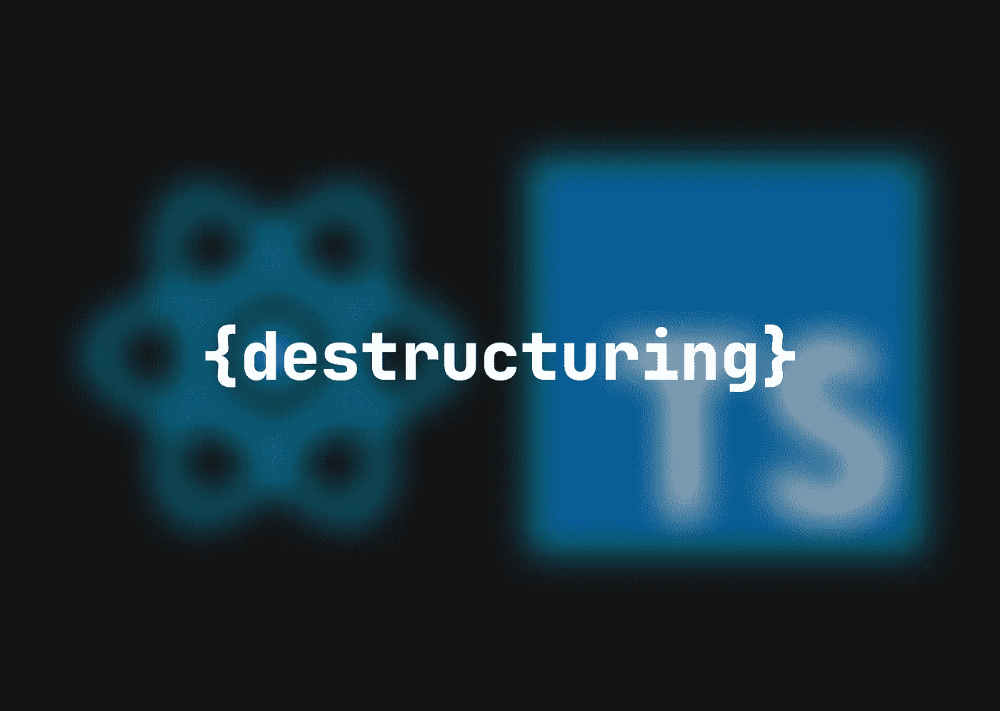

# 如何用 useMemo()和 destructing(React+TypeScript)从对象中解包数据

> 原文：<https://medium.com/codex/how-to-unpack-data-from-your-objects-with-usememo-and-destructuring-react-typescript-3559ce129d7?source=collection_archive---------5----------------------->

从版本 ES6 开始，JavaScript 提供了析构功能。使用它定义和解包对象和数组的值很简单，在 TypeScript 中也可以使用。在本文中，我们将讨论如何从你的道具和数据对象中获取数据。



用析构从对象中获取字段的语法非常简单

```
🤩 **GETTING A SPECIFIC FIELD FROM AN OBJECT WITH DESTRUCTURING**const data = {
  title: 'Define me!',
  description: 'Let's make it work!',
  count: 1
}const { title } = data
```

现在让我们看一个现实生活中的例子，看看如何在 React 和 TypeScript 的项目中使用它。

假设您的 redux 存储中有大量用户数据，或者来自之前的 fetch

```
🥰 **AMARI'S DATA**{
  name: 'Amari Pekka',
  emailAddress: '[amari@xmail.com](mailto:amari@xmail.com)',
  socialSecurity: 986543381,
  dateOfBirth: '1992-03-14',
  isMarried: true
}
```

并且您想在 UI 上只使用字段`name`和`isMarried`。当然，你可以参考那些像

```
🛼 **OLDSCHOOL WAY OF USING DATA ON THE UI**... <>
    <h1>Name: {data.name}</h1>
    <p>{data.isMarried ? 'Married' : 'Not married'}</p>
  </>...
```

或者你可以使用析构

```
🤸 **USING DESTRUCTURING IN THE COMPONENT WITH useMemo()**...const { name, isMarried }: 
  { name: string, isMarried: boolean } = useMemo(() => {
    return data
}, [data])return (
  <>
    <h1>Name: {name}</h1>
    <p>{isMarried ? 'Married' : 'Not married'}</p>
  </>
)...
```

在这种方法中，数据对象中某些字段的处理更加清晰。

👋我希望这在你寻找新的学习材料时对你有用。感谢您花时间阅读这篇文章！如果你想在未来读到更多这样的故事，请订阅我的电子邮件列表！