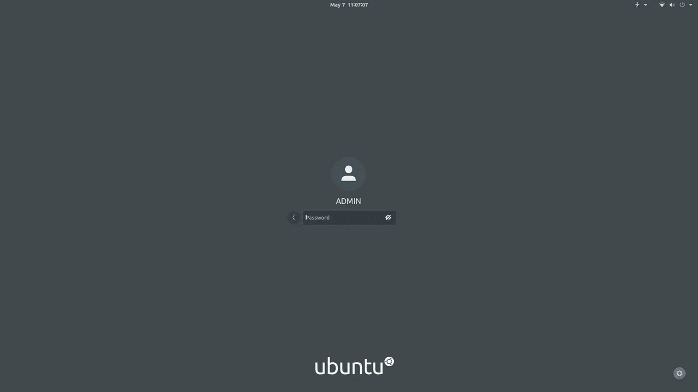
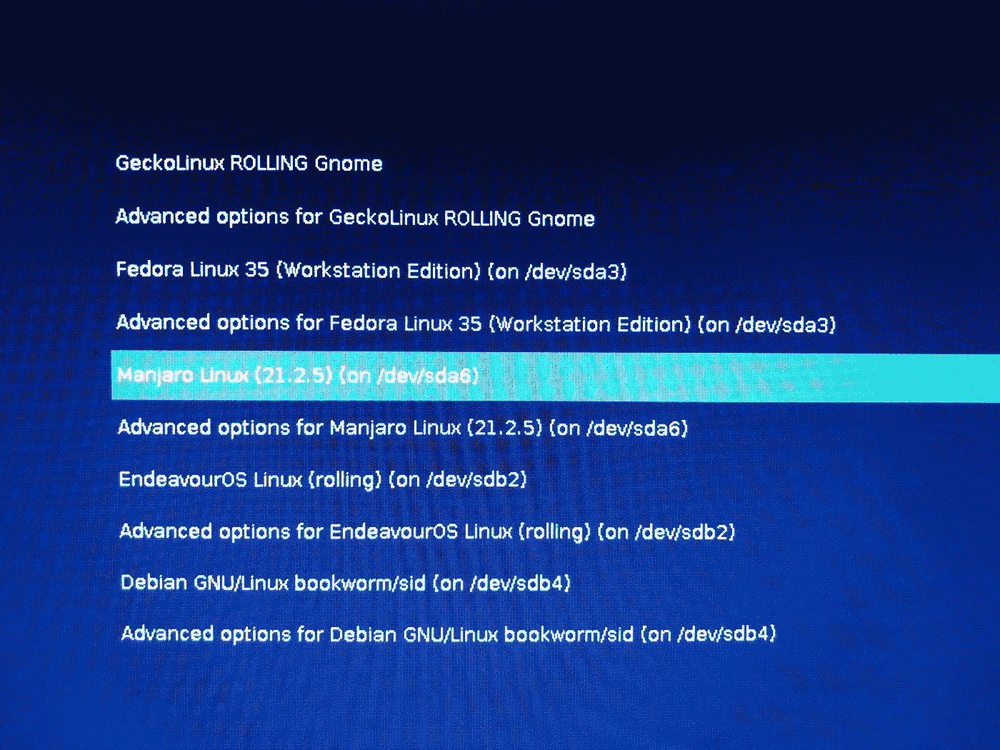
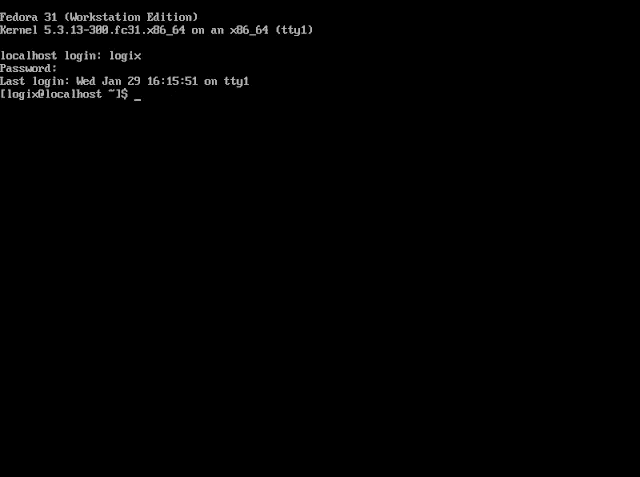

# 如何像专业人士一样更新您的多重引导 Linux 设置

> 原文：<https://medium.com/codex/how-to-update-your-multi-boot-linux-setup-like-a-pro-61f95d91e4c9?source=collection_archive---------6----------------------->

多只靴子

如果你像我一样是一个 Linux 爱好者，你不可能只在笔记本电脑或个人电脑上运行一个发行版。如果你像我一样，你至少在笔记本电脑上运行一个大容量 SSD 设备，甚至在一个 [dvd 盒](https://www.amazon.com/dvd-ssd-caddy/s?k=dvd+ssd+caddy&page=3)中安装第二个。你可以在这些内部驱动器上安装 3 到 8 个(或更多)操作系统，这在挑战你熟练使用多个包管理器的同时，也挠了一下[发行版](https://embeddedinventor.com/distro-hopping-what-why-how-explained/)的痒，例如[*apt*](https://en.wikipedia.org/wiki/APT_(software))(Debian/Ubuntu)[*dnf*](https://docs.fedoraproject.org/en-US/fedora/latest/system-administrators-guide/package-management/DNF/)(Fedora)[*zypper*](https://en.opensuse.org/SDB:Zypper_usage)(OpenSUSE)或 [*pacman*](https://wiki.archlinux.org/title/pacman) (Arch)如果你像我一样是滚动发布版本的粉丝，你会花大部分时间运行系统更新。

在多重引导系统上，什么是最有效和最安全的方法来确保您的所有发行版保持更新，需要最少的时间和精力？图形用户界面(GUI)是最好的方式，还是命令行是更好的选择？

# 忘记 GUI 更新选项

许多 Linux 发行版至少提供了一个安装更新的图形界面。

Ubuntu 使用它的*软件更新程序*。

Mint 使用其设计非常好的*更新管理器。*

Manjaro 提供了 Pamac。

OpenSUSE 提供其无所不包的控制中心， *YAST* 。

运行 Gnome 的 Fedora 和 Debian 使用 *Gnome 软件*，而在 KDE 上他们使用 *Muon 包管理器*。

这些只是几个到处浮动的更新 gui，在大多数情况下，它们的工作是通知用户有可用的更新，然后只需点击一两次就可以执行更新。

在多引导场景中，Linux 爱好者可能在一台机器上安装了 3 到 8 个或更多的发行版，并且可能有多台机器以类似的方式打包，试图通过图形界面进行更新太费时间了。

相反，多重引导用户需要熟悉 [TTY 子系统](https://www.linusakesson.net/programming/tty/)。

# 什么是 TTY？

> … [TTY 是 UNIX 和 Linux 中的抽象设备](https://itsfoss.com/what-is-tty-in-linux/)。有时它指的是物理输入设备，如串行端口，有时它指的是虚拟的 TTY，它允许用户与系统进行交互。
> 
> TTY 是 Linux 和 Unix 中的一个子系统，它通过 TTY 驱动程序使内核级的进程管理、行编辑和会话管理成为可能。

您可能想阅读上面的两个链接，以便更深入地了解 TTY 子系统的历史和用途。

据我所知，TTY 代表 TeleTYpe，在我们的现代计算世界中，曾经涉及打字和纸张打印的内容已经演变为一组在内核级别连接的虚拟命令行界面。程序员、系统管理员、开发人员和“大师级”用户能够在 TTY 完成大部分计算，如果他们愿意，完全可以绕过图形环境。出于我们的目的，我们需要知道的是，一旦引导过程到达显示管理器登录屏幕:

…我们有机会访问 TTY 控制台/终端，只需在键盘上轻点几下，就可以运行我们的更新。

通过 TTY 更新的另一大好处是，它消除了更新期间图形环境崩溃的可能性。在我开始通过 TTY 运行更新之前，我有几次在下载包更新时 Gnome 崩溃，这破坏了更新过程，以至于我不得不重新安装整个操作系统。吸取教训！

# 控制幼虫的发行版

在这个场景中，我们将[多重引导](https://www.zdnet.com/article/hands-on-linux-uefi-multi-boot-my-way/)几个不同的 Linux 发行版，每一个都从一个 [GRUB 菜单](https://itsfoss.com/what-is-grub/)中访问，该菜单在机器启动后向我们打招呼。对于本文，我们将假设您已经安装了两个或更多的发行版，并且能够通过 GRUB 菜单访问它们。更新发行版的顺序并不重要，除非你想把 GRUB 控制的发行版留到最后。这样做的原因是，如果在任何其他发行版上有内核或固件更改，这些更改将需要写入控制 GRUB 菜单，以便它可以成功地导航到所有内核更新的发行版。如果您忘记了这一步，当您尝试引导到内核升级的发行版时，可能会失败。

我们所说的“GRUB 控制发行版”是什么意思

在多重引导方案中，我们只依赖其中一个发行版来提供 GRUB 菜单，该菜单为所有已安装的发行版提供引导选项。每个发行版都可以在安装时生成自己的 GRUB 菜单，但随后只能从 BIOS 设置中选择一个，我称之为“控制”GRUB 菜单。

在过去，我通常使用 Manjaro 作为 GRUB 控制发行版，因为其他发行版配置它们的 GRUB 的方式并不引导 Manjaro——但是 Manjaro 的 GRUB 似乎可以引导其他人而不会出现问题。然而，最近，Manjaro 的 GRUB 配置花费了[很长的时间](https://forum.manjaro.org/t/lengthy-delay-during-grub-update-os-prober-issue/56987)来查找我系统上的其他发行版，因此，当我更新 GRUB 时，OS-probe 可能需要 20 分钟或更长时间来检测需要列出的其他发行版。我的解决办法是:安装 OpenSUSE Tumbleweed(或者 Gecko Rolling，几乎是同一个东西),并把它用作 GRUB 控制发行版，因为 Manjaro 可以很好地引导 OpenSUSE GRUB。带有 OpenSUSE 的 OS-prober 只需要几秒钟就可以检测到其他发行版。我相信这也适用于 OpenSUSE Leap。

当然，如果没有安装 Manjaro，您可以选择任何发行版作为 Grub 控制发行版。通过测试，你会发现在多重引导设置中，有些比其他的更好。

# 像专家一样从 TTY 更新

以下是步骤:

1.  打开笔记本电脑或个人电脑的电源
2.  从 GRUB 菜单中，选择除控制 GRUB 的发行版之外的任何发行版—将这个发行版留到最后

我的控制 Gecko/OpenSUSE GRUB 菜单

3.当登录屏幕弹出时，点击

> Ctrl + Alt + F3

(如果这样不行，试试 *Ctrl + Alt +* *F1* ， *F2，【F4】，F5* 或者 *F6 —* 实验鼓励)

4.这将把您带到一个 TTY 控制台/终端，看起来像这样:

5.提供登录凭据

6.发出更新命令(参见下面的示例)

7.更新完成后，键入

> "重新启动-i "

或者如果那不起作用，试试看

> "系统重启-i。"

8.在 GRUB 菜单中，选择另一个要更新的发行版，然后重复步骤 1 到 7

9.控制 GRUB 的发行版更新后，如果任何其他发行版对其内核或固件进行了更改，请键入以下命令来更新 GRUB

> " grub-mkconfig-o/boot/grub/grub . CFG "

或者如果这不起作用，

> " grub 2-mkconfig-o/boot/grub 2/grub . CFG "

或者，尝试

> “update-grub”(通常在 Ubuntu 和 Arch/Manjaro/endevoros 等上工作。)

10.键入步骤 7 中的 reboot 命令，然后从 GRUB 中选择您想要使用的发行版

就是这样！

对我来说，更新四个滚动版本(Gecko/OpenSUSE Tumbleweed、Manjaro Unstable、EndeavorOS 和 Debian Sid)和一个静态版本(Fedora)，都是在 SSD 驱动器上，配有相当快的 i7 处理器和不错的互联网连接，平均需要 10 到 20 分钟，这取决于有多少包在管道中。如果我尝试通过图形界面引导到每个发行版并进行更新，至少需要 2-3 倍的时间。使用 TTY 控制台/终端，我能够更好地跟踪我在进程中的位置，这样当我到达 GRUB 控制发行版时，我就知道是否要更新 GRUB。

我已经这样做了至少十年，几乎没有出现任何问题，假设不存在依赖问题或损坏的包——当然，无论我如何更新，这些问题都会存在。

# 常见更新命令

以下是主要 Linux 发行版的一些典型更新命令，以及通用软件包管理器 Flatpak 和 Snaps:

**Ubuntu 或者 Debian(包括 MX 和 Sparky 等。)**:

*须藤 apt 升级& &须藤 apt 升级*

**软呢帽**:

*sudo dnf 更新*

**OpenSUSE 风滚草**

*sudo zypper dup*

**OpenSUSE Leap**

*sudo zypper 更新*

**Arch，EndeavorOS 和其他基于 Arch 的发行版**:

*须藤 pacman -Syu*

# 曼哈罗

*pamac 更新-a*

或者

须藤 pacman -Syu

# Flatpak

*flatpak 更新*

# 谩骂

*须藤抓拍刷新*