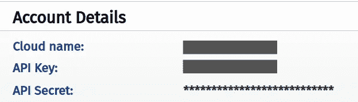

# 如何使用 NestJS 将图像上传到 Cloudinary

> 原文：<https://medium.com/codex/how-to-upload-images-to-cloudinary-using-nestjs-9f496460e8d7?source=collection_archive---------3----------------------->


> 在本文中，我将解释如何将 Cloudinary 包与 NestJS 定制提供程序一起使用。你可以在文章末尾找到一个例子。

# 项目配置

1.  首先，用 NestJS CLI 创建一个项目:

```
nest new nest-cloudinary-example
```

2.然后，使用 NestJS CLI 生成一个模块、提供者和服务:

```
nest generate module cloudinary
nest generate provider cloudinary
nest generate service clodinary
```

3.安装来自 npmjs.com 的 [Cloudinary](https://www.npmjs.com/package/cloudinary) 和 [buffer-to-stream](https://www.npmjs.com/package/buffer-to-stream) 包

# 代码实现

4.在 cloudinary 文件夹中创建一个名为`constants.ts` *，*的文件，这个文件包含一个名为`Cloudinary`的常量，它被用作提供者注入令牌。

5.在`cloudinary.provider.ts` *，*中您需要添加这段代码:

*   `***v2***` *:* 是从 Cloudinary 包中导出的名称空间。
*   `**CLOUDINARY**`:常量用作我们的提供者注入令牌。
*   `**CloudinaryProvider**`:动态提供程序，初始化连接到您的 cloudinary 帐户的配置。
*   `cloud_name`、`api_key`和`api_secret`属性来自您的 [Cloudinary 账户。](https://cloudinary.com/users/login)



6.接下来，在`cloudinary.service.ts`中添加以下代码:

*   `***toStream***` ***:*** 这个函数将从缓冲区到流的包转换成可读的流。
*   `***uploadImage***`:该方法使用 Cloudinary 包中的`upload_stream`函数，它需要一个回调函数来验证图像是否成功上传，最后，我们将缓冲区转换为可读的流，并通过管道传输到上传函数。
*   这个方法需要一个 Multer 文件类型，要了解关于这个包和实现的更多信息，请阅读 NestJS 官方文档中的章节 [**文件上传**](https://docs.nestjs.com/techniques/file-upload) 。但是如果你想跳过这个，删除**文件参数的类型。**
*   此外，如果您对 Multer 命名空间有问题，只需安装来自 npmjs.com 的 [Multer types](https://www.npmjs.com/package/@types/multer) 包

7.之后，在`cloudinary.module.ts`中插入以下代码:

# 例子

8.最后，您可以在项目的另一部分导入这个模块:

9.这是您使用该服务的方式:

# Github 存储库示例

[](https://github.com/saulcalderon/NestJS-Cloudinary) [## 索尔卡德龙/内斯特-克劳德纳里

### 如何使用 Cloudinary 包将图像上传到此服务的示例。-saulcalderon/NestJS-cloud inary

github.com](https://github.com/saulcalderon/NestJS-Cloudinary) 

感谢您的阅读，如果这篇文章有用或无用，请给我反馈。