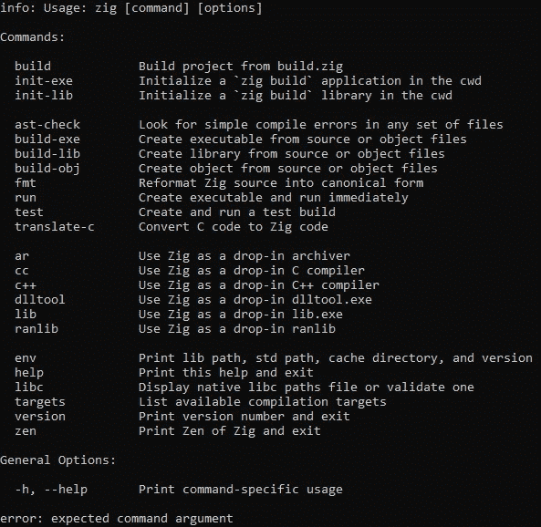
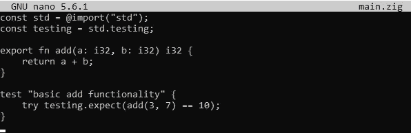
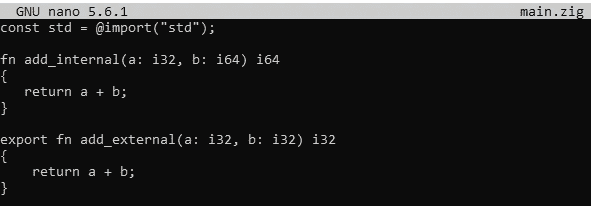
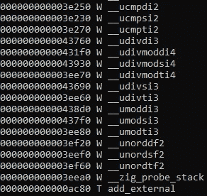
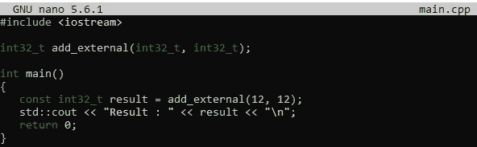
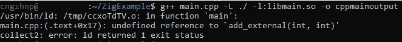
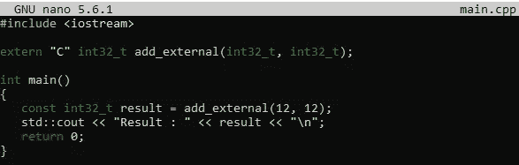
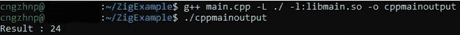

# 如何在 C++代码库中使用 Zig-lang 生成的动态库

> 原文：<https://medium.com/codex/how-to-use-a-dynamic-library-generated-by-zig-lang-in-c-codebase-f83790520e03?source=collection_archive---------3----------------------->

过去，我写过一个类似的故事,讲的是用 C++和 Python 来使用动态库，但是是用土耳其语写的。如果你想让我翻译它，请写下评论或者不要犹豫，在任何社交媒体账户上联系我。今天，我们将尝试使用 Zig 编程语言生成一个动态库，然后在 C++代码中使用它。我们开始吧！

在解释这个代码库的实现细节之前，也许我应该介绍一下我新喜欢的编程语言 [Zig](https://ziglang.org/) 。Zig 是一种刚起步的编程语言，它鼓励你编写基于编译时代码的元编程风格。至少对我来说，它的语法类似于 Go 语言，但它有许多独特而重要的特性集，我可以在另一篇文章中解释，比如 comptime、独立于 Glibc、零依赖性、嵌入式 C/C++编译器支持等等。目前，它支持跨平台编译，可以从许多不同的包管理器安装，你可以在这里找到它们。

在 Zig 中，有许多不同的选项，你可以在终端中简单地写下“Zig”来列出它们。如果你想从头开始创建一个可执行项目，你可以使用“ **zig init-exe** ”。另一方面，如果你想创建一个库项目，你可以直接使用“ **zig init-lib** ”命令，如下图所示。

Zig 列出终端上的所有选项/命令

如果您选择& run 上面的" **zig init-lib** "命令，zig 将在当前目录下生成 *build.zig* 文件，并在其中新建一个包含 *main.zig* 文件的" **src** "文件夹。在这个简单的例子中，我们与 *build.zig* 文件没有任何交互，该文件主要与编译、链接和测试配置相关。我们应该进入 *main.zig* 文件，尝试理解默认情况下写的是什么。

zig 自己创建的默认 main.zig 文件

默认情况下，您将在 *main.zig* 文件中看到这些内容，我将尝试逐行解释。第一行，让你想起了什么？哦，我也一样。就像 C#的[使用](https://docs.microsoft.com/en-us/dotnet/csharp/language-reference/keywords/using-directive)指令或者是 C++的[使用](https://en.cppreference.com/w/cpp/language/namespace)指令和[包含](https://en.cppreference.com/w/cpp/preprocessor/include)预处理器的组合。第二行是别名用法的一个很好的例子。它简化了语言标准所支持的测试功能的使用。

事后你可以猜到，它是一个函数调用，带两个 *i32* 类型参数，在同一个类型中返回它们的和。“ *fn* 是表示一个函数的关键字(也可以是缩写)，后面“*加*就是它的名字。然后给出类似于“*参数名-冒号-类型*”和 *i32* 等价于 *int32_t* C 类型的参数语法。与 Go 语言一样，返回类型位于这些参数之后。如果你熟悉 Golang，你可能会说[除了参数的冒号和函数的关键字名选择之外，它们几乎和](https://go.dev/tour/basics/4)一样。

测试是 Zig 语言的另一个关键特性，你可以在源代码中直接使用它。“ *test* ”关键字代表测试用例，之后你可以给这个用例命名。如果你熟悉类似 C++的 [GTest](https://github.com/google/googletest) 或 [Catch2](https://github.com/catchorg/Catch2) 这样的单元测试框架，那么下一行就简单易懂了吧？

测试中的期望与现实

深入解释，你可能会意识到一件事，我还没有提到有意。哦对了，*导出*关键字。有了下面的新例子，我会更详细地解释它。

Zig 中的导出关键字用法

假设有两个几乎相似的函数调用，分别命名为“ *add_internal* ”和“ *add_external* ”。第二个函数有另一个关键字“ [*export*](https://ziglang.org/documentation/0.9.0/#Exporting-a-C-Library) ”，这使得它可以公开使用。让我们编译这个代码块并生成一个动态库。

要从一个文件生成一个动态库，你必须显式地给出"*-动态*"选项，因为 Zig 默认生成一个**静态**库**。因此，在运行“*zig build-lib-dynamic { filename }*”命令后，我们将拥有一个动态库。让我们检查我们的函数调用是否位于动态库的符号表中。如下面的截图所示，符号表中有 *add_external* ，但不像我们预期的那样有 *add_internal* 。**

****

**符号表中的“add_external”**

**现在，我们准备在 C++代码中使用它。让我们写一个简单的 C++代码来立即使用 Zig 编写的函数。下面是要编译和运行的简单的几行 C++代码。**

****

**使用 Zig 函数的简单 C++代码**

**现在，一切都好了，对吗？哎呀，编译阶段似乎没问题，但链接我们有一个问题。为什么？**

****

**add_internal 函数的链接错误。**

**几分钟后…哦，对了[莽撞](https://en.wikipedia.org/wiki/Name_mangling)！编译阶段没问题，因为函数名根本没有冲突。但是，“ *ld* ”找不到这个函数的实现细节，因为函数名被篡改了。那么，下一个问题是，我们如何禁用这个功能的 mangling？你好，" *extern C* " [我的老朋友](https://www.youtube.com/watch?v=NAEppFUWLfc)。让我们通过在函数前面添加这个关键字来修改我们的函数签名，如下所示。**

****

**将 extern 关键字添加到函数签名后**

**现在，我们知道我们的函数签名不会再被破坏，我们可以照原样使用它。让我们再次编译并运行它，不要有任何错误。**

****

**成功编译后的打印输出**

**完美！现在，我们准备在 C++代码库中使用我们的实现。我希望你也喜欢这次旅行。在下一个故事中，我将尝试解释 Zig 语言更吸引人的功能。请在这里或任何你能找到我的地方分享你对这个故事的想法！**