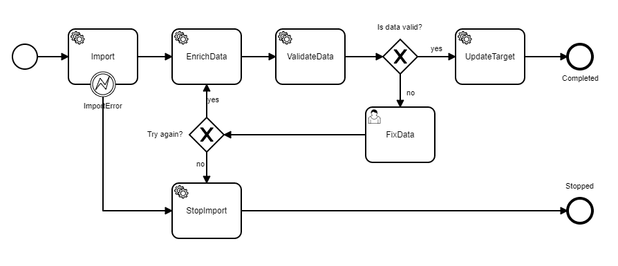
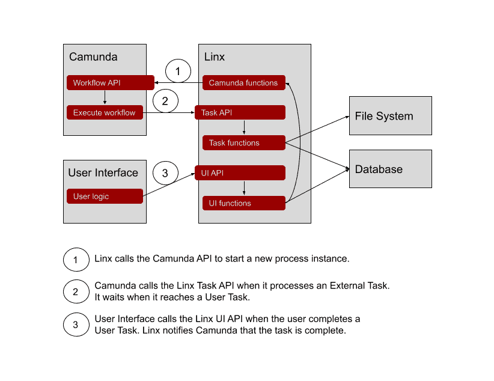
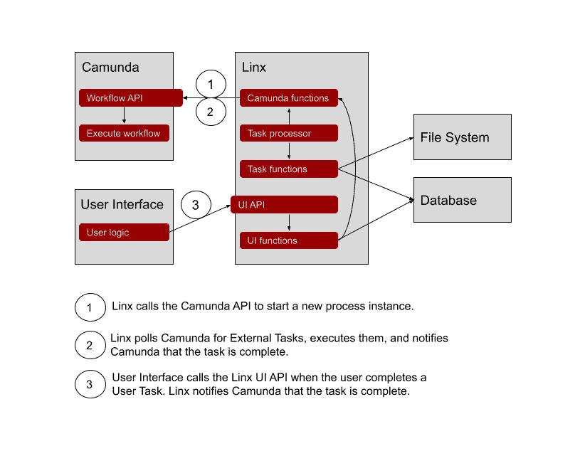

# 如何使用带有工作流引擎的低代码平台实现快速业务流程自动化。

> 原文：<https://medium.com/codex/how-to-use-a-low-code-platform-with-a-workflow-engine-for-rapid-business-process-automation-af4b8be92010?source=collection_archive---------8----------------------->

## 使用工作流和低代码实现过程自动化的实例。

# 介绍

我最近发现了开源工作流引擎 [Camunda](https://camunda.com/) ，在我们的一个客户提到使用它来开发我们的低代码产品 [Linx](https://linx.software/) 之后。在浏览了 Camunda 的文档后，我意识到它可能是 Linx 的完美合作伙伴。

工作流(或业务流程管理)软件通常涵盖三个领域:

1.  工作流引擎。引擎保持状态并决定接下来必须发生什么。
2.  用户任务管理。控制用户任务分配以及用户如何与这些任务交互的用户界面和逻辑。
3.  自动化任务执行。与其他技术互动的机制。这些可能是 API 的连接器或一种或多种编程语言的挂钩。

Camunda 涵盖了所有这些领域，并且有一个全面的 REST API。您可以将它作为一个独立的服务运行，并将一个定制的用户任务界面和自动任务执行与 API 挂钩。

自动化任务通常用工作流引擎支持的语言编程。在 Camunda 的例子中，如果你使用 REST API，它是 Java 或者你选择的语言。开发自动化任务的另一种方法是使用低代码工具——这是我认为两者可以很好合作的地方。

# 假设

从理论上讲，使用工作流引擎来编排用低代码工具构建的业务流程应该能让我们两全其美。

我们使用 BPMN 建模工具设计工作流，并使用低代码创建任务自动化。当进行建模时，我们专注于业务问题，当实现自动化任务时，我们专注于技术方面，但不必编码。

编排(工作流引擎)和任务自动化(低代码)的分离还有其他一些优点:

*   维护。我们可以在不影响另一个的情况下改变其中一个。
*   灵活性。我们可以混合执行技术。例如，在可能的地方使用低级代码，在必须的地方使用代码。或者具有多个甚至不同的工作流引擎。不管怎样都行。
*   性能。我们可以扩大需要它的区域。例如，如果工作流引擎出现问题，我们就扩展它，如果任何执行任务需要资源，我们就扩展它。
*   测试。我们可以分别测试流程逻辑和任务执行。

和一些缺点:

*   需要维护的技术不止一项。
*   复杂。不同的部分如何组合在一起并不总是显而易见的，这使得维护起来更加困难。

# 试验

我们的许多客户仍然使用文件作为他们系统集成流程的一部分。来自系统 A 的文件用于更新系统 b。通常有几十到几百种格式，都有不同的规则适用。常见的过程是将文件导入到临时数据库中，丰富数据，验证数据，然后更新目标。

因此，为了测试在 Camunda 中使用 Linx 的想法，我决定构建一个通用的文件导入过程。我们通过在 Linx 中添加任务自动化来添加新的文件导入。工作流程本身保持不变。

通用文件导入过程如下所示:

所有服务任务(带齿轮的任务)也是外部任务。它们在 Camunda 之外执行，在本例中是由 Linx 执行的。

我最初的架构让 Camunda 调用一个由 Linx 托管的微服务来执行任务。

但是在意识到我必须编写代码并对我的 Camunda 实例进行一些配置才能调用外部 API 之后，我决定尝试一种不同的策略，并以如下方式结束:

Linx 轮询 Camunda 的工作并执行它，而不是 Camunda 调用 Linx。

建造它的过程比预期的要容易。

*   用 Camunda Modeler 设计工作流程。
*   在 Linx 中为 Camunda 中的每个服务任务创建一个函数。这些函数应该是幂等的，因为如果 Camunda 和 Linx 之间出现问题，它们可能会被同一个工作流实例调用多次。
*   在 Linx 中创建一个定时器服务来轮询 Camunda 的任务。
*   在 Linx 中添加一个函数，将任务 Id 与其相关的 Linx 函数相匹配。

# 结果

我很喜欢这个结果。将一个合适的工作流引擎与一个开发人员友好的低代码工具结合起来，可以让我们两全其美。我们获得了构建业务流程的简单方法、防弹状态管理，以及实现所有自动化和集成部分的快速方法。

该项目可在 [Github](https://github.com/linx-software/file-import-process) 上获得。

# 资源

*   [Github 上的项目](https://github.com/linx-software/file-import-process)
*   [Linx 文档](https://linx.software/docs/)
*   [卡蒙达文档](https://docs.camunda.org/)