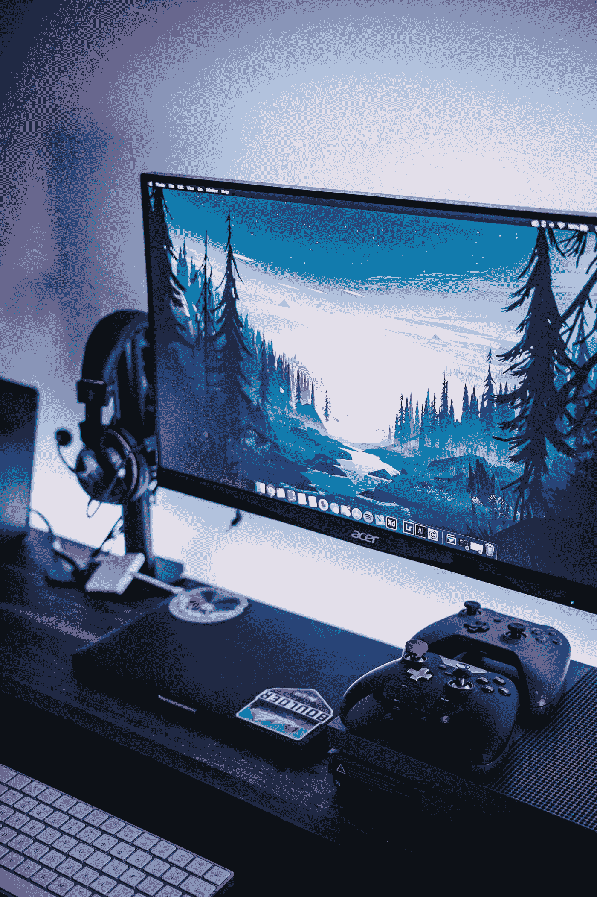

# 如何在您的电脑上使用任天堂 Switch 专业控制器

> 原文：<https://medium.com/codex/how-to-use-a-nintendo-switch-pro-controller-on-your-pc-4f2f4a1cc196?source=collection_archive---------11----------------------->

## 你曾经想在你的电脑上使用任天堂 Switch 专业控制器，但笔记本电脑或台式机崩溃了吗？现在你可以了。

马克斯·安德烈在 [Unsplash](https://unsplash.com?utm_source=medium&utm_medium=referral) 拍摄的照片

如果不使用控制器，在电脑上玩视频游戏几乎是不可能的。对于玩网游的人来说更是如此。许多电脑游戏玩家也使用控制器作为与队友和其他玩家在线交流的方式。

因为微软承认 Pro 控制器是直接输入控制器，而不是 Xbox 系列、S/X、Xbox One 游戏手柄等 XInput 设备。因此，让它与你的电脑游戏兼容可能会很麻烦。

在本教程中，我将向你展示如何在你的电脑上使用任天堂 Switch 专业控制器，使它更容易玩你选择的任何游戏。所以继续滚动！

## **使用有线链接将你的 Switch Pro 控制器连接到你的电脑上**

任何 USB-A 到 USB-C 线应该与您的任天堂 Switch 专业控制器一起工作，尽管它附带的是最简单的选择。

USB-A 线应插入电脑的 USB 端口。

将电线的 USB-C 端连接到开关控制器的头部。

让 Windows 来识别。这种技术通常伴随着听觉指示。

如果 Steam 在您的电脑上运行，主屏幕按钮周围会出现一圈蓝光。

## **设置蒸汽与任天堂 Switch Pro 控制器一起工作**

一旦 Switch Pro 控制器连接或连接到您的系统，一些游戏开发人员就会检测到它。但 Steam 会要求您激活支持，然后才能与您的游戏集合一起运行。

前往蒸汽菜单栏中的蒸汽>设置>控制器>通用控制器设置。

应该启用 Switch Pro 配置支持。

如果你想要默认的任天堂配置，选择使用任天堂按钮配置。但是如果你想模拟默认的 Xbox 控制器布局，不要选中它。

## **无线连接(通过蓝牙)**

无论您的电脑是否内置了蓝牙技术，或者您是否使用了蓝牙加密狗，这一过程都很简单。

要进入设置菜单，请使用 Windows 键。

在“设置”页面上，选择齿轮符号。

将会出现一个包含许多选项的菜单，特别是设备。选择设备。

这将带你到一个关于蓝牙和其他小工具的部分。

从下拉菜单中选择“添加蓝牙或其他设备”。

这将允许您选择要连接的硬件类型。

从菜单中选择蓝牙。

您需要准备好您的任天堂 Switch 专业版控制器进行连接。USB-C 端口旁边提供了一个微小的同步按钮，用于连接控制器。

轻按并按住控制器的小同步按钮，直到你看到一系列的灯在周围闪烁。

回到显示屏，您的系统应该将任天堂 Switch Pro 控制器识别为连接到 PC 的蓝牙设备。

**最终判决**

将任天堂 Switch Pro 控制器集成到您的电脑上进行电脑游戏非常简单。当你想在很多游戏中使用它时，唯一的绊脚石就出现了。Steam 游戏和非 Steam 游戏是电脑游戏的两种类型。

Steam 客户端的功能是作为一站式定制源，供您设置任天堂 Switch Pro 控制器，并在您的所有 Steam 游戏中应用这些配置。

x360ce 控制器模拟器为每个游戏定制控制器，特别是非 Steam 游戏。你可以用这两种方法来处理你所有的游戏设置。

— — — — — — — — — — — — — — — — — — — — — — — — — — — — — — — — — — — — —

[SEO 内容开发](https://siddmasood.medium.com/how-can-you-add-meta-descriptions-and-change-them-in-your-wordpress-blog-16b859689be8)、 [SaaS](/@siddmasood/a-brief-explanation-of-saas-and-what-is-saas-all-about-3b61d24ac7b7) 、[商业](https://siddmasood.medium.com/10-best-tips-how-to-optimize-your-linkedin-profile-for-maximum-exposure-f29f5a209144)、[数字营销](/@siddmasood/what-is-always-on-marketing-why-its-important-in-digital-marketing-890e44827598)、健康和网络安全是我撰写的一些主题。我还为网站内容撰写文案，并[创建社交媒体内容](https://www.linkedin.com/in/sidramasood-seo-content-writer/)。

如果你喜欢你所读的，试着加入媒体，阅读各种其他文章。你的一部分稿费给了像我这样的作者。[要加入，请点击此处。](/@siddmasood)

查看我的其他 [Linktree](https://sidramasood.linkst.ar/) 个人资料，并关注我。