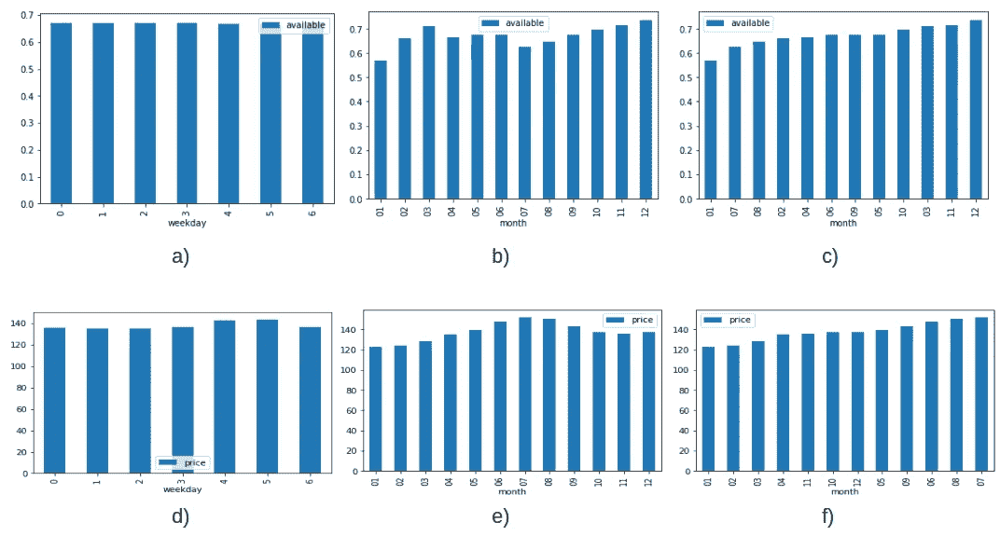
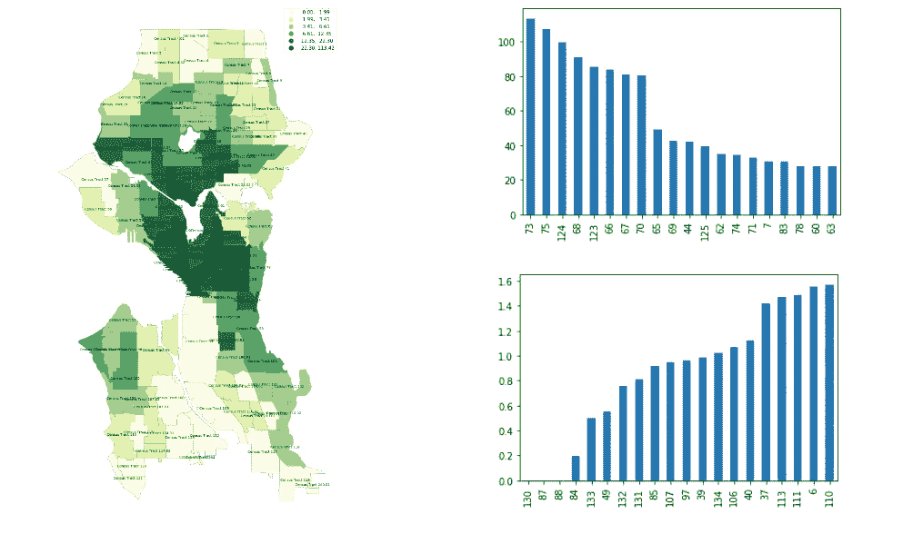
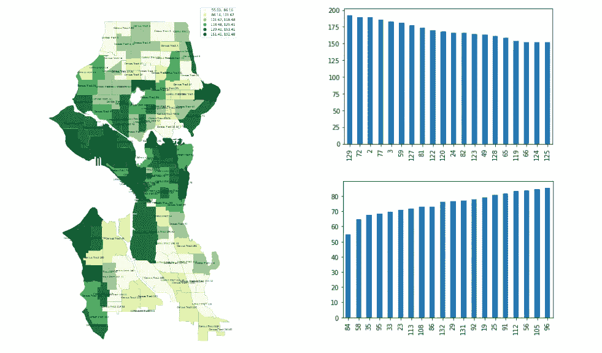
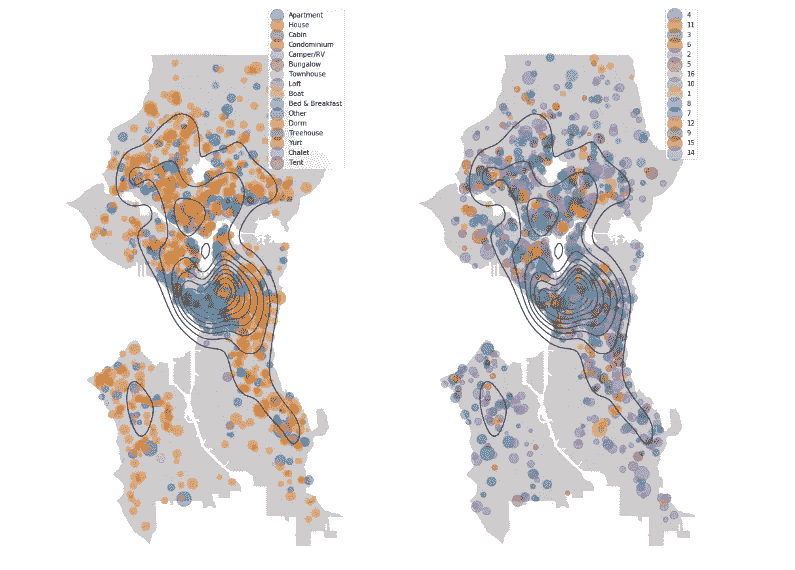

# 如何利用 Airbnb 成为你的优势

> 原文：<https://medium.com/codex/how-to-use-airbnb-to-your-advantage-f568d8a6d282?source=collection_archive---------11----------------------->

# 介绍

领导力是一门艺术，成为领导者的机会可以有不同的形式和大小。无论是为朋友和家人计划一次经济实惠的居家旅行，还是管理你最近开始的 Airbnb 项目。像任何其他艺术形式一样，掌握这门艺术需要实践、问正确的问题，也许还需要你的数据科学家朋友的帮助。说到练习，我知道你已经准备好了。在本文中，我已经为您介绍了后两者。

在这篇文章中，我将使用 Airbnb 西雅图数据作为例子来回答一些重要的商业问题，这些问题可能会帮助你更好地领导你的新 Airbnb 企业，并希望明确提出正确的商业问题需要什么样的思维过程。在本文的其余部分，您可能会看到许多奇怪的图(条形图、散点图和 choropleth 图)，但不要担心；它们在这里是为了促进我们的理解，并帮助我们注意到一些回答我们业务问题的模式。

为了让你更容易理解，我已经把整篇文章组织好了，首先展示情节，解释情节，然后在他们的帮助下回答问题。

# 第一节

条形图

以下是一些条形图，显示了所有列表的可用性或价格趋势。上面一行是可用率，下面一行是价格率。第一列描述周趋势，第二列描述月趋势，第三列与第二列相同，只是为了方便排序。

**下面是我们可以从这些柱状图中得出的一些观察结果:**

*   从 a)、b)和 c)中，可以观察到，与一年中的月份相比，可用性的比率有一定的变化，但与一周中的日期相比，可用性的比率没有变化。
*   从 d)、e)和 f)中可以观察到，一周中的每一天和一年中的每一个月的价格都不同。
*   由于两个原因，入住率可能会有所不同:
    -房源已被预订
    -房源因维修而关闭
    -第二个原因很少见，不会显示出模式的任何重大变化。
    -所以，我们会假设当房源不可用时，是因为他们已经被占用了。
*   从该月可用率的变化，如 c)所示，我们可以观察到以下情况:
    -房源在各月中被占用最多(按降序排列):
    —1 月
    —7 月
    —8 月
    -房源在各月中被占用最少(按降序排列):
    —12 月
    —11 月
    —3 月
*   从 f)中所示的该月价格变化中，我们可以观察到以下情况:
    -各月中价格最高的房源(按降序排列):
    —7 月
    —8 月
    —6 月
    -价格最低的房源(按降序排列):
    —1 月
    —2 月
    —3 月

现在事实摆在我们面前，我们可以考虑一些商业问题了。

从一个家庭成员的角度来看，他/她将与家人一起度假，并希望计划一次预算友好的旅行，最好的方式是在住宿的地方节省一些现金，而不要在住宿质量上有太多的折衷。你可以在 Airbnb 价格最低的几个月里计划你的旅行。既然我们已经分析了趋势，我们有资格回答这个问题:

*   **如果你预算有限，去西雅图的最佳月份是哪个月？**
    一月、二月和三月是价格最低的月份。尤其是一月份，这也是为什么一月份大部分房源都被占的原因。二月和三月房源的入住率相对较低，因为房价再次上涨。因此，如果人们想在天气不太冷但价格仍然相当低的西雅图享受时光，二月和三月是预订 Airbnb 的好时机。

从业主的角度来看，你的重点应该是最大限度地提高你在每件物品上的利润。你可以根据一年中的时间为你的物品确定合适的价格。还有一点很重要，那就是选择一年中合适的时间来维护你的列表，以最大化你的收益。这给我们带来了以下问题:

*   **在 Airbnb 上列出你的房产的最佳时间是什么时候？如何根据一年中的时间来设定价格？夏天，尤其是七月、八月和六月，价格最高，因为这是舒适的天气，也是大多数游客来西雅图旅游的时候。因此，从商业的角度来看，如果你计划在 Airbnb 上出售你的房产，并希望最大化你的利润，你应该在夏季将价格定得高一些，因为游客量已经非常高了，而且大多数酒店都已经订满了，所以人们有可能愿意支付高额费用来寻找住宿的地方。另一方面，一月是你应该把价格定在预算友好的时候，因为这将吸引人们在寒冷的天气里预订你的房源。**
*   **业主一年中什么时候可以取下房源进行保养维修？**

# 第二节

本节将使用 choropleth 图、条形图和散点图分析西雅图不同区域的 Bnb 密度和平均价格。看看我们能否找到一些模式，帮助我们最大限度地提高 Airbnb 业务的收益。

左侧为 BNB 密度曲线图，右侧为条形图。

*   回到上图，左边是 choropleth 图，描述了西雅图特定区域的 bnb 密度。从淡黄色最不稠密到深绿色最稠密。右边是条形图。右上角是前 20 个 BNB 密集区，右下角是后 20 个密集区。
*   从相关的 choropleth 和 bar 图中，我们可以观察到 73、75、124、68 和 123…区域中的 bnb 密度最高。并且区域 130、87、88、84、133…具有最低的 bnb 密度。
*   我们可以观察到高密度区域的 bnb 价格在 30-200 美元之间。

左边是平均价格曲线图，右边是条形图。

*   这里，左边是 choropleth 图，描述了西雅图特定区域的 bnb 的平均价格。从淡黄色最不稠密到深绿色最稠密。右边是条形图。右上是平均价格最高的前 20 个区域，右下是平均价格最低的后 20 个区域。
*   从平均价格线图和柱状图中，我们可以观察到地块 129、72、2、77 和 3…的价格最高。而 84、58、35、95、33、23…地块的 bnb 平均价格最低。

散点图左图描述了各种物业类型的覆盖范围，右图描述了西雅图景观上各种大小的 BnB 的覆盖范围。

*   房子和公寓是西雅图最常见的房产类型，异国情调的豪宅非常少见。
*   一间卧室和浴室的住宿是最常见的。
*   以及 BNB 2 或 4 个民族中的大多数。
*   房产类型散点图显示主城区充斥着公寓和共管公寓。主要原因是主城区空间不足，地价高。这使得拥有高层建筑更加方便，因此在城市地区有大量的公寓和共管公寓，而房子到处都是。
*   出于同样的原因，像树屋和联排别墅这样占用更多空间的房产类型在市区很少见，大多出现在郊区或耕地较少的地区。
*   从容纳散点图中，我们可以观察到，大多数 Airbnb 都迎合年轻的单身汉或夫妇。这可以从遍布西雅图的大量只容纳 1 或 2 人的公寓或房屋中观察到。

# 通过以上观察，我们可以回答一些非常有趣的商业问题。以下是其中的一些:

从数据中观察到的哪些模式可能有助于增加 Airbnb 业主的业务？ **第一点:**

*   首先，让我们清除大多数人可能有的误解。人口越密集的地区，价格越有竞争力。反之亦然。但这里的情况并非如此。人口稠密的地区，如主城区和一些其他地区，如西雅图郊区，挤满了 bnb，但土地在平均价格清单的顶部。而一些人口密度较低的地区或地块，价格也非常实惠。
*   用供求的概念可以更好地解释这一点。对于一个正常人或没有经验的人来说，BNB 高密度区域或主城区的供应量似乎相当高，而且不知何故超过了需求。这样，每家 BnB 的价格都将具有竞争力，以吸引游客。但在现实中，数据讲述了一个不同的故事。根据 BnB 密度和平均价格比率的柱状图，具有高 BnB 密度的区域组与具有高平均价格比率的区域组具有高重叠。这证实了与需求相比，供应仍然很少，正因为如此，BNB 密集地区的 BNB 业主可以以高于平均水平的价格逃脱，仍然有人预订他们的房源。而人口密度较低的 BNB 地区的需求则相反，BNB 的所有者必须设定有竞争力的价格，并争取客户。
*   因此，如果你打算进入房地产和 Airbnb 业务，拿出一些现金，在主城区或 bnb 人口密集的地区购买一些公寓或房子。这样，你就不必太在意你的物品的价格，同时在一定程度上仍能最大化你的利润。

**第二点:**

*   从右边的散点图中，我们可以观察到 Airbnb 的 major 迎合了年轻的单身汉或情侣。这可以从遍布西雅图的大量只容纳 2 或 4 人的公寓或房屋中观察到。而且由于同样的原因，各大 bnb 都是一居室房源。西雅图的年龄分布可以证明这一点，主要人口是年轻的单身汉或年轻夫妇。这就是为什么主要的 BNB 上市公司都是为了迎合更大比例的年龄分布而设立的。
*   因此，除了上述建议，另一个让你收入最大化的方法是迎合更多的人群。具体来说，最好是多套 1、2 居室的公寓，而不是大户型。即使你有更大的房产，比如一套四居室的公寓或一栋房子，也最好将房产的每个房间单独列出。

文章的主要内容到此结束。我希望这些分析和用它们回答的一系列商业问题，为在 Airbnb 业务中取得成功所需的思维过程打下坚实的基础。但是这篇文章仅仅揭示了整个游戏的一小部分。对评论和娱乐设施的分析仍有待进一步研究。我将用下面的话来结束这个话题:

> 提出正确的问题以获得正确的答案。
> 
> 你打算回答什么问题来征服 Airbnb 的海洋？

点击此处查看我的 Github 可用链接[以了解更多关于该分析的信息。](https://github.com/rohit18115/Airbnb_Seattle)