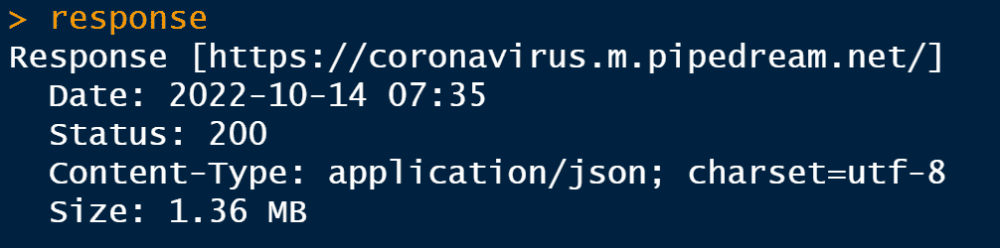

# 如何在 R 编程中使用 API

> 原文：<https://medium.com/codex/how-to-use-apis-in-r-programming-a67258597d56?source=collection_archive---------4----------------------->


作者图片

你想离开 CSV 俱乐部吗？这个帖子是给你的。

在这篇文章中，我将向您展示如何从 **API** 中检索数据，并使用它进行分析。

但是首先，我们需要理解术语 **API** 的含义。

**什么是 API？**

**API** 代表**应用编程接口**，是程序员用来创建外部系统并与之交互的一组命令、函数、协议和对象。

好了，放松点，老虎！不要惊慌。

所以对于那些在外面吃饭的人来说，当你去餐馆的时候。

餐馆会给你提供他们提供的食物菜单。他们不会让你进入他们的厨房去挑选你想要的任何东西，甚至不会让你知道他们的秘方！

他们有服务员，你叫服务员去拿你想要的东西，服务员有责任去厨房为你拿。

所以当我们在说 **API** 的时候，你的电脑就是你在餐厅，要端上来的食物就是你需要的数据，而餐厅就是服务器。我以为你会在吃完后给小费的那个服务员是 API 。

如果你想点菜，服务员会帮你拿。

如果你想要数据，API **会帮你得到。**

我相信现在这些点应该联系起来了。


API 有一个动词，它允许你的计算机与托管数据的服务器通信，其中一些数据超出了本文的范围。

这些动词被称为请求。

我将只谈论允许你的服务员从餐馆的厨房为你取食物的动词。

**在 R 中发出 API 请求**

为了生成一个 **API 请求**，我们将需要两个包`httr` 和`jsonlite`包。

```
install.packages("httr","jsonlite") 
library(httr) 
library(jsonlite)
```

我将使用由不同国家的 Covid 病例记录组成的 API 。

第一步是通过指定 **API** URL 来发出一个 **GET** 请求

```
response <-GET("https://coronavirus.m.pipedream.net/")
```

我们应该期待的输出是一个包含从 **API** 服务器返回的所有信息的列表。

这将作为变量`response,` 存储，包含 **API** 服务器对我们请求的响应。

如果我们要检查可变响应，



这为我们提供了响应的摘要，正如您可以看到的, **GET** 请求被发送到的 URL，以及发出该请求的日期和时间。

JSON 格式的内容类型、内容大小和状态表明我们的请求是否成功。

在这种情况下，数字 200 表示请求成功。

**JSON 是什么？**

变量 response 包含一个列表，在这个列表中，我们的数据以一种叫做 **JSON** 的原始格式存储。

**JSON** 是在 **API** 中存储和传输数据的结构，代表 Javascript 对象符号。

JSON 中的值被赋予了*键-值*对，如下图所示。


您可以使用函数`rawToChar`访问 **JSON** ，该函数将`response` 中的内容转换为 **JSON** 格式。


很乱对，这才是真正的 **JSON** 的样子。

**将 JSON 转换为列表结构**

为了方便地操作这些数据，我们需要使用`jsonlite`包中的`fromJSON()`函数将其转换成一个列表数据结构。

```
data <- fromJSON(rawToChar(response$content)) names(data)
```


我们感兴趣的数据存储在`rawData`中，可以通过调用

```
View(data$rawData)
```


这是我们的数据，您可以看到我们有 14 个变量，尽管有些变量包含缺失值。

因为它是一个 **API** ，在写这篇文章时，这些是你看到的当前值，数据定期更新，因为你可以探索和看到 COVID 的发生率和死亡率。

从现在开始，您可以像浏览常规 CSV 一样浏览数据。

**结论**

现在，你可以向你妈妈解释什么是 **API** ，你也可以从 **API** 中获取数据，并将其转换成合适的格式进行分析。

这只是潜入海洋，一些 **API** 更复杂，需要额外的操作来从他们的服务器获取数据。

但是这已经足够让你开始自己探索各种 **API** 了。

[你可以在这个库中找到免费的公共 API。](https://github.com/public-apis/public-apis)

*原载于 2022 年 10 月 15 日*[*【http://rblogopedia.wordpress.com】*](https://rblogopedia.wordpress.com/2022/10/15/how-to-use-apis-in-r-programming/)*。*