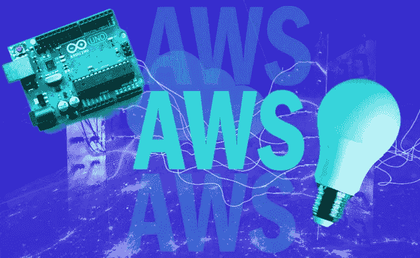

# 如何使用 AWS 物联网核心来构建和扩展您的物联网解决方案

> 原文：<https://medium.com/codex/how-to-use-aws-iot-core-to-build-scale-your-iot-solution-5b4411a3b0bd?source=collection_archive---------6----------------------->

物联网风靡全球。现在，随着联网设备数量的增加，生活质量也在提高。然而，开发人员面临的最大挑战是让所有这些设备彼此同步通信。另一方面，如果基础设施从一开始就不够高效，那么扩展就不可能。

**什么是 AWS 物联网核心？**

AWS 物联网核心是一个管理云服务的系统，能够安全地连接您的设备，使它们不仅可以与其他亚马逊设备通信，还可以与其他云应用程序和设备通信。借助 AWS IoT Core，您可以通过安全连接在连接的设备之间实时发送、读取、处理和传输数据。

最重要的是，AWS 物联网核心让您能够同时管理大量设备。因为它可以连接到其他 AWS 解决方案，让您完全控制 AWS 套装中的所有设备。如今，许多公司都在提供像这样的[物联网开发服务](https://www.daffodilsw.com/iot-application-development)。

AWS 物联网核心有许多用途，但是，在本文中，我们将概述如何连接您的设备以及如何管理您的数据。

**物联网核心中的设备**

**注册您的设备**

第一步也是最重要的一步是使用 AWS 物联网核心注册您的设备。

请记住，在 AWS 物联网核心中，每个设备都被称为一个东西。事物可以是设备的逻辑或物理表示。设备注册表是您在 AWS IoT Core 中将设备作为一个事物进行分配的地方。

一次只能注册一个设备，例如，当传感器跟踪特定房间的温度时。例如，在管理一支无人驾驶车队时，人们可以注册许多设备。您可以创建一组物联网设备注册表。这允许您累积所有设备，以便一次对许多设备应用相同的命令集。

**配置和供应设备**

注册后，您需要整理您的设备并使其可用。您将需要三种资源来设置您的设备，以便在物联网核心中使用:

1.  你的东西。
2.  设备证书(X. 509 证书)。此证书是一个数字证书，它使用公钥基础设施来验证证书中提到的设备是否具有正确的密钥。如果你已经注册了一个物联网，那么建议要么让 AWS 创建一个 X.509 证书，要么使用一个现有的证书。
3.  此证书有助于物联网核心设备通信和验证设备，您还需要将其复制到您最近为设备创建的证书中，并复制到设备本身。使用证书是因为它有利于长期连接。您只需将证书复制到您的设备上一次。
4.  物联网政策。物联网政策是一份重要的文件，告知您的设备是否允许接收和发送数据。如果没有物联网政策，您的设备将无法发送和接收数据。要设置您的设备，您需要将物联网政策附加到设备证书。
5.  如果您只有少量设备需要在物联网核心中调配，这一过程将会产生奇迹。然而，当处理大量设备时，这一过程将是乏味且耗时的。幸运的是，有了 AWS，我们可以为更多的设备自动完成这项工作。

**及时注册(JITR)**

单独注册每一个设备需要花费大量的时间和精力，当您使用自己的设备管理解决方案时，这可能会导致许多问题。

JITR 帮助您设置高效的工作流程，注册设备证书并自动将物联网策略链接到它们。JITR 可以很容易地与任何现有的证书或 AWS 生成的证书一起使用。如果您已经拥有由第三方 CA(证书颁发机构)为您的设备颁发的设备证书，则 JITR 最有效。这是一种自动注册设备的方法，无需将证书复制到您的设备上。

如果您使用自己的 CA，那么您必须首先注册一个 CA 证书来验证您的设备证书。通常，设备制造商有这方面的信息，尽管他们很难注册设备。有了 JITR，这很容易，因为你的设备是预先注册，随时可以使用。

**即时供应(JITP)**

JITR 能做的事情，JITP 都能做，但效率更高一点。例如，JITR 需要几个额外的步骤:创建一个规则和一个 AES Lambda 函数，该函数激活设备证书并将策略附加到该证书。

**如果你想使用 JITP 有两个步骤**

*   将配置模板附加到设备证书至关重要。告知物联网核心您的设备与之交互的其他设备的文档称为配置模板。
*   将 IAM 角色附加到设备证书。指定设备可以访问哪些 AWS 服务的对象称为 IAM。

JITP 将在更高的层面上创造物联网事物和 AWS 物联网政策。把这个保单附在证书上，把同样的证书附在东西上。完成后，您的设备就可以在物联网核心中使用了。

**管理您的设备**

**发送和接收消息**

在 AWS 物联网核心中，您可以使用两种协议实时发送和接收来自设备的信息:

*   MQTT:是一个轻量级的发布/子协议。它通常用于网络匮乏且无法发送大量数据的区域。它被视为设备到设备协议，在物联网解决方案中很常见。
*   HTTP:当你想通过网络发送数据时，使用这个协议。它通常比 MQTT 支持更多的信息传输，不适合较低带宽的区域。

您可以通过 AWS Message Broker 将数据从您的设备过滤、转换和路由到您连接到 AWS IoT Core 的任何其他设备。AWS Message Broker 是一个发布/订阅服务，它使用户能够通过将消息发布到主题来发送消息。然后，用户可以通过简化订阅特定主题来接收这些消息。

用户有可能是 AWS 资源或物联网核心中的其他设备。但是，向许多不同的用户发送一条消息允许您最终调整 Message Broker 上的主题，因此用户只接收和发送您希望他们接收和发送的数据。

**AWS 物联网核心功能**

AWS IoT 可以轻松地与各种现有的 AWS 资源集成，包括亚马逊简单队列服务、亚马逊简单通知服务、AWS Lambda、亚马逊 DynamoDB、亚马逊 Kinesis 和亚马逊简单存储服务(S3)。

**设备影子服务**

如果你有机会管理物联网解决方案，你必须意识到设备数据并不总是可用，设备可能会在一天中不方便的时间尝试相互通信。您可以使用 AWS 的设备影子服务存储设备最近的通信状态。因此，当您的设备离线时，从您的设备提取数据的资源可以显示最新的设备状态，除此之外，您无需担心数据中断。

**就业服务**

作业服务是另一组服务，允许您定期有效地与其他设备通信。此服务将允许您创建和安排作业操作，以向各种设备发送命令，并允许您查看设备上作业的历史记录。

对于作业服务，固件更新是一个很好的应用程序。您可以轻松地使用作业服务来安排常见的固件更新，也可以查看过去的更新。

AWS 物联网核心是一个强大的工具，对于真正的设备通信来说，这确实是一个复杂的过程。是的，JITR 和 JITP 可以让开发人员轻松配置这些设备，消息代理、作业服务和规则引擎都可以无缝地调度和发送命令。

希望这篇博客能够帮助您了解 AWS 物联网核心如何在未来的部署中帮助您的企业。它可以是您连接小规模和大规模物联网部署设备所需的工具，简单易行。