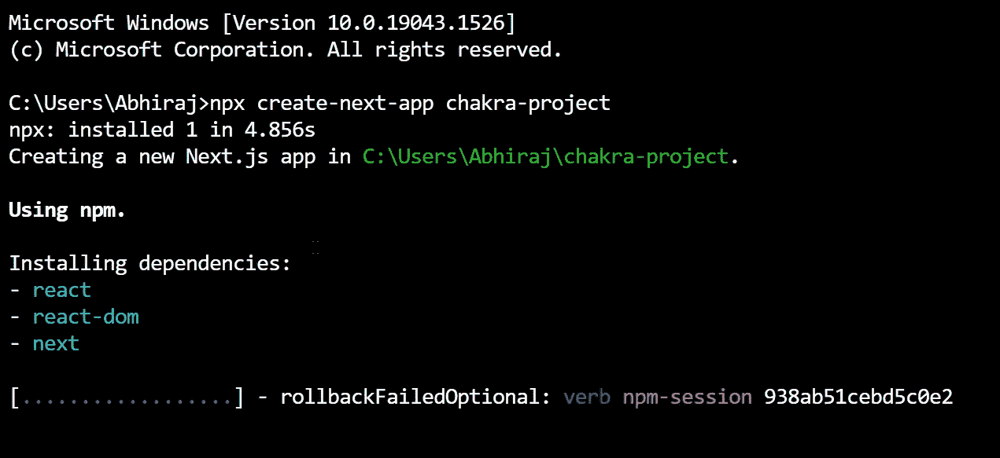
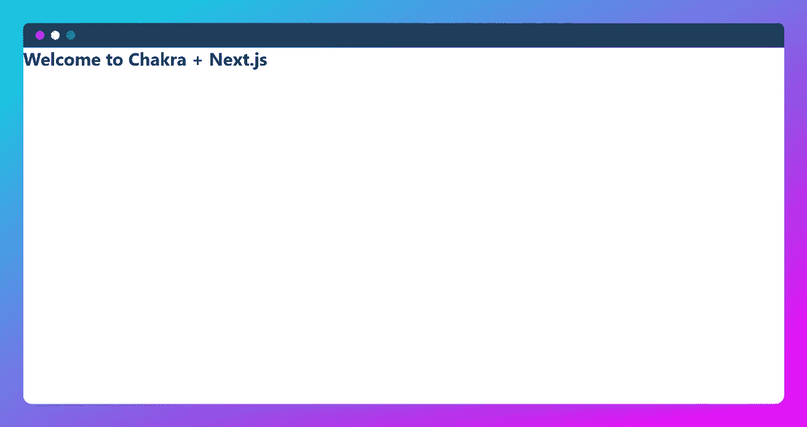
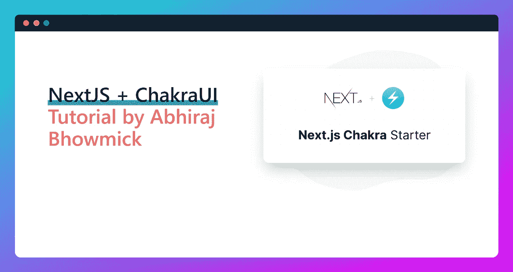

# 如何配合 NextJS 使用 ChakraUI？

> 原文：<https://medium.com/codex/how-to-use-chakraui-with-nextjs-5a4d1f1a9be1?source=collection_archive---------2----------------------->


亲爱的读者朋友们，你们好！已经很久了，我说的对吗？嗯，我很抱歉不能为你创造内容，主要是由于我的董事会考试。

设计一个用户界面从来都不容易，但 Chakra UI 是一个漂亮的 UI 包，可以让您的 Next.js 应用程序快速启动并运行，同时又保持美观。在本教程中，您将学习如何使用 Chakra UI 设置一个小型 Next.js 应用程序。

脉轮的每个组成部分都被设计成可接近的，脉轮维护者已经竭尽全力确保这些组成部分遵守 [WAI-ARIA](https://www.w3.org/WAI/standards-guidelines/aria/) 规则。它还带有一个简单的 API，允许开发人员快速入门。它使个人和团队能够创建包容性的应用程序，而不必担心组装各种组件。

Chakra 利用[情感](https://emotion.sh)来允许开发者从他们的 JavaScript 内部设计他们的组件。它有一个预设的主题，但自定义选项允许你快速改变它。

# 我们开始吧

首先，我们将设置 Chakra UI 和 NextJS。

## **1。创建一个 NextJS 项目**

通过在您选择的终端上运行以下命令，您可以创建一个空白的 Next.js 项目。

```
npx create-next-app chakra-project
```



## **2。将 Chakra UI 添加到您的 Next.js 应用程序中**

要开始使用 Chakra UI，请运行以下命令安装核心 Chakra UI 包:

```
npm i [@chakra](http://twitter.com/chakra)-ui/react [@emotion/react](http://twitter.com/emotion/react)@¹¹ [@emotion/styled](http://twitter.com/emotion/styled)@¹¹ framer-motion@⁴
```

## 3️.**添加脉轮提供者**

Chakra 利用了 ChakraProvider 组件，该组件围绕着您的网站，其内容包括 Chakra 主题、颜色模式功能、CSS 重置、全局样式等属性。

所以，你需要在`。/pages/_app.js `:

```
import { ChakraProvider } from ‘[@chakra](http://twitter.com/chakra)-ui/react’;

 const MyApp = ({ Component, pageProps }) => {
 return (
 <ChakraProvider>
 <Component {…pageProps} />
 </ChakraProvider>
 );
 }

 export default MyApp; 
```

如果使用 Typescript，请使用“”中的“ChakraProvider”组件。/pages/_app.tsx '并替换为以下代码:

```
import type { AppProps } from ‘next/app’;
import { ChakraProvider } from ‘[@chakra](http://twitter.com/chakra)-ui/react’;

 const MyApp = ({ Component, pageProps }: AppProps) => {
 return (
 <ChakraProvider>
 <Component {…pageProps} />
 </ChakraProvider>
 );
 }

 export default MyApp;
```

## 4️.**完成项目设置并进行测试**

在你的`。/pages/index.jsx `或`。/pages/index.tsx `，添加以下代码:

```
import { Heading } from ‘[@chakra](http://twitter.com/chakra)-ui/react’;

 const Home = () => {
 return (
 <Heading>Welcome to Chakra + Next.js</Heading>
 ); 
 }

 export default Home;
```

现在使用“npm run dev”命令启动开发服务器

如果所有内容都正确导入，那么当组件重新加载时，您应该会看到这一点。



## 创建一个英雄组件

现在你的项目运行良好，我们将制作一个英雄组件来学习查克拉是如何工作的

首先，创建一个`。/components/Hero.js `文件。并在内部尝试以下示例代码:

你可能想知道我们到底什么时候做了一个 blob？好吧，我们现在就去做！

创建一个`。/components/Blob.jsx `文件，包含以下代码:

创建好 hero 和 blob 组件后，将“Hero.jsx”导入到“。/pages/index.js `文件如下:

```
import Hero from ‘../components/Hero’;

 const Home = () => {
 return (
 <Hero />
 );
 }

 export default Home;
```

完成所有这些步骤后，您的项目在开发服务器中应该是这样的:



恭喜你！🎉既然你已经学会了如何制作优秀的用户界面，是时候开始你的工作了！🕉️

# 结论

Next.js 只加载任何给定页面所需的 Javascript 和 CSS。这大大加快了页面加载的速度。ChakraUI 由基本的构建模块组成，可以帮助您构建 web 应用程序的前端，并且它是可定制和可重用的。

有效地结合使用这两种技术将使您的工作变得更加容易。

在本文中，我们介绍了如何在 NextJS 中使用 ChakraUI。我希望你能从这篇文章中学到一些有价值的东西。

我们学习了如何:

1.  如何用 NextJS 设置 Chakra UI
2.  如何用 ChakraUI 创建一个英雄组件

## 感谢您的阅读

如果你喜欢这篇文章，请订阅我的[时事通讯](https://abhirajbhowmick.substack.com)永远不要错过我的博客、产品发布会和技术新闻，并在 [Twitter](https://twitter.com/rainboestrykr) 上关注我，获取关于网络开发资源的每日线程。