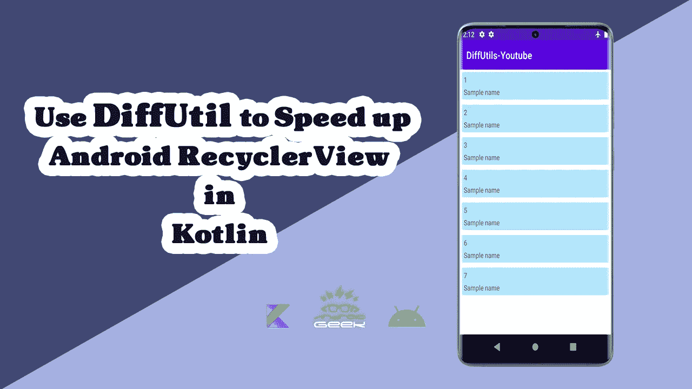

# 如何在 Kotlin 的 RecyclerView 中使用 DiffUtils

> 原文：<https://medium.com/codex/how-to-use-diffutils-in-recyclerview-in-kotlin-2b5d1f01abe2?source=collection_archive---------0----------------------->



## 你在 Android 中创过列表吗？🤔

## 你用什么做的？🤔

ListView 或 RecyclerView 是两种类型的视图。

如果你是一名 Android 开发者，你肯定在某个时候用过 RecyclerView。在本文中，我们将介绍如何使用 DiffUtils 更新 RecyclerView。

之前我们有一篇文章( [Here](/@ezatpanah/recyclerview-in-android-with-example-in-depth-guide-94462a6b573b) )是关于使用 recyclerview 和它有多简单的，现在我想向你展示一个更好的方法来管理你的列表。

大多数时候，我们的列表会完全改变，我们会为 RecyclerView Adapter 设置一个新列表。为了更新适配器，我们使用 notifyDataSetChanged。这个手术很贵。DiffUtil 类现在处理这个问题。它做得很好！

## 什么是困难

这个类找出两个列表之间的差异，并提供更新后的列表作为输出。此类用于通知 RecyclerView 适配器的更新。

我们开始吧👩🏻‍💻

## 逐步实施

## 步骤 1-准备每行的用户界面

在资源布局中为 RecyclerView 创建一个自定义布局文件，名为 item_row.xml。

```
<?xml version="1.0" encoding="utf-8"?>
<androidx.constraintlayout.widget.ConstraintLayout xmlns:android="http://schemas.android.com/apk/res/android"
    xmlns:app="http://schemas.android.com/apk/res-auto"
    android:layout_width="match_parent"
    android:layout_height="wrap_content"
    android:background="#B3E5FC"
    android:layout_margin="5dp"
    android:padding="5dp">

    <TextView
        android:id="@+id/tvId"
        android:text="Id"
        android:layout_width="wrap_content"
        android:layout_height="wrap_content"
        app:layout_constraintStart_toStartOf="parent"
        app:layout_constraintTop_toTopOf="parent" />

    <TextView
        android:id="@+id/tvName"
        android:text="Name"
        android:layout_marginTop="5dp"
        android:layout_width="wrap_content"
        android:layout_height="wrap_content"
        app:layout_constraintStart_toStartOf="parent"
        app:layout_constraintTop_toBottomOf="@id/tvId" />
</androidx.constraintlayout.widget.ConstraintLayout>
```

## 步骤 2 —在活动或片段布局中添加 RecyclerView

在活动布局 **activity_main.xml** 布局文件中添加 RecyclerView，并添加以下代码。

```
<?xml version="1.0" encoding="utf-8"?>
<androidx.constraintlayout.widget.ConstraintLayout xmlns:android="http://schemas.android.com/apk/res/android"
    xmlns:app="http://schemas.android.com/apk/res-auto"
    xmlns:tools="http://schemas.android.com/tools"
    android:layout_width="match_parent"
    android:layout_height="match_parent"
    tools:context=".MainActivity">

    <androidx.recyclerview.widget.RecyclerView
        android:id="@+id/rvMain"
        android:layout_height="match_parent"
        android:layout_width="match_parent"
        app:layout_constraintTop_toTopOf="parent"
        app:layout_constraintStart_toStartOf="parent"/>

</androidx.constraintlayout.widget.ConstraintLayout>
```

## 步骤 3-创建数据资源类

样本模型. kt

```
class SampleModel(val id:Int,val name : String)
```

## 步骤 4-创建适配器类

为视图项创建视图容器，连接 recycle view 的数据源，并通过创建 recycle view 适配器来处理视图逻辑。

```
class SampleAdapter  : RecyclerView.Adapter<SampleAdapter.ViewHolder>(){
    private lateinit var binding: ItemRowBinding
    override fun onCreateViewHolder(parent: ViewGroup, viewType: Int): SampleAdapter.ViewHolder {
        binding= ItemRowBinding.inflate(LayoutInflater.from(parent.context),parent,false)
        return ViewHolder()
    }

    override fun onBindViewHolder(holder: SampleAdapter.ViewHolder, position: Int) {
        holder.setData(differ.currentList[position])
        holder.setIsRecyclable(false)
    }

    override fun getItemCount()=differ.currentList.size

    inner class ViewHolder : RecyclerView.ViewHolder(binding.root){
        fun setData(item : SampleModel){
            binding.apply {
                tvId.text=item.id.toString()
                tvName.text = item.name
            }
        }

    }

    private val differCallback = object : DiffUtil.ItemCallback<SampleModel>(){
        override fun areItemsTheSame(oldItem: SampleModel, newItem: SampleModel): Boolean {
            return  oldItem.id == newItem.id
        }

        @SuppressLint("DiffUtilEquals")
        override fun areContentsTheSame(oldItem: SampleModel, newItem: SampleModel): Boolean {
            return oldItem == newItem
        }

    }

    val differ = AsyncListDiffer(this,differCallback)

}
```

## 步骤 5 —使用 MainActivity.kt

现在，我们需要的东西都有了。
将适配器连接到 RecyclerView。接下来，将 RecyclerView 附加到 MainActivity 的适配器类。

```
class MainActivity : AppCompatActivity() {
    private lateinit var binding: ActivityMainBinding
    private val sampleAdapter by lazy{ SampleAdapter() }

    override fun onCreate(savedInstanceState: Bundle?) {
        super.onCreate(savedInstanceState)
        binding= ActivityMainBinding.inflate(layoutInflater)
        setContentView(binding.root)

        sampleAdapter.differ.submitList(loadData())

        binding.apply {
            rvMain.apply {
                layoutManager=LinearLayoutManager(this@MainActivity)
                adapter=sampleAdapter
            }
        }
    }
    fun loadData() : MutableList<SampleModel>{
        val nameList : MutableList<SampleModel> = mutableListOf()
        nameList.add(SampleModel(1,"Sample 1"))
        nameList.add(SampleModel(2,"Sample 2"))
        nameList.add(SampleModel(3,"Sample 3"))
        nameList.add(SampleModel(4,"Sample 4"))
        nameList.add(SampleModel(5,"Sample 5"))
        nameList.add(SampleModel(6,"Sample 6"))
        nameList.add(SampleModel(7,"Sample 7"))
        nameList.add(SampleModel(8,"Sample 8"))
        nameList.add(SampleModel(9,"Sample 9"))
        nameList.add(SampleModel(10,"Sample 10"))
        nameList.add(SampleModel(11,"Sample 11"))
        nameList.add(SampleModel(12,"Sample 12"))

        return nameList
    }
}
```

搞定了:)

Github 来源:

[](https://github.com/ezatpanah/DiffUtils-Youtube) [## GitHub-ezatpanah/DiffUtils-Youtube

### 此时您不能执行该操作。您已使用另一个标签页或窗口登录。您已在另一个选项卡中注销，或者…

github.com](https://github.com/ezatpanah/DiffUtils-Youtube) 

另外，你可以在 Youtube 上查看我关于这篇文章的 android 视频:

感谢您的阅读和快乐编码！

*别忘了*👏