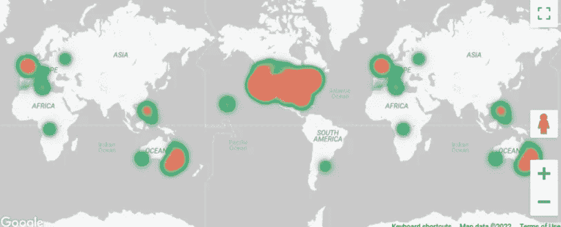

# 如何在 Google Data Studio 中使用热图

> 原文：<https://medium.com/codex/how-to-use-heat-maps-in-google-data-studio-6b536bef9b6e?source=collection_archive---------6----------------------->

## 新特性:在 Data Studio 中使用热图

作者图片

一个很酷的新更新，你可能和我一样等待了很久。在谷歌数据工作室，你现在可以使用基于谷歌地图的热图。我认为这是另一个精彩的更新。其他 BI 工具已经提供了一段时间了。现在我最喜欢的解决方案 Data Studio 也终于明白了。[在这里](https://support.google.com/datastudio/answer/11521624?hl=en&ref_topic=6267740#zippy=)你可以找到…