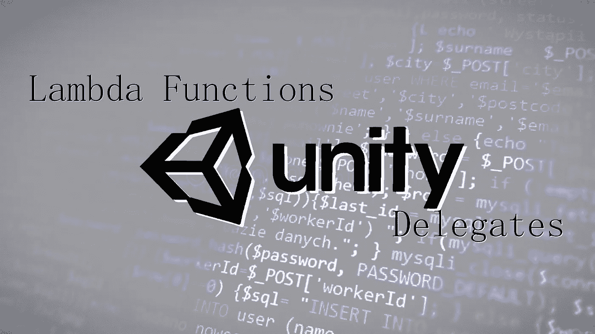

# 如何在 Unity C#中使用 Lambda 表达式和委托

> 原文：<https://medium.com/codex/how-to-use-lambda-expressions-and-delegates-in-unity-c-dcabf7206133?source=collection_archive---------0----------------------->

## 对游戏开发人员工具箱中一些最强大的工具的简单、直接的概述

了解如何使用中级 C#功能增强您的游戏开发项目

软件开发人员最重要的特征之一是总是处于**“学习模式”**。如果你是一个 [Unity C#](https://unity.com/) 游戏开发者，这比以往任何时候都更真实，因为 Unity 定期发布**新版本**，与…