# 如何使用 Metricbeat 代理将 Windows 指标收集到 AWS Elasticsearch。

> 原文：<https://medium.com/codex/how-to-use-metricbeat-agent-to-collect-windows-metrics-to-aws-elasticsearch-es-ede9308575e6?source=collection_archive---------2----------------------->

## 设置度量基准


照片由 [Unsplash](https://unsplash.com?utm_source=medium&utm_medium=referral) 上的 [Fotis Fotopoulos](https://unsplash.com/@ffstop?utm_source=medium&utm_medium=referral) 拍摄

Metricbeat 是一个代理，可用于从虚拟机(Windows/Linux)、容器、Kubernetes 集群等计算源收集指标。Metricbeat 有两个版本，受两个许可证约束。一个是受 Elastic 公司许可的 Metricbeat，另一个是受 Apache 2.0 许可的 Metricbeat-OSS。如果你需要将 Metricbeat 与 AWS ES 一起使用，你必须下载 Metricbeat OSS 版本，因为 AWS ES 使用开源的“Elasticsearch 开放发行版”。

从互联网上搜索时，不会显示 OSS 版本。搜索 Metricbeat Download 并向下滚动下载页面，如下所示。

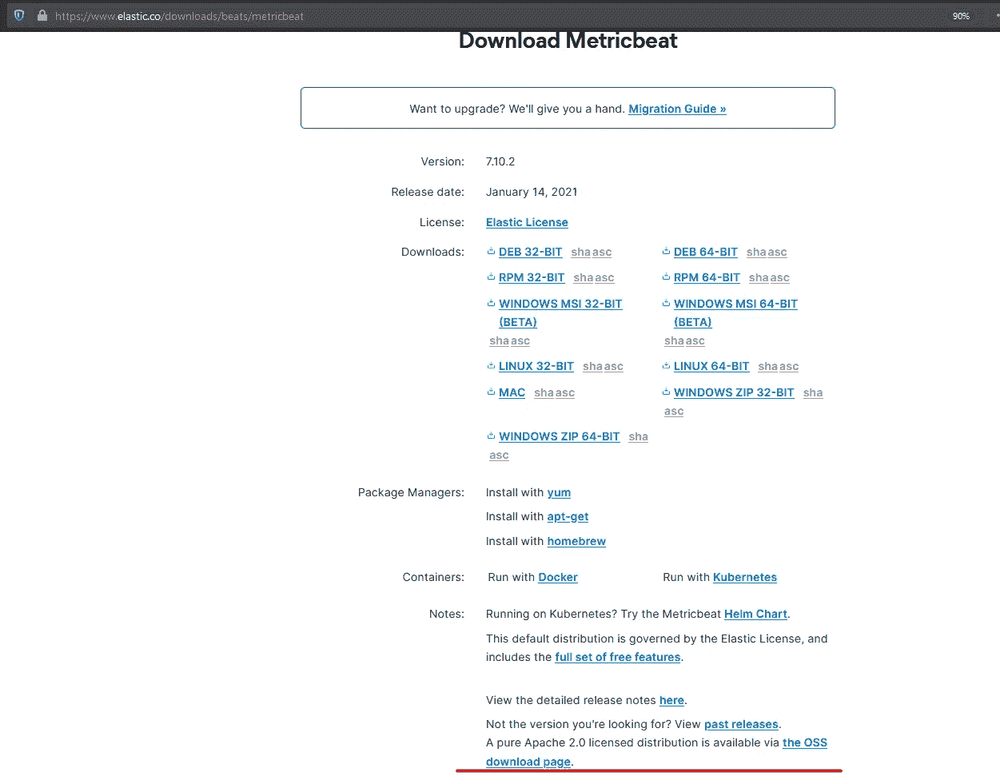

Metricbeat 代理下载

如上图中的下划线所示，你可以在那里找到 OSS 版本的链接。点击它，它会将您重定向到 Metricbeat OSS 页面。根据您的 windows 实例下载 64 位或 32 位 zip 文件(如果这些是最新的 Windows 操作系统，如 Windows 10 或 Windows Server 2016/2019，这将是 64 位)。

下载完成后，将下载的 zip 文件复制到所需的位置并解压缩。将提取的目录复制到您想要的位置，例如 C 盘的程序文件中。在此遵循[给出的 Metricbeat 官方安装指南。仅完成步骤 1 和 3。](https://www.elastic.co/guide/en/beats/metricbeat/current/metricbeat-installation-configuration.html)

注意:如果由于不允许运行脚本而在执行脚本时出现错误，请更改脚本执行策略并运行脚本。然后把它变回原来的样子。您可以通过以下方式实现这一点:

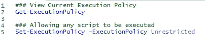

更改 Windows PowerShell 执行策略

该脚本将安装 Metricbeat windows 服务。接下来，我们需要启用用于收集 windows 指标的 Windows 模块。如何启用我在上面分享的官方指南中定义的模块。

```
metricbeat.exe modules enable windows
```

## 配置 Windows 模块以收集指标。

启用 Windows 模块后，让我们将其配置为收集当前 Windows CPU 使用情况、可用内存(MB)和当前磁盘写入速度。Windows 模块 YAML 文件位于 Metricbeat 安装位置内的 modules.d 目录中。下图包含为使用 Metricbeat windows 模块收集上述两个指标而编写的 YAML 代码。

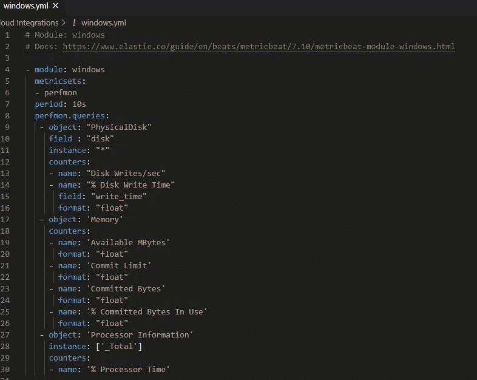

Windows 模块配置

Metricbeat Windows 模块实际上使用 Windows Perfmon API 来提取指标。因此，您可以使用 Windows 性能计数器来查找可用计数器及其计数器路径信息。例如，下面是一些与 Windows CPU 相关的性能计数器。

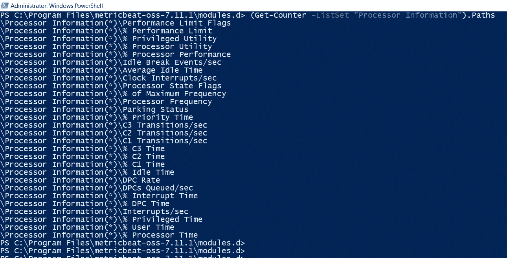

一些可用的 CPU 相关计数器

```
(Get-Counter -ListSet “Processor Information”).Paths
```

从上面的输出可以看出，我已经使用处理器时间计数器来获取用例中所需的信息。您可以使用以下命令查看当前计数器值；

```
Get-Counter -Counter “\Processor Information(*)\% Processor Time”
```

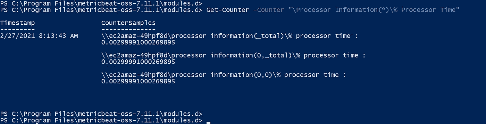

Windows 处理器时间计数器

您还可以使用 windows 模块将 Windows 服务信息发送到您的 ES 域，但是在本文中，我们不打算讨论这个问题。接下来，我们需要配置 Metricbeat YAML 文件，Metricbeat 代理使用该文件连接到 AWS ES 域及其 Kibana 实例，以便推送收集的指标。为此，我们需要一个用户 Metricbeat 用户，我们可以使用它在 Metricbeat YAML 文件中进行配置。由于我们必须将凭据硬编码到 YAML 文件中，因此请创建具有所需最低权限的 Metricbeat 用户。

## 配置 AWS ES 以从 Metricbeat 接收指标。

我将首先创建一个名为“log_input”的 Kibana 角色，并具有所需的权限，如下所示。

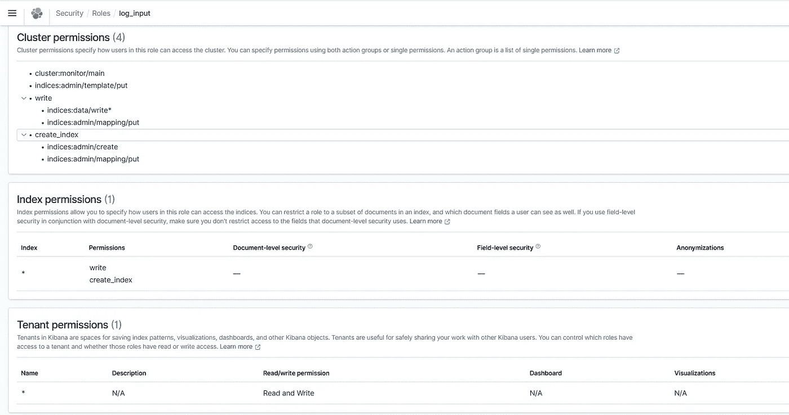

授予新用户访问权限的自定义 Kibana 角色

```
Cluster Permissions
- create_index 
- write
- cluster:monitor/main
- indices:admin/template/putIndex Permissions
- create-index
- writeTenant Permissions
- Read and Write
```

请注意，您需要选择应用这些权限所需的索引和租户。在这个场景中，因为我们必须注入数据，所以我使用了通配符标记。你甚至可以使用这里提到的[的“开放发行版”文档，根据你的需求将权限调整到一个更低的级别。](https://opendistro.github.io/for-elasticsearch-docs/docs/security/access-control/users-roles/#create-roles)

接下来，让我们用上面创建的角色创建一个内部用户。你可以使用任何有意义的名字。导航到安全性下的内部用户部分，并创建一个新用户。然后在 Roles 部分下，将新创建的用户映射到“log_input”角色。现在，让我们导航回 Windows EC2，继续配置 Metricbeat 代理。

## 配置 Metricbeat YAML 文件。

在 Metricbeat YAML 文件中，我们主要需要配置两个部分。首先，让我们配置 Kibana 部分。我们需要提供我们的 Kibana 端点 URL，并将使用的协议称为“https”。请注意，在 URL 中，我们需要特别提供我们正在使用的端口，尽管很明显是 443。

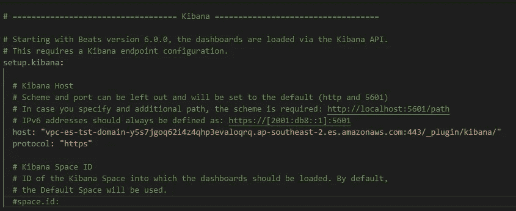

配置 YAML 文件中的基巴纳节

接下来，我们需要配置 Elasticsearch 部分。在这里，我们还需要提供带有 443 端口和协议的 ES 端点 URL。此外，我们需要配置我们在 ES 中创建的新用户凭证，以验证 Metricbeat 代理发送的数据。在这一部分，您还可以提供自己的索引名称。如果不提供索引名，Metricbeat 将使用其默认索引名发送数据，即“metricbeat- <version>-yyyy”。MM.dd”。</version>

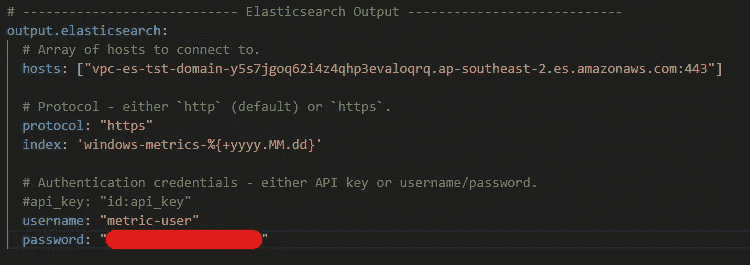

配置 YAML 文件中的 ES 部分

此外，您需要向文件中添加四行内容。其中两行是因为我们使用的 es 版本(AWS 的开放发行版版本),另外两行是因为我们提供的自定义索引名，如上所示。如果您没有使用自定义索引名称，您可以选择退出下面显示的最后两行。

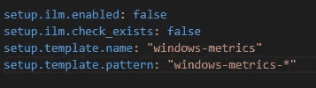

需要将附加配置添加到 YAML 文件中

确保在线条前面没有任何凹痕。保存并关闭 YAML 配置文件。接下来的步骤取决于您的 ES 域的访问策略。如果您使用了对 ES 群集的开放式访问，无论是启用了 VPC 的 ES 群集还是公共群集，您都可以按照官方指南的步骤 5 启动 Metricbeat Windows 服务。

```
PS>\ start-service metricbeat
```

但是如果您正在使用一个定制的 JSON 定义的访问策略，那么您必须启用对 EC2 的访问，以便通过访问策略访问 Kibana 端点。ES 集群有两个级别的身份认证，一个是在 Kibana 接口内部，另一个是在 ES 集群的端点通过访问策略进行的。由于 Metricbeat 不支持 EC2 IAM 角色身份验证，我们必须将内部用户凭证硬编码到 Metricbeat YAML 文件中。来自 Metricbeat 代理的这个请求作为匿名用户请求到达 es 集群端点，该请求未由任何用户 ID 签名。您可以手动签署这些请求(本文中没有讨论),因为这将是一个涉及手动工作的非常大的过程，或者您必须为端点上的匿名用户提供 ESHttp 操作，因为事实上他们在集群内部使用我们创建的角色和用户再次得到了正确的身份验证。

Metricbeat 代理本身需要 3 个特定的 ESHttp 操作来将 metricv 数据作为 ESHttpGet、ESHttpPut 和 ESHttpPost 加载到 ES 集群。除此之外，如果您要加载 Kibana web 界面来管理集群，您还需要剩余的 ESHttp 操作。因此，您需要将语句部分中的以下策略部分添加到 ES 集群的访问策略中；

```
{
   "Effect": "Allow",
   "Action": "es:ESHttp*",
   "Principal":{"AWS":"*"},
   "Resource": "<Your Domain endpoint URL (without https://)>/*"}
```

您可以从 IAM 控制台查看所有 6 个 ESHttp 操作。

现在你可能想知道为什么我们没有完成正式文件中的第 4 步。我们不需要步骤 4 来将我们的指标发送给 AWS ES。步骤 4 将使用 Metricbeat 默认模板、可视化和仪表板来设置您的 ES 集群，您可以直接将它们用于索引。不幸的是，AWS 管理的 es 不允许您在自己的管理的 ES 集群中直接进行设置。为此，您将不得不做一些额外的步骤，我们将不会在这篇文章中进行，以保持这篇文章的重点。

通过导航到索引管理→索引部分，您可以确认 ES 集群正在成功接收您的数据。您将能够看到使用您在 Metricbeat YAML 文件中提供的名称创建的索引。

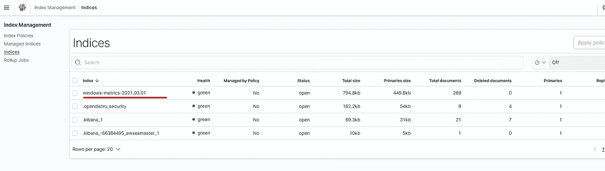

确认索引被 ES 集群接收

作为最后的步骤，您可以使用 Stack Management 部分下的索引模式来捕获它，然后根据您的需求创建自己的可视化和仪表板。创建索引模式时，您必须提供您在 YAML 文件中给出的准确的索引名称，不包括动态部分(日期部分)。

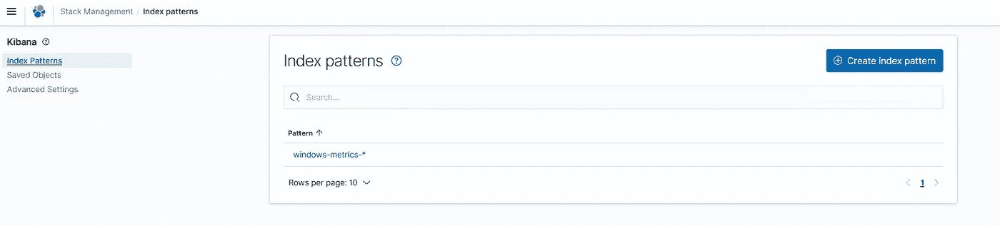

创建的索引模式

然后，您可以根据自己的喜好使用这个新创建的索引模式来创建图表、图形或表格。

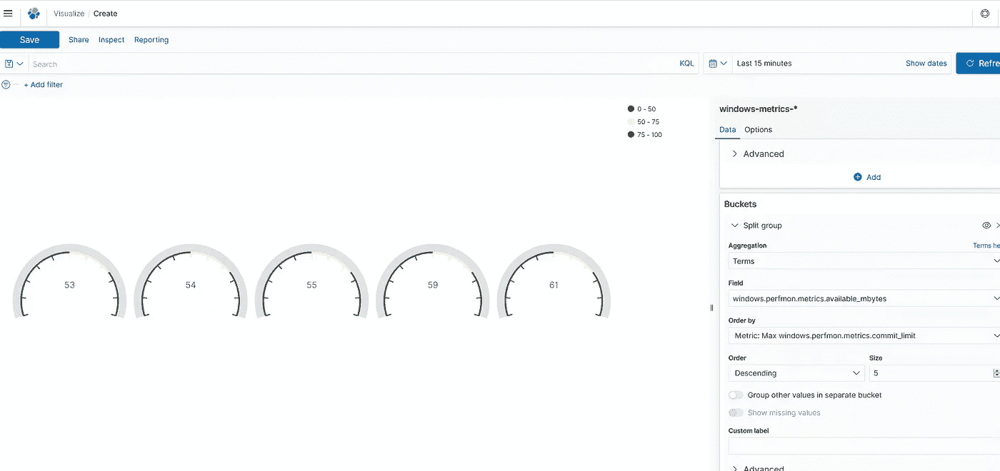

创建自定义可视化效果

我希望这篇文章已经解决了你开始阅读时遇到的问题，或者你已经在这个现代世界的生活中了解了云的新事物。如果你能通过回复让我知道任何问题，或者如果这篇文章通过鼓掌按钮帮助了你，我将不胜感激。


👋 [**今天就加入牧神吧，每周都会在你的收件箱里收到类似的故事！**](https://faun.dev/join) ️ **获得每周必读的科技故事、新闻和教程。**

**关注我们的** [**推特**](https://twitter.com/joinfaun) 🐦**和** [**脸书**](https://www.facebook.com/faun.dev/) 👥**和**[**insta gram**](https://instagram.com/fauncommunity/)**📷**并加入我们的** [**脸书**](https://www.facebook.com/groups/364904580892967/) **和**[**Linkedin**](https://www.linkedin.com/company/faundev)**群**💬**

**[](https://www.faun.dev/join?utm_source=medium.com/faun&utm_medium=medium&utm_campaign=faunmediumbanner)**

## **如果这篇文章有帮助，请点击拍手👏按钮下面几下，以示你对作者的支持！⬇**