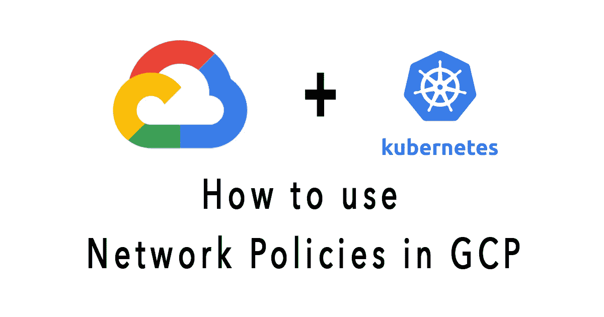

# 如何在 Kubernetes 引擎上使用网络策略

> 原文：<https://medium.com/codex/how-to-use-network-policy-on-kubernetes-engine-1d3c0cb9dac8?source=collection_archive---------2----------------------->

## [法典](http://medium.com/codex)

最小特权的[原则被广泛认为是增强关键系统免受故障和恶意行为影响的重要设计考虑因素。它建议每个组件必须能够访问**合法目的所必需的信息和资源。这个文档演示了最小特权原则是如何…**](https://en.wikipedia.org/wiki/Principle_of_least_privilege)