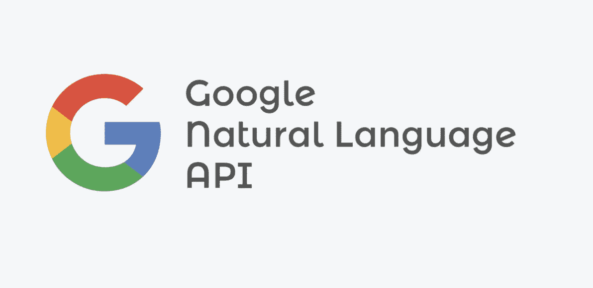

# 如何在 GCP 使用 NLP

> 原文：<https://medium.com/codex/how-to-use-nlp-in-gcp-ad6c0a0c4b2a?source=collection_archive---------7----------------------->

## [法典](http://medium.com/codex)

Cloud Natural Language API 允许您提取文本文档、新闻文章或博客文章中提到的人、地点、事件等信息。你可以用它来了解社交媒体上对你的产品的看法，或者从呼叫中心或消息应用程序中发生的客户对话中解析意图。您甚至可以上传文本文档进行分析。

# 云自然…