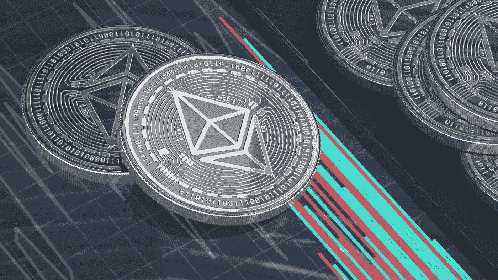

# 如何使用 OpenZeppelin 的 PaymentSplitter

> 原文：<https://medium.com/codex/how-to-use-openzeppelins-paymentsplitter-8ba8de09dbf?source=collection_archive---------0----------------------->

## *如何在 ERC721 项目中使用 PaymentSplitter。*

由[绘制的图片](https://unsplash.com/@drawkit?utm_source=unsplash&utm_medium=referral&utm_content=creditCopyText)在 [Unsplash](https://unsplash.com/s/photos/ethereum?utm_source=unsplash&utm_medium=referral&utm_content=creditCopyText) 上

当你在区块链创建一个项目，比如 NFT 的项目，你可能会期望得到某种形式的报酬。主要来自铸造新代币或二次销售。

但是，如果你不是唯一的开发者，你如何处理支付其他开发者，或艺术家，或营销团队？您可以在每次提款时手动支付，或者您可以让他们自己使用 PaymentSplitter 支付，并确保他们提取的金额不会超过欠款。

# 什么是 PaymentSplitter？

[PaymentSplitter](https://docs.openzeppelin.com/contracts/4.x/api/finance) 是一个开源的解决方案，用于在区块链公平分配资金。它通常在契约部署期间初始化，并且是不可变的，除非您覆盖并添加添加和移除`payees`的功能。

支付拆分器遵循**拉模型**进行支付。这意味着收款人可以从合同中提取资金。而不是以某种方式从契约中发送。

**收款人** 不能提取超过其**份额的**，该份额由合同透明安全地处理。您还可以在合同中查询收款人的具体份额和解冻资金。这有助于提高透明度。

在初始化过程中会添加受款人，以及他们收到的百分比份额。收款人可以使用`receive`函数提取资金，并将他们的地址作为参数添加进来。使用`payee(index)`可以找到收款人，使用`shares(account)`可以找到股份。现在就试着实现吧。

# 如何实现 PaymentSplitter？

由于令人惊叹的 OpenZeppelin 团队，在现有或新合同中实现 PaymentSplitter 非常容易。我将使用一个简单的 NFT 契约来实现它。但是你可以使用任何合同。

首先，我们需要更新从 OpenZeppelin 导入的契约，以包含 PaymentSplitter 契约。

通过添加这一行代码(第 8 行)，我们添加了来自 OpenZeppelin 的 PaymentSplitter 契约，而无需我们自己添加文件。

接下来，我们需要稍微更新我们的`constructor`,将一些变量传递给 PaymentSplitter 契约。

我们添加了`_payees`和`_shares`参数，它们将被 PaymentSplitter 的`constructor`使用。我们在部署契约时传递这些变量。

# 使用 HardHat 部署参数

*在本文中，我不会详细介绍使用 HardHat 部署合同的细节，但是我将向您展示如何为 PaymentSplitter 合同添加适当的参数。*

通过以下简单的部署脚本，我们将在您选择的链上部署我们的合同。

在`NFT.deploy()`参数中，您需要添加适当的变量，在我们的例子中是一个地址数组，后跟一个百分比份额数组。

我们的`0xExample`合约将能拉动总资金的 60%，`0xExample2`只能提取 40%。

PaymentSplitter 不直接从可用资金中提取，因此您将无法连续提取 60%的可用资金。你会退出，只有当有更多的机会时，你才能退出更多。您可以在 [Remix](http://remix.ethereum.org/) 中轻松测试这一点，而无需部署到测试网。

# 结论

我可能有偏见，因为我在我最新的 NFT 项目中使用了这份合同，但我认为 OpenZeppelin 团队已经做了一些令人惊叹的工作。这份合同非常容易建立，而且效果很好。不要再和团队争论报酬的问题，让他们自己拿他们的那份就行了。

非常感谢你的阅读，祝你有美好的一天。

点击这里查看我最新的 [NFT 收藏。](https://www.pixel-pizzas.com/)

[用支持介质支持我，成为会员](https://mbvissers.medium.com/membership)。

[在 Twitter 上关注我](https://twitter.com/MVissers4)跟上我。