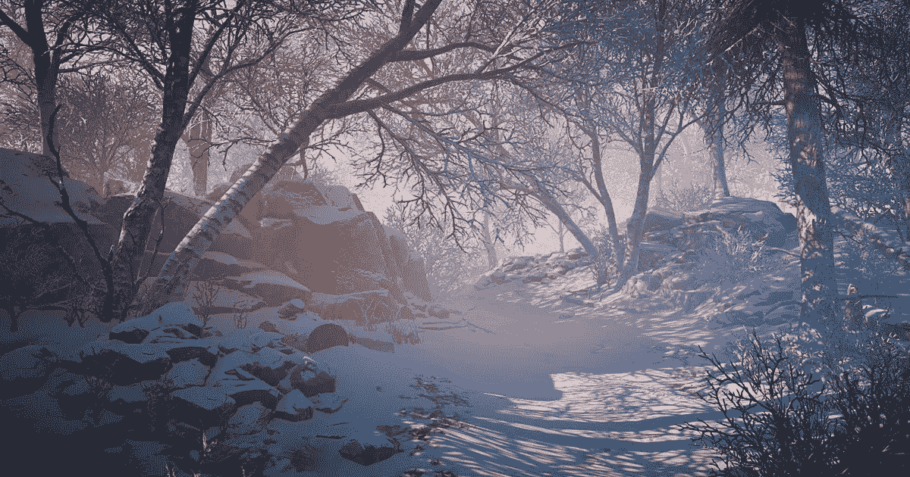
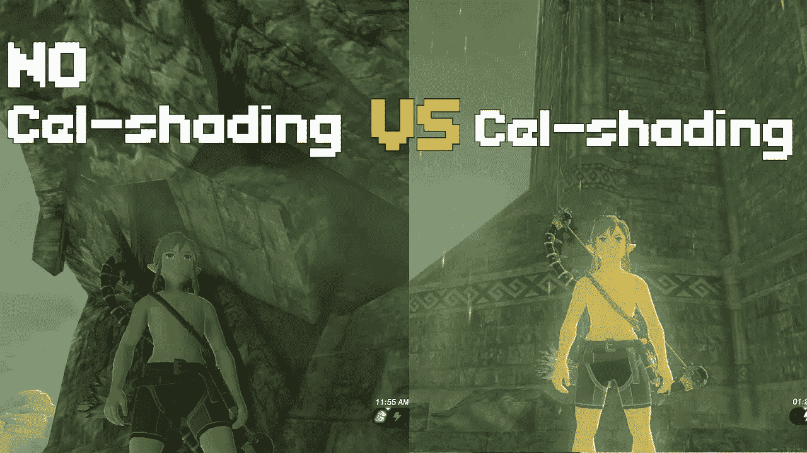
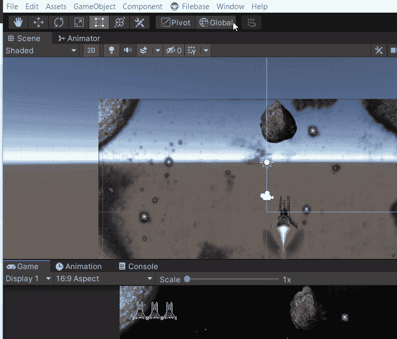
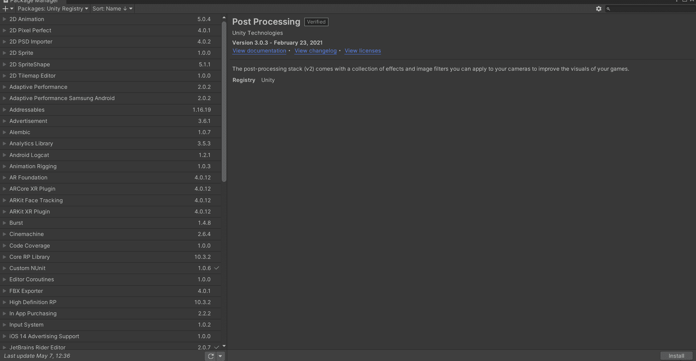
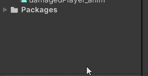

# 如何在 Unity 中使用后期处理

> 原文：<https://medium.com/codex/how-to-use-post-processing-in-unity-2de1b7b9d44d?source=collection_archive---------4----------------------->

# 什么是后期处理？

后期处理是游戏开发周期中的最后一个阶段。本质上，后期处理是指在游戏画面中加入滤镜和特效的过程。虽然这听起来很简单，但这是一个视觉奇迹发生的设计工厂！多亏了后期处理，游戏设计者、艺术家和开发者都可以让他们的游戏视觉尽可能接近他们想要的概念！这个过程还负责通过添加雾等大气效果来设定游戏的基调。

[Unity 中后处理堆栈的高度雾](https://forum.unity.com/threads/height-fog-for-post-processing-stack-2.692545/)

艺术风格化也深受后期处理的影响——它可以将游戏从现实主义的艺术风格转变为更加卡通化或风格化的艺术。例如，《塞尔达传说:野性的呼吸》通过后期处理实现了其独特的艺术风格着色和着色。

[在《塞尔达传说:野性的呼吸》中没有细胞着色故障](https://www.youtube.com/watch?v=kDnOPEVrITU)

# 如何在 Unity 中使用？

Unity 引擎有一系列的后期处理和全屏效果，可以用最少的努力极大地增强应用程序的外观。这些效果可用于制作风格化的图形或模拟真实的摄像机和视频资源。然而，默认情况下这并没有集成到 Unity 中，必须由软件包管理器安装——我们所有 Unity 拥有的你可以添加的东西的中心！

1.  转到窗口菜单，找到软件包管理器

2.在包管理器中，向下滚动直到看到后处理。然后单击安装。

> **注意**:当搜索 Unity 拥有的包时，确保你在 Unity 注册表中。

4.一旦安装完毕，让 Unity 重新编译你的项目，你就可以开始了！您应该能够在项目部分→包中找到它

在下一篇文章中，我将讲述如何通过后期处理让你的游戏进入 AAA 状态！