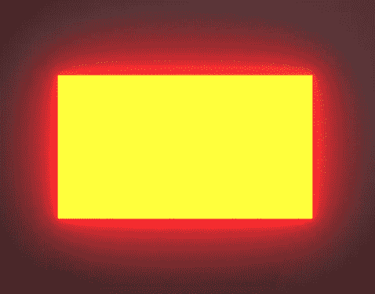
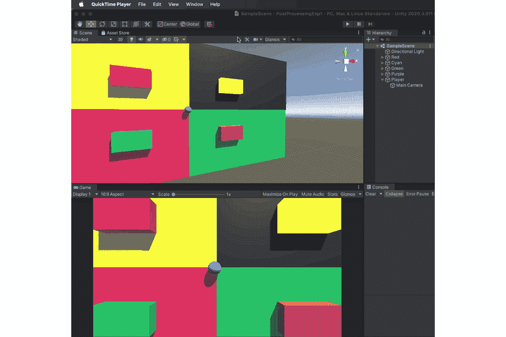
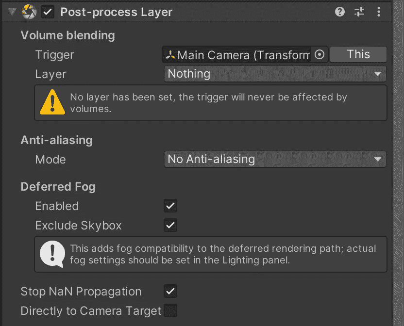
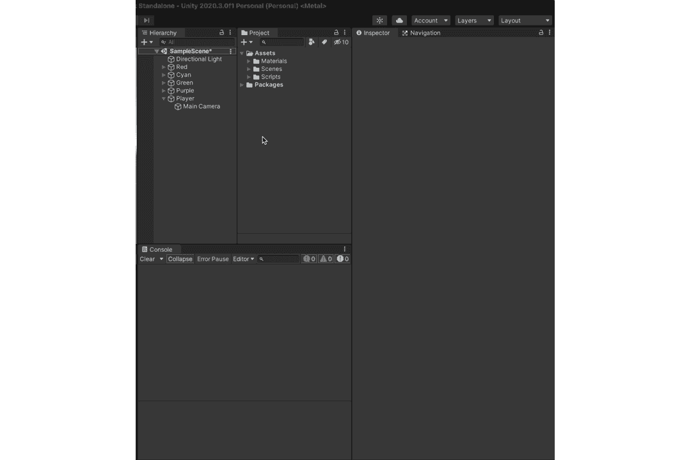
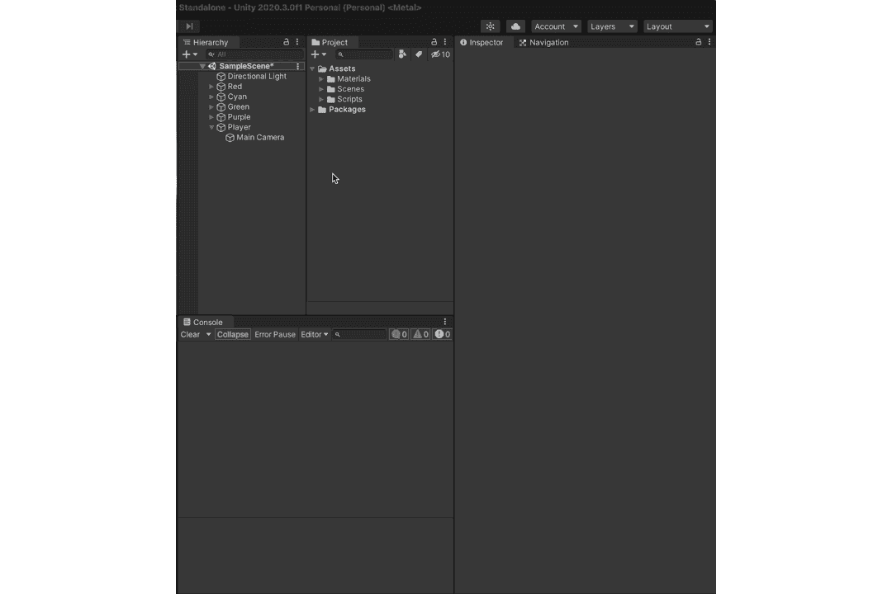
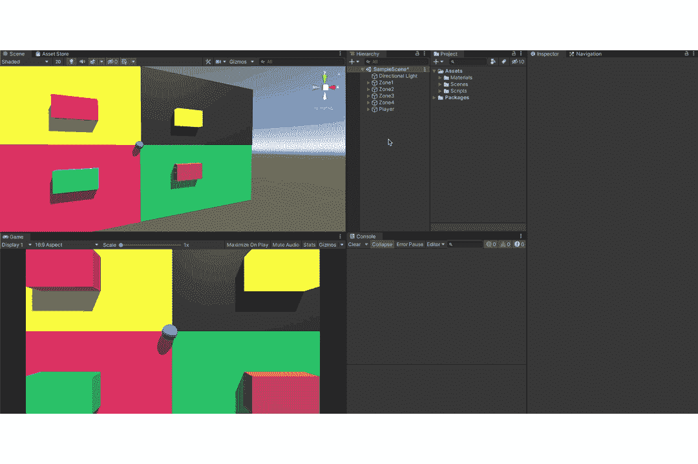

# 如何在 Unity 中使用后处理—第一部分

> 原文：<https://medium.com/codex/how-to-use-post-processing-in-unity-part-i-3744c650d945?source=collection_archive---------1----------------------->

花

如果你一直在关注我的文章，你可能会听到我说使用“一些元素”会给你的游戏带来活力。嗯，后处理恰好是其中一个要素。几乎所有的游戏都使用了某种形式的后期处理，无论是像《空心骑士》这样的 2D 艺术作品，还是像《最后的我们》这样的 3D 杰作。在本文中，我们将看看如何在 Unity 中运行后处理。

***步骤 1 -安装后处理包:***

将后处理包安装到项目中。为此，从工具栏中选择**窗口**选项，并选择包管理器选项。这应该会弹出一个新的窗口(确保您将数据包管理器设置为 Unity Registry)。之后，您所要做的就是搜索您需要的包(在这种情况下是后处理)并安装它。

**窗口→包管理器→检查包(Unity 注册表)→安装后处理**

***步骤 2-主摄像头设置:***

随着后期处理在我们的项目中的使用，我们现在需要一种方法来渲染/启用场景中的后期处理。这可以使用**后处理层来完成。**该组件已经包含一种叫做抗锯齿的后处理形式(它可以平滑锯齿状边缘)。**后处理层**组件包含一个**体积混合**特征。在这里，我们可以选择一个**层**，该层中出现的任何东西都会激活其相关的后处理效果。稍后会有更多内容。

体积混合还包含一个**触发器**，默认为主相机。该触发器需要一个**转换**。可以将它视为启用或禁用后处理可视化方面的触发器。

将后处理层添加到主相机

在上面的 GIF 中，你可以看到也可以使用任何游戏物体的变换作为**触发**来进行**体积混合**。

选择将包含后期处理效果的层。

我们也可以通过点击它来选择多个层，这意味着你可以有一个混合层，每个层用于定义某种混合效果。

***第三步-后处理体积设置:***

后处理音量是一个允许您控制后处理效果和效果类型的组件。你甚至可以控制可访问性，使效果在全局甚至局部发生，就像你进入一个房间，它就亮了。一个简单的方法是在游戏对象上附加一个碰撞器，当**后处理层的**转换进入碰撞器时触发效果。

要使用后处理卷组件，您需要做以下工作，将它添加到所需的游戏对象，确保游戏对象在正确的后处理层(上面创建的层)。完成后，您现在可以创建一个包含后期处理效果的配置文件。最后，创造你想要的效果。

***创建游戏对象→设置后处理层→添加后处理体积组件→创建后处理体积概要→添加效果***

感谢您的阅读。更多关于如何在 unity 中使用后期处理的内容将在文章的下一部分介绍！！！